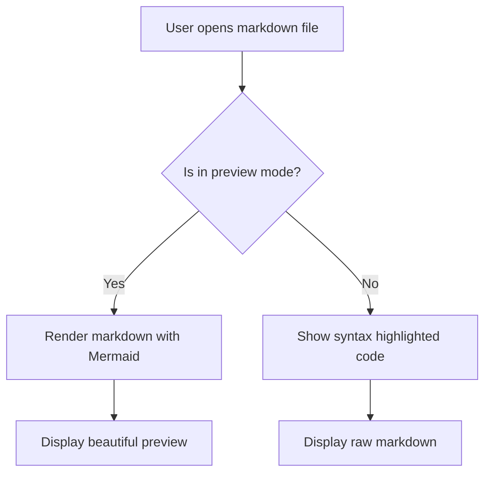
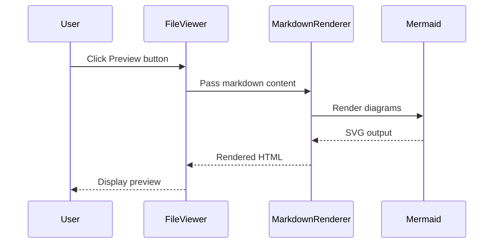
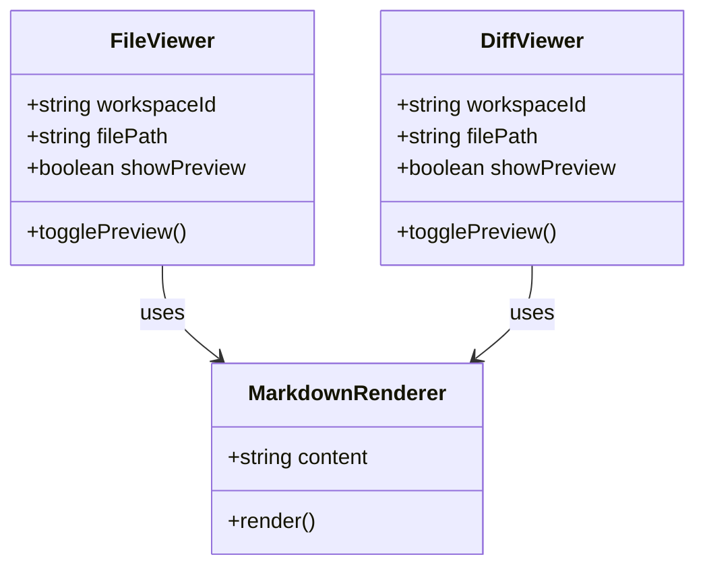
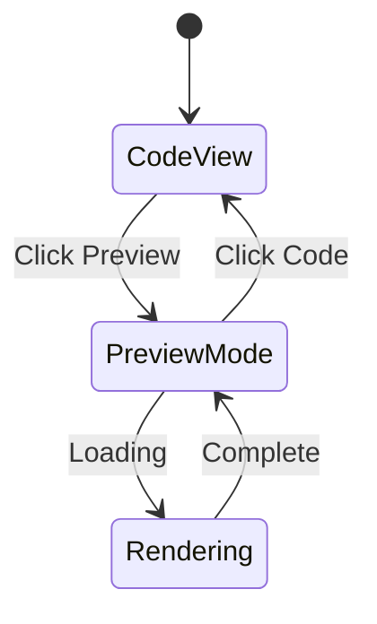

# Markdown Preview Test

This file demonstrates the new markdown preview feature with Mermaid support!

## Features

- **GitHub Flavored Markdown** support
- **Mermaid diagram** rendering
- **Code highlighting** in markdown
- **Tables**, **lists**, and more

## Example Code Block

```typescript
function greet(name: string): string {
  return `Hello, ${name}!`;
}

console.log(greet("World"));
```

## Example Table

| Feature | Status | Notes |
|---------|--------|-------|
| Markdown Preview | ✅ Done | Toggle between code and preview |
| Mermaid Support | ✅ Done | Renders diagrams inline |
| Files Tab | ✅ Works | Preview markdown in Files browser |
| Unstaged Tab | ✅ Works | Preview markdown in Unstaged changes |
| Diff vs Main | ✅ Works | Preview markdown in Diff vs Main |

## Example Mermaid Diagrams

### Flowchart



### Sequence Diagram



### Class Diagram



### State Diagram



## Lists

### Unordered List
- Item 1
- Item 2
  - Nested item 2.1
  - Nested item 2.2
- Item 3

### Ordered List
1. First item
2. Second item
3. Third item

## Links

Check out the [Factory Factory repo](https://github.com/purplefish-ai/factory-factory) for more info!

## Emphasis

**Bold text** and *italic text* and ***bold italic text***

## Blockquotes

> This is a blockquote.
> It can span multiple lines.
>
> And have multiple paragraphs.

## Horizontal Rule

---

## Task Lists

- [x] Implement markdown preview
- [x] Add Mermaid support
- [x] Test with various markdown features
- [ ] Get user feedback
