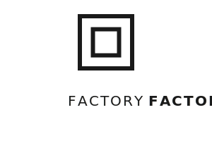
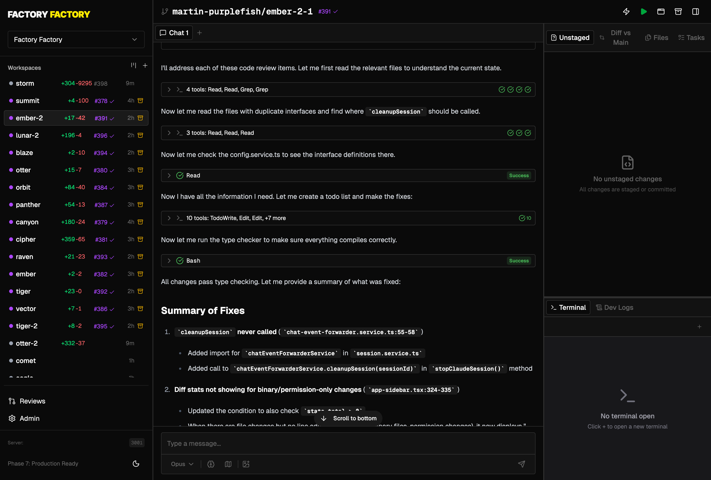

<p align="center">
  
</p>

<p align="center">
  <strong>Run multiple Claude Code sessions in parallel with isolated git worktrees.</strong>
</p>

<p align="center">
  Work on multiple features simultaneously, each in its own branch. Let AI agents progress PRs automatically.
</p>

<p align="center">
  <a href="https://www.npmjs.com/package/factory-factory"></a>
  <a href="https://github.com/purplefish-ai/factory-factory/actions/workflows/ci.yml"></a>
  <a href="https://github.com/purplefish-ai/factory-factory/blob/main/LICENSE"></a>
  <a href="https://factoryfactory.ai"></a>
</p>

<p align="center">
  
</p>

---

## Table of Contents

- [Installation](#installation)
- [Running](#running)
- [Quick Start](#quick-start)
- [CLI Reference](#cli-reference)
- [Architecture](#architecture)
- [Feature Highlights](#feature-highlights)
  - [Ratchet (Automatic PR Progression)](#-ratchet-automatic-pr-progression)
  - [GitHub Integration](#-github-integration)
  - [Kanban Board](#-kanban-board)
  - [Quick Actions](#-quick-actions)
- [Development](#development)
- [Desktop App (Electron)](#desktop-app-electron)
- [Security Considerations](#security-considerations)
- [Troubleshooting](#troubleshooting)
- [Acknowledgements](#acknowledgements)

---

## Installation

**Prerequisites:**
- Node.js 18+
- GitHub CLI (`gh`) - authenticated
- Claude Code - authenticated via `claude login`

### Option 1: Run with npx (Recommended)

No installation needed! Run Factory Factory directly:

```bash
npx factory-factory@latest serve
```

### Option 2: Install globally

```bash
npm install -g factory-factory
ff serve
```

### Option 3: Install from source (for development)

```bash
git clone https://github.com/purplefish-ai/factory-factory.git
cd factory-factory
pnpm install
pnpm link --global
```

## Running

### Web App

```bash
# Using npx (no install required)
npx factory-factory@latest serve

# Using installed CLI
ff serve

# Development mode with hot reload
ff serve --dev
# or with pnpm (for local development)
pnpm dev
```

The server automatically:
- Creates the data directory (`~/factory-factory/`)
- Runs database migrations
- Finds available ports if defaults are in use
- Opens your browser when ready

### Desktop App (Electron)

```bash
# Development with hot reload
pnpm dev:electron

# Build distributable
pnpm build:electron
```

The Electron app stores data in the standard location for your OS:
- **macOS:** `~/Library/Application Support/Factory Factory/`
- **Windows:** `%APPDATA%/Factory Factory/`
- **Linux:** `~/.config/Factory Factory/`

## CLI Reference

```bash
# Start the server
ff serve [options]
# or
npx factory-factory@latest serve [options]

Options:
  -p, --port <port>           Frontend port (default: 3000)
  --backend-port <port>       Backend port (default: 3001)
  -d, --database-path <path>  SQLite database path (default: ~/factory-factory/data.db)
  --host <host>               Host to bind to (default: localhost)
  --dev                       Development mode with hot reloading
  --no-open                   Don't open browser automatically
  -v, --verbose               Enable verbose logging
```

**Other CLI commands:**
```bash
ff build        # Build for production
ff db:migrate   # Run database migrations
ff db:studio    # Open Prisma Studio
```

**Examples:**
```bash
# Quick start with npx
npx factory-factory@latest serve

# Development mode with custom port
ff serve --dev --port 8080

# Production mode without auto-opening browser
ff serve --no-open

# Custom database location
ff serve --database-path /path/to/data.db
```

## Quick Start

1. **Authenticate required tools:**
   ```bash
   gh auth login        # GitHub CLI
   claude login         # Claude Code
   ```

2. **Run Factory Factory:**
   ```bash
   npx factory-factory@latest serve
   ```

3. **Create your first workspace:**
   - Open the web UI (automatically opens at http://localhost:3000)
   - Configure your project with a local git repository
   - Click "New Workspace" to create your first isolated worktree
   - Start chatting with Claude Code!

## Development

### Development Commands

```bash
# Server
pnpm dev                     # Start dev server with hot reload
pnpm dev -- --no-open        # Without browser auto-open
pnpm dev -- --verbose        # With detailed logging
pnpm build                   # Build for production
pnpm start                   # Start production server

# Electron
pnpm dev:electron            # Start Electron with hot reload
pnpm build:electron          # Build distributable package

# Quality
pnpm test                    # Run tests
pnpm test:watch              # Run tests in watch mode
pnpm test:coverage           # Run tests with coverage
pnpm typecheck               # TypeScript checking
pnpm check:fix               # Lint + format with Biome

# Database
pnpm db:migrate              # Run migrations
pnpm db:studio               # Open Prisma Studio
pnpm db:generate             # Regenerate Prisma client

# Other
pnpm storybook               # Start Storybook for UI components
pnpm deps:check              # Check dependency rules
```

## Architecture

```
Project (repository configuration)
    └── Workspace (isolated git worktree)
            ├── Session (Claude Code chat session)
            └── Terminal (PTY terminal)
```

**Key capabilities:**
- **Isolated workspaces:** Each workspace gets its own git worktree and branch for true parallel development
- **Real-time streaming:** WebSocket-based communication with Claude Code CLI
- **Persistent sessions:** Resume and review previous conversations
- **Terminal access:** Full PTY terminal per workspace
- **GitHub integration:** Import issues, track PR state, automatic PR progression via Ratchet
- **Kanban board:** Visual project management with GitHub issue intake

## Feature Highlights

### 🔄 Ratchet (Automatic PR Progression)

Ratchet automatically moves pull requests toward merge by monitoring and fixing issues.

- **Automatic monitoring:** Checks READY workspaces with open PRs every minute
- **Smart PR classification:** Tracks PR state as `CI_RUNNING`, `CI_FAILED`, `REVIEW_PENDING`, `READY`, or `MERGED`
- **Auto-fix agents:** Creates Claude sessions to automatically fix CI failures and address review comments
- **Conflict resolution:** Agents sync with main branch before applying fixes
- **Configurable behavior:** Control CI fixes, review fixes, allowed reviewers, and auto-merge in Admin → Ratchet

### 🔗 GitHub Integration

Seamless integration with GitHub via the authenticated `gh` CLI.

- **Issue import:** Start workspaces directly from GitHub issues with one-click import
- **PR tracking:** Automatic PR state monitoring and status updates
- **Linked workspaces:** Issues are automatically linked to their workspaces (prevents duplicates)
- **Kanban intake:** GitHub Issues column shows issues assigned to `@me` for easy triage

### 📋 Kanban Board

Real-time visual project management with automatic column placement.

- **Smart columns:** GitHub Issues → Working → Waiting → Done
- **Auto-categorization:**
  - **Working:** Provisioning, new, failed, or actively running sessions
  - **Waiting:** Idle workspaces that have completed at least one session
  - **Done:** Workspaces with merged PRs
- **Live updates:** Real-time workspace status and PR state changes
- **Mobile responsive:** Full touch support for drag-and-drop on mobile devices

### ⚡ Quick Actions

One-click prompts for common workflows, fully customizable via markdown.

- **Agent-driven:** Each action creates a new Claude session with a predefined prompt
- **Extensible:** Add custom actions by creating markdown files in `prompts/quick-actions/`
- **Built-in actions:** Review code, simplify implementations, sync with main, rename branches, and more

## Security Considerations

> **⚠️ Important:** Factory Factory runs Claude Code with automatic command execution enabled by default. Claude can execute bash commands, write and modify files, and perform operations without manual confirmation.

This design enables seamless parallel workflows, but you should understand:

- **Workspace isolation:** Each workspace operates in its own git worktree with a dedicated branch
- **Filesystem access:** Claude has full access to files within each workspace
- **Automatic execution:** Commands run without approval prompts for uninterrupted operation
- **System-level access:** Isolation is at the git worktree level, not containerized

**Best practices:**
- ✅ Only use with repositories you trust
- ✅ Review changes carefully before merging PRs
- ✅ Keep your GitHub authentication secure
- ✅ Monitor Ratchet auto-fix behavior in Admin settings
- ✅ Consider running in a VM or container for untrusted code

## Brand

| Color | Hex | Usage |
|-------|-----|-------|
| Factory Yellow | `#FFE500` | Primary accent |
| White | `#FAFAFA` | Light backgrounds |
| Black | `#0A0A0A` | Dark backgrounds |

**Typography:**
- **Inter Black** - Headlines and logotype
- **IBM Plex Mono SemiBold** - Code and app icon

## Troubleshooting

### Authentication Issues

**GitHub CLI not authenticated:**
```bash
gh auth status          # Check authentication status
gh auth login           # Login to GitHub
```

**Claude Code not authenticated:**
```bash
claude login            # Authenticate Claude Code CLI
claude --version        # Verify installation
```

### Database Issues

**Migration failures or corrupt database:**
```bash
# Run migrations manually
ff db:migrate

# Reset database (⚠️ destroys all data)
pnpm exec prisma migrate reset

# View database in Prisma Studio
ff db:studio
```

### Port Conflicts

The server automatically finds available ports if defaults are in use. Use `--verbose` to see which ports are selected:

```bash
ff serve --verbose
```

Or specify custom ports:
```bash
ff serve --port 8080 --backend-port 8081
```

### Common Issues

**"Command not found: ff"**
- Install globally: `npm install -g factory-factory`
- Or use npx: `npx factory-factory@latest serve`

**Workspace stuck in "Provisioning" state:**
- Check logs in the Terminal tab
- Ensure git worktree creation succeeded
- Verify repository has no uncommitted changes

**Claude not responding:**
- Verify Claude Code is installed and authenticated
- Check that `claude` command works in your terminal
- Review session logs for error messages

**PR state not updating:**
- Ensure GitHub CLI is authenticated: `gh auth status`
- Manually refresh using the Refresh button in Kanban view
- Check that repository has correct GitHub remote configured

## Acknowledgements

This project was inspired by:

- [Conductor](https://conductor.build) - Mac app for running coding agents in parallel
- [VibeKanban](https://vibekanban.com) - Visual kanban for AI-assisted development
- [Gastown](https://github.com/steveyegge/gastown) - Steve Yegge's multi-agent coding environment
- [Multiclaude](https://github.com/dlorenc/multiclaude) - Dan Lorenc's parallel Claude sessions tool

## License

MIT
