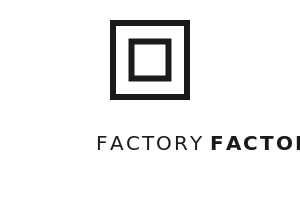
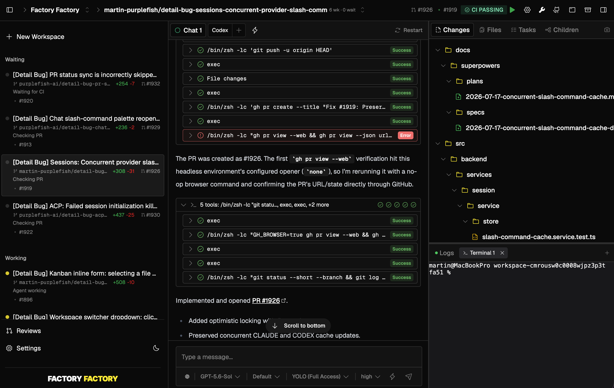

<p align="center">
  
</p>

<p align="center">
  <strong>Run Claude Code and Codex in parallel, each in an isolated git workspace.</strong>
</p>

<p align="center">
  Turn issues into branches, steer multiple agents, review changes, and keep pull requests moving from one local command center.
</p>

<p align="center">
  <a href="https://www.npmjs.com/package/factory-factory"></a>
  <a href="https://github.com/purplefish-ai/factory-factory/actions/workflows/ci.yml"></a>
  <a href="https://github.com/purplefish-ai/factory-factory/blob/main/LICENSE"></a>
  <a href="https://factoryfactory.ai"></a>
</p>

<p align="center">
  
</p>

Factory Factory is a local workspace manager for AI coding agents. Every workspace gets its own git worktree and branch, so agents can work on separate tasks without stepping on each other. The UI brings chat, diffs, files, terminals, issues, and pull request status together in one place.

## Quick start

You will need:

- Node.js 20.19+, 22.12+, or 24+
- A local git repository
- At least one agent provider:
  - Claude Code, authenticated with `claude login`
  - A ChatGPT/Codex account configured for Codex sessions
- The authenticated [GitHub CLI](https://cli.github.com/) for GitHub issues and pull requests

Start Factory Factory without installing it:

```bash
npx factory-factory@latest serve
```

Factory Factory opens in your browser and stores its database in `~/factory-factory/` by default.

Then:

1. Add a project by selecting a local git repository.
2. Create a workspace, or start one from a GitHub or Linear issue.
3. Choose Claude or Codex and start a session.
4. Review the agent's changes, use the integrated terminal when needed, and open a pull request.

## What it does

- **Parallel, isolated work:** Each task runs in a dedicated worktree and branch while your main checkout stays untouched.
- **One workspace for the whole task:** Chat with agents, inspect files and diffs, run commands, and track PR state without switching tools.
- **Claude and Codex sessions:** Factory Factory connects to both providers through the Agent Client Protocol (ACP), with resumable sessions and runtime model options.
- **Issue-to-PR workflow:** Pull assigned work from GitHub or Linear, link it to a workspace, and follow it through to merge.
- **Automatic PR progression:** Ratchet watches open pull requests and can dispatch follow-up agents for failing CI and actionable review feedback.
- **Repeatable automation:** Quick actions, periodic tasks, and child workspaces help split up or repeat common workflows.

The core model is intentionally small:

```text
Project (a local git repository)
└── Workspace (an isolated worktree and branch)
    ├── Agent sessions (Claude or Codex over ACP)
    └── Terminal, files, changes, and pull request state
```

## Install and run

For regular use, install the CLI globally:

```bash
npm install -g factory-factory
ff serve
```

Useful commands:

```bash
ff serve --help     # Ports, database path, host, and other options
ff proxy --private  # Share the app through a password-protected Cloudflare tunnel
ff db:studio        # Inspect the local database with Prisma Studio
```

`ff proxy` requires `cloudflared` on your `PATH`. Factory Factory automatically runs database migrations, finds an available port, and opens the browser when the server is ready.

### Hosting behind your own reverse proxy

To serve Factory Factory from your own domain (e.g. `https://ff.example.com`) via nginx, Caddy, or another reverse proxy:

- Set `CORS_ALLOWED_ORIGINS` to the exact public origin(s), comma-separated: `CORS_ALLOWED_ORIGINS=https://ff.example.com`. This gates both HTTP CORS and WebSocket upgrades; non-loopback origins must match exactly (scheme + host + non-default port, no trailing slash).
- Keep `BACKEND_HOST` bound to `localhost`/`127.0.0.1` so only your proxy can reach the server.

By default the server rejects WebSocket upgrades that carry client-address headers (`x-forwarded-for`, `cf-connecting-ip`, etc.), because it expects to sit behind an authenticated proxy that strips them. If your reverse proxy adds these headers, either strip them before forwarding, or set `TRUST_PROXY_HEADERS=true` to accept them. **Only enable `TRUST_PROXY_HEADERS` when the backend is reachable solely through your trusted proxy** (i.e. bound to loopback) — otherwise clients could spoof address headers. The remote-address trust check (loopback / `TRUSTED_LOCAL_CIDRS`) still applies.

## Security

> [!WARNING]
> Factory Factory runs coding agents that can execute commands and modify files without manual confirmation. Workspaces isolate git branches; they are not containers or security sandboxes.

Use Factory Factory only with repositories and agent instructions you trust. Review changes before merging, protect your GitHub and Linear credentials, and consider a VM or container when working with untrusted code.

## Development

```bash
git clone https://github.com/purplefish-ai/factory-factory.git
cd factory-factory
pnpm install
pnpm dev
```

Before opening a pull request, run the standard checks:

```bash
pnpm test
pnpm typecheck
pnpm check
```

See [CONTRIBUTING.md](CONTRIBUTING.md) for project structure, conventions, and the full contributor workflow.

## Acknowledgements

Factory Factory was inspired by [Conductor](https://conductor.build), [VibeKanban](https://vibekanban.com), [Gastown](https://github.com/steveyegge/gastown), and [Multiclaude](https://github.com/dlorenc/multiclaude).

## License

[MIT](LICENSE)
