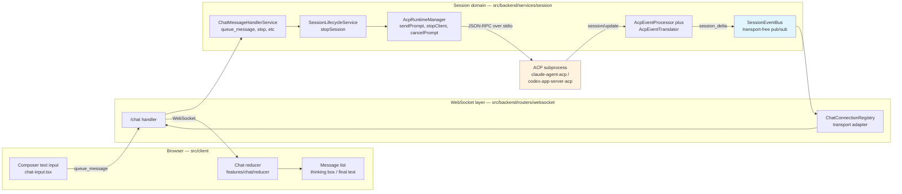
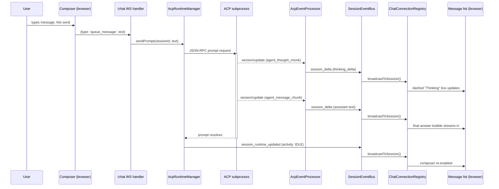
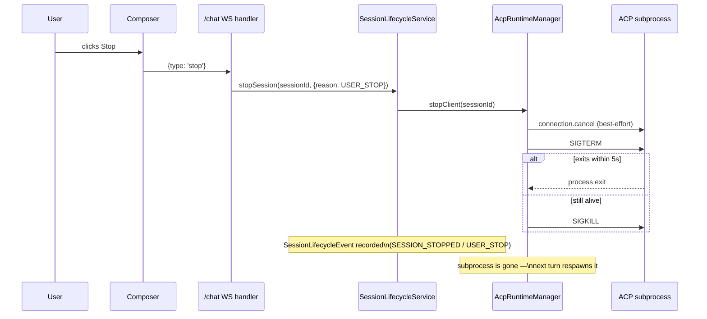
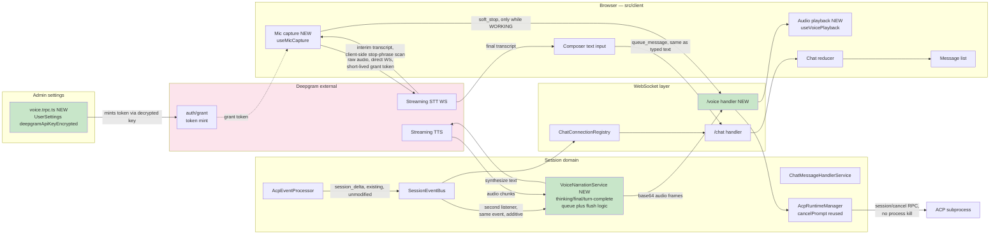
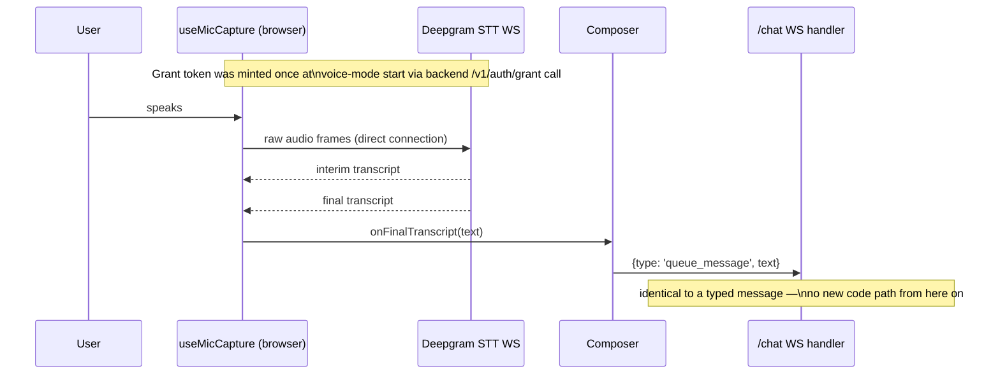
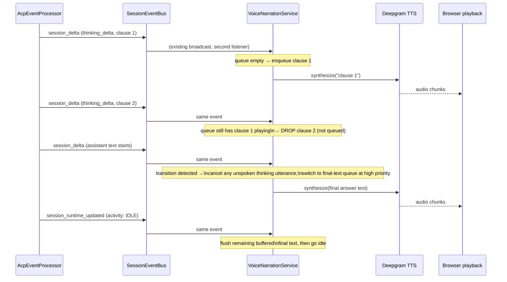
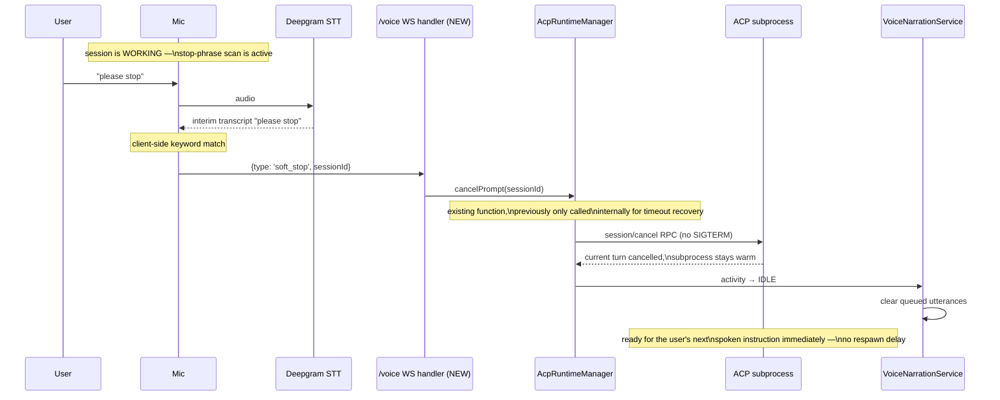

# Real-Time Voice Mode — Design Doc

## Executive Summary

**Goal:** Let a user work with the Claude/Codex agent harness in a workspace entirely by voice — speak instructions, hear the agent's final answers spoken back, hear a sampling of its live reasoning while it's still working, and interrupt it mid-turn by saying "please stop."

**Key finding that shapes this design:** the agent harness itself does not need to change. The ACP event stream the backend already receives from Claude/Codex sessions structurally distinguishes reasoning (`agent_thought_chunk`) from final reply text (`agent_message_chunk`), and separately publishes a turn-completion signal (`SessionRuntimeState.activity: WORKING → IDLE`) independent of that content. Voice mode is built as a new consumer of data that already exists, not a fork of the agent loop.

**BYOK:** users bring their own Deepgram API key, entered once in an admin settings tab, encrypted at rest with the same `CryptoService` (AES-256-GCM) already used for the Linear integration's API key.

**Scope of change to the existing system:** additive. The existing text chat pipeline, the existing hard `stop` control, and the existing ACP event emission are all unmodified. Voice mode taps in as a second WebSocket endpoint and a second listener on the existing internal event bus — see [§5](#5-what-changes-in-the-existing-system) for the precise list.

---

## 1. Current System

### 1.1 Component overview



### 1.2 Sequence: a normal text turn today



### 1.3 Sequence: stopping a turn today (unchanged by this design)



This is a full teardown: it always kills the ACP subprocess. It's the right tool for "I'm done, stop entirely," and it stays exactly as-is. It is the wrong tool for a mid-conversation "please stop" in voice mode, which is why §2 introduces a second, lighter path.

---

## 2. Proposed System

### 2.1 Component overview (additions in bold outline)



### 2.2 Sequence: voice input reaching the agent (STT)



### 2.3 Sequence: selective narration (thinking vs. conclusion)

This is the core new logic. It runs entirely downstream of the existing `AcpEventProcessor` output — no change to how those deltas are produced.



### 2.4 Sequence: "please stop" (new soft-stop path, hard stop untouched)



---

## 3. Data Model Changes

```prisma
model UserSettings {
  // ...existing fields, unchanged...
  voiceModeEnabled          Boolean  @default(false)   // NEW — admin toggle
  deepgramApiKeyEncrypted   String?                     // NEW — AES-256-GCM, same scheme as Linear's key
}
```

`SessionLifecycleEventReason` gains one new enum member (`VOICE_INTERRUPT`, alongside the existing `USER_STOP` / `PROMPT_TIMEOUT` / etc.) so a voice-triggered cancel is attributable in history, distinct from a typed "please stop" via the hard stop button. Purely additive — no existing reason changes meaning.

---

## 4. New Components Inventory

```
Backend:
├── src/backend/services/settings/  (extend UserSettings accessor/service)
├── src/backend/trpc/voice.trpc.ts                              (NEW)
│     getConfig / updateConfig / mintGrantToken
├── src/backend/routers/websocket/voice.handler.ts               (NEW)
│     dedicated /voice?sessionId= endpoint
├── src/backend/services/session/service/voice/
│     voice-narration.service.ts                                 (NEW)
│         subscribes to SessionEventBus, clause/queue/flush state machine
│     deepgram-tts-client.ts                                     (NEW)
│         thin wrapper around Deepgram's TTS API
└── src/backend/services/session/service/lifecycle/
      acp-runtime-manager.ts (MODIFY — new caller of existing cancelPrompt,
                               no change to cancelPrompt itself)

Frontend:
├── src/client/routes/admin/VoiceModeSection.tsx                 (NEW)
├── src/client/features/voice/                                   (NEW feature)
│     use-mic-capture.ts       (MediaRecorder → direct Deepgram STT WS)
│     use-voice-playback.ts    (queued Web Audio API playback)
│     use-barge-in.ts          (VAD-based playback pause)
│     voice-mode-toggle.tsx
└── src/shared/chat-capabilities.ts (MODIFY — add voiceInput.enabled flag)
```

---

## 5. What Changes in the Existing System

This is the direct answer to "what changes to the regular logical flows that already exist":

| Existing flow | Change |
|---|---|
| Typed message → `queue_message` → ACP prompt execution | **None.** Voice input produces text that enters at the exact same `queue_message` call the composer already makes. |
| ACP event translation (`AcpEventTranslator`, `AcpEventProcessor`) | **None.** Same events, same shapes, same flush timing. |
| `SessionEventBus` → `ChatConnectionRegistry` → chat WebSocket → reducer → UI rendering | **None.** Existing broadcast is untouched. Voice mode adds a second, independent listener on the same bus (`VoiceNarrationService`) — this is additive by construction, since `SessionEventBus` is already a plain `EventEmitter` that supports multiple subscribers. |
| Hard `stop` (WS `{type: 'stop'}` → `SessionLifecycleService.stopSession` → SIGTERM/SIGKILL) | **None.** Stays the sole path for "stop and don't resume this turn," used identically by typed and voice UIs alike when the user hits the Stop button. |
| `AcpRuntimeManager.cancelPrompt` | **Reused, not modified.** Previously called only internally for prompt-timeout recovery; voice interrupt becomes a second caller. Its behavior (ACP-level cancel, no process kill, orphaned tool calls finalized) is exactly what was already built for a different reason — we're not adding new cancellation semantics, just a new trigger. |
| `SessionRuntimeState.activity` (WORKING/IDLE) and `session_runtime_updated` | **None.** Read by the new narrator service as an additional consumer; not modified or delayed by that read. |
| `UserSettings` schema / admin settings service | **Additive migration only** (two new nullable/defaulted columns). No existing field changes shape or meaning. |
| `ChatBarCapabilities` | **Additive flag** (`voiceInput.enabled`), following the exact pattern already used for `thinking.enabled`, `attachments.enabled`, etc. When false (default), composer rendering is pixel-identical to today. |
| WebSocket upgrade dispatcher (`server.ts`) | **Additive route registration** (`/voice` added to the existing path→handler map alongside `/chat`, `/terminal`, `/snapshots`). Existing routes untouched. |
| `SessionLifecycleEventReason` enum | **Additive member** (`VOICE_INTERRUPT`). Existing reasons unchanged. |

Net effect: a user who never enables voice mode should see **zero behavioral difference** anywhere in the app — every touch point above is either a new listener, a new route, or a new enum value, none of which affect the path when voice mode is off.

---

## 6. Implementation Plan (phased)

Each phase validates one architectural bet independently before building on it.

### Phase 0 — Admin settings & BYOK plumbing
- `UserSettings` migration, `voice.trpc.ts` (`getConfig`/`updateConfig`), `VoiceModeSection.tsx` admin tab.
- Validate the key with a lightweight Deepgram call before saving (mirrors `IssueTrackingSection`'s "validate then save" UX).
- No audio yet. **Exit criteria:** key round-trips encrypted, `hasApiKey` reflects state correctly, feature stays fully hidden until enabled.

### Phase 1 — Speech-to-text in (push-to-talk)
- `mintGrantToken` endpoint (backend calls Deepgram `/v1/auth/grant` with the decrypted key, TTL tuned to session length, refreshed before expiry).
- `useMicCapture` hook: push-to-talk button, direct browser→Deepgram STT WebSocket, final transcript fed into the existing composer send path.
- No TTS, no interrupt. **Exit criteria:** a spoken instruction reaches the agent and gets a normal typed-style response; validates the direct-to-Deepgram browser flow and token minting end-to-end.

### Phase 2 — Text-to-speech out (final answers only)
- `/voice` WS handler, `VoiceNarrationService` skeleton that only speaks the accumulated final-answer text, triggered off `activity: WORKING → IDLE`.
- `useVoicePlayback` queued audio playback.
- No thinking narration yet — every final answer is read in full, once complete. **Exit criteria:** validates backend TTS synthesis, audio delivery framing (base64-over-JSON on `/voice`), and playback latency budget.

### Phase 3 — Selective thinking narration
- Implement the clause-buffer / drop-on-backlog / flush-on-transition state machine from §2.3.
- This phase is mostly UX tuning (clause boundary heuristics, cooldown between spoken thinking snippets) once the mechanism is in place. **Exit criteria:** user reports voice mode "feels like listening to a colleague think out loud," not a monologue or a wall of silence.

### Phase 4 — Voice interrupt & barge-in
- `soft_stop` WS message + handler wired to `cancelPrompt`, gated to only scan for stop-phrases while `WORKING`.
- Client-side VAD for barge-in (pause/duck TTS playback the instant the user starts speaking).
- New `SessionLifecycleEventReason.VOICE_INTERRUPT`. **Exit criteria:** "please stop" reliably cancels the in-flight turn without killing the subprocess, and doesn't false-positive during normal dictation while idle.

---

## 7. Risks & Open Questions

1. **Latency stacking** across mic → STT → transcript → ACP → first token → narration decision → TTS → playback needs real measurement; each hop is individually cheap but they're serial for the first utterance of a turn.
2. **Clause segmentation is a tuning problem**, not an architecture problem — expect iteration in Phase 3.
3. **`cancelPrompt`'s only production caller today is internal timeout recovery**; voice interrupt is its first user-initiated caller. Verify `finalizeOrphanedToolCalls` and downstream `SessionLifecycleEvent` recording behave correctly for the new reason, not just `PROMPT_TIMEOUT`.
4. **Audio backpressure policy**: the existing `sendStreamOutput` helper silently drops frames above a buffered-bytes threshold, which is fine for terminal text but produces an audible glitch for dropped audio. Needs its own policy, not a reuse of the lossy default as-is.
5. **Deepgram TTS WebSocket framing specifics** (Flush/Clear control messages, codec choice) need a focused doc read during Phase 2 implementation — not confirmed in this design pass.

### 7.1 Conditions for "zero impact on existing users" to actually hold

§5 argues every change is additive at the architecture level. That's true of the diagrams, but three implementation choices determine whether it's true in practice:

- **`VoiceNarrationService`'s listener on `SessionEventBus` must fail closed.** The bus is a plain `EventEmitter`; listeners on the same event fire synchronously in registration order, so an uncaught exception in the narrator's handler can propagate up through the `.emit()` call and disrupt delivery to `ChatConnectionRegistry` — the path every session, voice or not, depends on. The handler must be wrapped so a bug in new code cannot affect existing chat delivery.
- **The listener must no-op in O(1) for non-voice sessions**, and that check must be the first thing it does. Otherwise every session pays a small constant tax on every delta forever, whether or not voice mode is ever touched — a real if small performance regression for the entire existing user base, not a behavioral one.
- **`cancelPrompt` needs test coverage for its new caller.** The function itself doesn't change, but it's only been exercised via one internal trigger (timeout recovery) so far; a user-initiated call may hit it at different points in the turn lifecycle than a timeout ever would. "It's reused, so it's safe" isn't sufficient — it needs to be verified in the new context before shipping Phase 4.

---

## 8. Detailed Phase Scoping

Confirmed against Deepgram's current API docs and this repo's exact boilerplate. Each phase below is independently shippable and gates the next.

**Deepgram contracts confirmed for this scoping pass:**

- **STT**: `wss://api.deepgram.com/v1/listen` — query params `model`, `language`, `encoding`, `sample_rate`, `channels`, `interim_results`, `endpointing`, `utterance_end_ms`, `vad_events`, `smart_format`. Server sends `Results` (`is_final`/`speech_final`), `UtteranceEnd`, `SpeechStarted`, `Metadata`. Client ends the stream with `{type: "CloseStream"}`.
- **TTS**: `wss://api.deepgram.com/v1/speak` — query params `model` (voice, e.g. `aura-2-*`), `encoding` (`linear16`/`mulaw`/`alaw`), `sample_rate`, `speed`. Client sends `{type:"Speak", text}`, `{type:"Flush"}` (synthesize what's buffered now), `{type:"Clear"}` (discard buffered/in-flight audio — this is the built-in "user interrupted the agent" primitive), `{type:"Close"}`. Server streams raw binary audio frames back (no JSON wrapper), plus `Metadata`/`Flushed`/`Cleared`/`Warning` JSON control messages.
- **Browser auth** (native `WebSocket` can't set custom headers): pass the short-lived grant token via the `access_token` query parameter — `wss://api.deepgram.com/v1/listen?...&access_token=<jwt>`. Minted server-side via `POST https://api.deepgram.com/v1/auth/grant` with `Authorization: Token <decrypted long-lived key>`, optional `ttl_seconds` (default 30s, max 3600s).
- **This repo's WS registration boilerplate** is a one-line addition: `server.ts` builds each handler via `create<X>UpgradeHandler(application)` and adds it to a `Map<string, Handler>` (`server.ts:107-116`) that a single `server.on('upgrade', ...)` dispatcher reads by pathname (`server.ts:363-384`). A `/voice` route is exactly this pattern — no change to existing entries.
- **`stop` lives in the same discriminated union as every other chat control message** (`ChatMessageSchema`, `src/shared/websocket/chat-message.schema.ts:36-112`). Giving voice its own `voice-message.schema.ts` and its own `/voice` connection means the existing chat schema and its handlers gain zero new variants — an even cleaner separation than implied earlier.

### Phase 0 — Admin settings & BYOK plumbing

**Goal:** an encrypted Deepgram key and an enabled toggle exist and round-trip correctly. No audio.

**Tasks:**
- `prisma/schema.prisma`: add `voiceModeEnabled Boolean @default(false)` and `deepgramApiKeyEncrypted String?` to `UserSettings`; `pnpm db:migrate`.
- `src/backend/trpc/voice.trpc.ts` (NEW), mirroring `linear.trpc.ts`'s shape exactly:
  - `getConfig` query → `{ enabled, hasApiKey }`, never plaintext (mirrors `PublicLinearConfigSchema`'s stripping pattern).
  - `updateConfig` mutation → input `{ enabled, apiKey? }`; encrypts via `cryptoService.encrypt()` before persisting only when a new `apiKey` is supplied (mirrors `project.trpc.ts:352-361`); omitted `apiKey` leaves the stored value untouched.
  - `validateApiKey` mutation → a cheap authenticated Deepgram call (e.g. `GET /v1/projects`) before the user is allowed to save, mirroring `linear.validateKeyAndListTeams`.
- `src/backend/trpc/index.ts`: mount `voice: voiceRouter`.
- `src/client/routes/admin-page.tsx` + `src/client/routes/admin/VoiceModeSection.tsx` (NEW): new "Voice" tab, local never-prefilled `apiKey` state, validate-then-save flow — mirrors `IssueTrackingSection.tsx`'s `LinearConfigFields`.

**Decisions needed:** none blocking — this phase is a mechanical repeat of an existing pattern.

**Acceptance criteria:** key round-trips through encrypt/decrypt; `trpc.voice.getConfig` payload contains no plaintext key (verify in devtools network tab); toggling `enabled` off is observable by every later phase's capability check.

### Phase 1 — Speech-to-text in (push-to-talk)

**Goal:** a spoken instruction reaches the agent as a normal message. No TTS, no interrupt.

**Tasks:**
- `voice.trpc.ts`: add `mintGrantToken` mutation — calls Deepgram's `/v1/auth/grant` with the decrypted key, returns `{ accessToken, expiresAt }`. Never exposes the long-lived key.
- `src/client/features/voice/use-mic-capture.ts` (NEW): `getUserMedia` → capture → `new WebSocket('wss://api.deepgram.com/v1/listen?...&access_token=' + token)` with `model=nova-3`, `encoding=linear16`, `sample_rate=16000`, `interim_results=true`, `smart_format=true`, `vad_events=true`. Final `Results` → `onFinalTranscript(text)`; interim `Results` → `onInterimTranscript(text)` (unused until Phase 4). Mic release sends `{type:'CloseStream'}`.
- `onFinalTranscript` feeds into the **exact same** send path the composer already uses for typed text (`use-chat-actions.ts`) — zero new code on the send side.
- `src/shared/chat-capabilities.ts`: add `voiceInput.enabled`, computed from `voiceModeEnabled && hasApiKey`.
- `src/client/features/voice/voice-mode-toggle.tsx` (NEW): push-to-talk control, gated by that flag.

**Decisions needed:**
- **Audio capture method.** `MediaRecorder` (`audio/webm;codecs=opus`) is less code but batches on a timeslice and needs an opus-aware Deepgram encoding; an `AudioWorkletNode` streaming raw 16kHz PCM is lower-latency and matches Deepgram's preferred `linear16` directly, at the cost of a worklet processor script. Recommend the worklet given voice mode's whole value proposition is feeling like a live conversation — latency is the product here.
- **Token refresh strategy.** Deepgram confirms a connection stays authenticated past token expiry once the handshake succeeds, so a single voice-mode session only needs a fresh token on reconnect, not on a timer. Simplest correct approach: mint once per connection attempt.

**Acceptance criteria:** a spoken sentence produces a `queue_message` with the correct transcript and gets a normal agent response, indistinguishable from typing it.

### Phase 2 — Text-to-speech out (final answers only)

**Goal:** the completed final answer is spoken once per turn.

**Tasks:**
- `src/shared/websocket/voice-message.schema.ts` (NEW): separate discriminated union from `ChatMessageSchema` — `{type:'audio_chunk', data, seq}` (server→client), plus scaffolding for `{type:'soft_stop'}` (built in Phase 4).
- `src/backend/routers/websocket/voice.handler.ts` (NEW): `createVoiceUpgradeHandler(application)` built with `createWebSocketUpgradeHandler({ connectionName: 'voice', requiredParams: ['sessionId'], ... })`, mirroring `chat.handler.ts`/`snapshots.handler.ts`.
- `src/backend/server.ts`: one new map entry, `['/voice', voiceUpgradeHandler]` — the entire footprint on this file.
- `src/backend/services/session/service/voice/voice-narration.service.ts` (NEW, minimal for this phase): tracks active voice sessions in a `Map`; listener on `sessionEventBus` checks that map first (O(1) no-op, per §7.1) before doing anything else; on `activity: IDLE`, opens/reuses a Deepgram TTS socket, sends `{type:'Speak', text: <accumulated final answer>}` then `{type:'Flush'}`; forwards binary audio frames back to the browser as base64-wrapped `audio_chunk` messages.
- `src/client/features/voice/use-voice-playback.ts` (NEW): decodes base64 → raw PCM, manually builds `AudioBuffer`s for scheduled playback (Deepgram's `linear16` output is headerless PCM, not a container format, so `decodeAudioData` doesn't apply — this is real client-side work, not just "play the blob").

**Decisions needed:** none blocking; base64-over-JSON framing choice from the original design is reconfirmed reasonable — Deepgram's raw PCM at 24kHz is ~48KB/s, ~64KB/s after base64 inflation, trivial for a local WebSocket.

**Acceptance criteria:** every completed turn is audibly spoken once; turn-complete-to-first-audio latency is measured and recorded as a baseline for Phase 3/4 tuning.

### Phase 3 — Selective thinking narration

**Goal:** implement the clause-buffer / drop-on-backlog / flush-on-transition state machine from §2.3.

**Tasks:**
- Extend `voice-narration.service.ts` to also read `session_delta` thinking/assistant content, using the same block-boundary signal `AcpEventProcessor` already computes (read-only reuse, no changes to that file).
- Clause segmentation: flush a clause on sentence-ending punctuation or a max-length fallback so an unpunctuated thought can't buffer forever.
- Enqueue a thinking clause for synthesis only when the session's utterance queue is empty; otherwise drop it.
- On detecting the thinking→assistant transition: send `{type:'Clear'}` to the Deepgram TTS socket to cut off any in-flight thinking narration (this is literally the same primitive Deepgram's own docs describe for a human interrupting a TTS agent — repurposed here for the agent's own thinking-to-conclusion transition), then switch to buffering final-answer text.
- On turn-complete: flush remaining final text.
- Tunable constants (hardcoded for v1, no admin UI): max/min clause length, cooldown between spoken clauses.

**Decisions needed:** none blocking — explicitly a tuning phase, expect iteration against real transcripts rather than getting it right on paper.

**Acceptance criteria:** during a multi-step turn, at most one thinking clause is ever "in flight"; the instant the final answer starts, in-progress thinking narration is audibly cut off in favor of it.

### Phase 4 — Voice interrupt & barge-in

**Goal:** "please stop" cancels the in-flight turn without killing the subprocess; the user speaking pauses playback.

**Tasks:**
- Implement the `soft_stop` handler (scaffolded in Phase 2's schema) on the `/voice` connection, mirroring `chat-message-handlers/handlers/stop.handler.ts`'s structure but calling `acpRuntimeManager.cancelPrompt(sessionId)` directly — bypassing `SessionLifecycleService.stopSession`'s teardown entirely.
- `src/shared/core/enums.ts`: add `VOICE_INTERRUPT` to `SessionLifecycleEventReason`; record it via `sessionLifecycleEventService.record()` alongside the cancel call.
- `use-mic-capture.ts`: while `sessionStatus.phase === 'running'`, scan interim transcripts for a small stop-phrase set; on match, send `{type:'soft_stop'}`.
- `src/client/features/voice/use-barge-in.ts` (NEW): simple RMS-energy voice-activity threshold on the mic stream (no VAD library needed at this scope) to detect the user starting to talk; on detection, immediately pause `use-voice-playback.ts` output.
- **New test coverage for `cancelPrompt`** (per §7.1 risk 3): exercise the voice-triggered call at multiple points in a turn (before any tool call, mid-tool-call, mid text stream) and confirm `finalizeOrphanedToolCalls` and lifecycle-event recording behave correctly — genuinely new coverage, since the only existing caller is timeout recovery.

**Decisions needed:**
- Stop-phrase matching: start with plain substring match on interim transcripts (cheapest, ships fastest); revisit only if false positives/negatives show up in real use.
- Barge-in sensitivity (RMS threshold, minimum sustained-speech duration) — expect iteration, same as Phase 3.

**Acceptance criteria:** "please stop" cancels generation within roughly one STT round-trip; the ACP subprocess is confirmed still alive afterward (no respawn); the next spoken instruction is picked up immediately with no restart delay.
