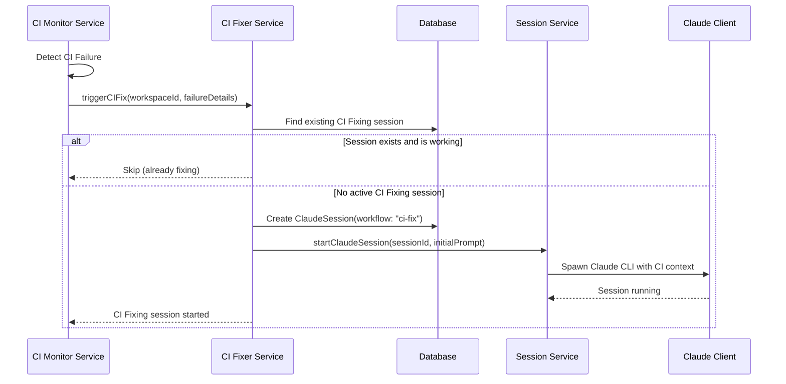
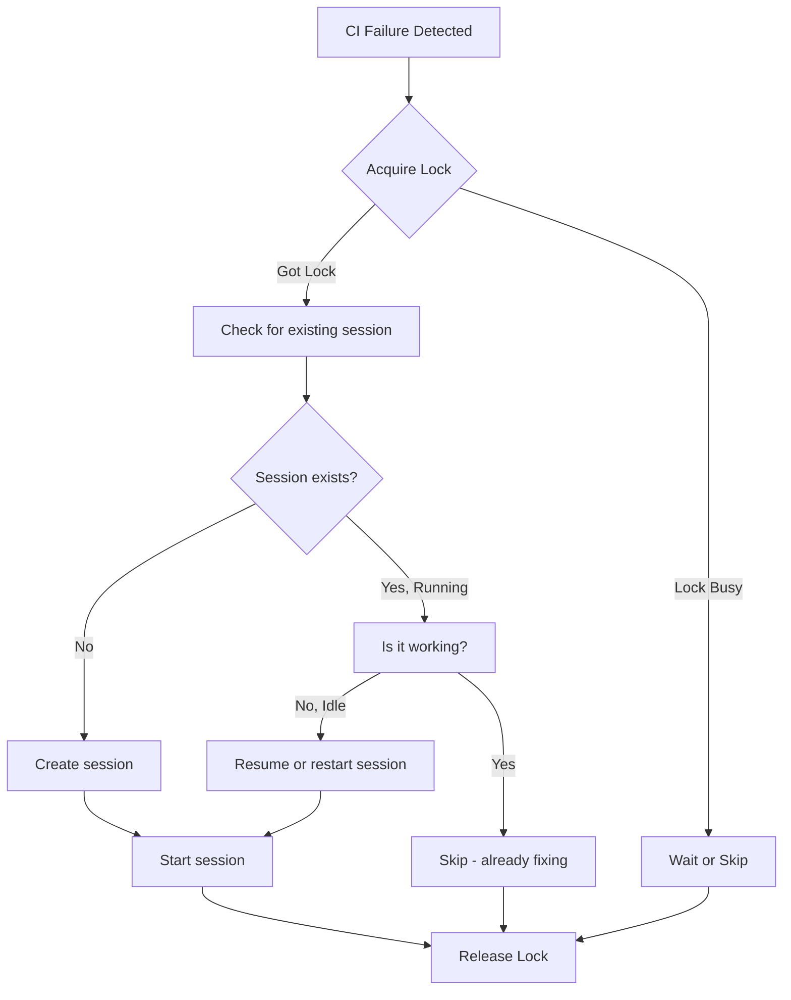
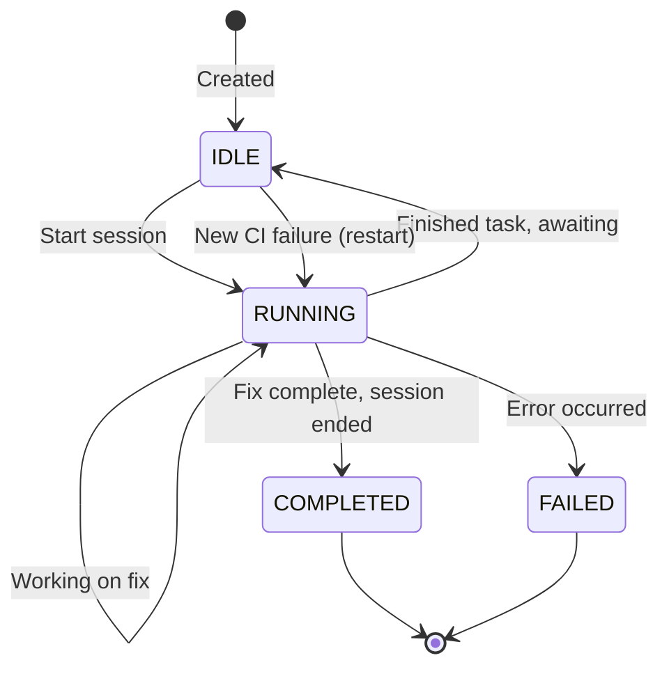

# CI Fixing System Design

## Overview

The CI Fixing System extends the existing CI Monitoring System to automatically create and manage dedicated Claude sessions that fix CI failures. When a workspace's PR fails CI, the system spawns a specialized "CI Fixing" session that investigates the failures and implements fixes.

**Related:** [CI Monitoring System Design](./ci-monitoring-system.md) - The monitoring infrastructure this feature builds upon.

## Requirements (from Issue #487)

1. When a workspace fails CI, create a new Claude session dedicated to fixing CI issues
2. Name the session "CI Fixing" for clear identification
3. Prevent duplicate concurrent CI fixing sessions - if a CI fixing session already exists and is actively working, do not create another

## Architecture

### Design Principles

1. **Single CI Fixer Per Workspace** - Only one CI Fixing session can be active at a time per workspace
2. **Non-Blocking** - The CI fixing session runs independently; it doesn't block other workspace sessions
3. **Idempotent** - Multiple CI failure detections should not spawn duplicate sessions
4. **Rich Context** - Pass detailed CI failure information to the fixing session

### High-Level Flow



## Data Model Changes

### Option A: Workflow-Based Identification (Recommended)

Use the existing `workflow` field on `ClaudeSession` to identify CI fixing sessions.

```prisma
// No schema changes needed - use existing workflow field
model ClaudeSession {
  workflow String  // Add "ci-fix" as a new workflow type
}
```

**Advantages:**
- No schema migration required
- Leverages existing patterns
- Natural fit with workflow-based session organization

**Query for existing CI fixing session:**
```typescript
const existingSession = await claudeSessionAccessor.findByWorkspaceId(workspaceId, {
  workflow: 'ci-fix',
  status: 'RUNNING'
});
```

### Option B: Dedicated Field

Add an explicit field to track CI fixing sessions.

```prisma
model ClaudeSession {
  isCIFixingSession Boolean @default(false)
}

model Workspace {
  activeCIFixSessionId String?  // Direct reference to active CI fixer
}
```

**Advantages:**
- More explicit intent
- Faster lookup for active CI fixer

**Disadvantages:**
- Requires schema migration
- Additional state to maintain

### Recommendation

Use **Option A** - the workflow-based approach aligns with existing patterns and requires no schema changes.

## New Components

### 1. CI Fixer Service

**Location:** `src/backend/services/ci-fixer.service.ts`

```typescript
class CIFixerService {
  /**
   * Attempt to start a CI fixing session for a workspace.
   * Returns early if a CI fixing session is already active.
   */
  async triggerCIFix(params: {
    workspaceId: string;
    prUrl: string;
    prNumber: number;
    failureDetails?: CIFailureDetails;
  }): Promise<CIFixResult>;

  /**
   * Check if a CI fixing session is currently active for a workspace.
   */
  async isFixingInProgress(workspaceId: string): Promise<boolean>;

  /**
   * Get the active CI fixing session for a workspace, if any.
   */
  async getActiveCIFixSession(workspaceId: string): Promise<ClaudeSession | null>;
}

interface CIFailureDetails {
  failedChecks: Array<{
    name: string;
    conclusion: string;
    detailsUrl?: string;
  }>;
  checkRunsUrl: string;
}

type CIFixResult =
  | { status: 'started'; sessionId: string }
  | { status: 'already_fixing'; sessionId: string }
  | { status: 'error'; error: string };
```

### 2. CI Fix Workflow

**Location:** `prompts/workflows/ci-fix.md`

```yaml
---
name: CI Fix
description: Investigate and fix CI failures
expectsPR: false
---
# CI Failure Resolution

You are investigating CI failures for this workspace's pull request.

## Your Task

1. Review the CI failure information provided
2. Fetch detailed logs from GitHub if needed using `gh` CLI
3. Identify the root cause of each failure
4. Implement fixes for the failing tests/checks
5. Commit your fixes with clear commit messages
6. Push the changes to trigger a new CI run

## Guidelines

- Focus on fixing the CI failures, not improving unrelated code
- If a fix requires significant changes, explain what's needed before proceeding
- Run tests locally before committing to verify your fix
- If you cannot determine the cause of a failure, explain what you've tried

## CI Failure Context

The CI failure details will be provided in the initial message.
```

### 3. Integration with CI Monitor Service

**Modified:** `src/backend/services/ci-monitor.service.ts`

```typescript
// In the notification logic, after detecting a failure:

private async handleCIFailure(workspace: Workspace, failureDetails: CIFailureDetails) {
  // Existing: Notify active session
  await this.notifyActiveSession(workspace, failureDetails);

  // New: Trigger CI fixing session
  await ciFixerService.triggerCIFix({
    workspaceId: workspace.id,
    prUrl: workspace.prUrl!,
    prNumber: workspace.prNumber!,
    failureDetails,
  });
}
```

## Concurrency Handling

### Race Condition Prevention

Multiple CI failure detections could attempt to create sessions simultaneously. We need to prevent race conditions:



### Implementation Strategy

**Option 1: Database-Level Lock (Recommended)**

Use a database transaction with `SELECT ... FOR UPDATE` semantics:

```typescript
async triggerCIFix(params: CIFixParams): Promise<CIFixResult> {
  return await prisma.$transaction(async (tx) => {
    // Atomic check-and-create within transaction
    const existing = await tx.claudeSession.findFirst({
      where: {
        workspaceId: params.workspaceId,
        workflow: 'ci-fix',
        status: { in: ['RUNNING', 'IDLE'] }
      }
    });

    if (existing) {
      const isWorking = sessionService.isSessionWorking(existing.id);
      if (isWorking) {
        return { status: 'already_fixing', sessionId: existing.id };
      }
      // Session exists but idle - we can reuse or restart it
    }

    // Create new session within transaction
    const session = await tx.claudeSession.create({
      data: {
        workspaceId: params.workspaceId,
        workflow: 'ci-fix',
        name: 'CI Fixing',
        status: 'IDLE',
      }
    });

    return { status: 'pending', sessionId: session.id };
  });

  // Start session outside transaction
  if (result.status === 'pending') {
    await sessionService.startClaudeSession(result.sessionId, {
      initialPrompt: this.buildInitialPrompt(params)
    });
    return { status: 'started', sessionId: result.sessionId };
  }

  return result;
}
```

**Option 2: In-Memory Lock**

Use a per-workspace lock in the service:

```typescript
class CIFixerService {
  private pendingFixes = new Map<string, Promise<CIFixResult>>();

  async triggerCIFix(params: CIFixParams): Promise<CIFixResult> {
    const { workspaceId } = params;

    // Check for in-flight operation
    const pending = this.pendingFixes.get(workspaceId);
    if (pending) {
      return pending;  // Return existing promise
    }

    // Create and track the operation
    const promise = this.doTriggerCIFix(params);
    this.pendingFixes.set(workspaceId, promise);

    try {
      return await promise;
    } finally {
      this.pendingFixes.delete(workspaceId);
    }
  }
}
```

### Recommendation

Use **Option 1 (Database-Level Lock)** for correctness across server restarts and potential multi-instance deployments. Combine with **Option 2** for efficiency in avoiding redundant DB queries during rapid fire events.

## Initial Prompt Construction

The CI fixing session needs rich context about what failed:

```typescript
private buildInitialPrompt(params: CIFixParams): string {
  const { prUrl, prNumber, failureDetails } = params;

  let prompt = `## CI Failure Alert

The CI checks for PR #${prNumber} have failed.

**PR URL:** ${prUrl}

`;

  if (failureDetails?.failedChecks.length) {
    prompt += `### Failed Checks\n\n`;
    for (const check of failureDetails.failedChecks) {
      prompt += `- **${check.name}**: ${check.conclusion}`;
      if (check.detailsUrl) {
        prompt += ` ([logs](${check.detailsUrl}))`;
      }
      prompt += `\n`;
    }
    prompt += `\n`;
  }

  prompt += `### Next Steps

1. Use \`gh pr checks ${prNumber}\` to see the current check status
2. Use \`gh run view <run-id> --log-failed\` to see detailed failure logs
3. Identify the root cause and implement a fix
4. Commit and push your changes

Please investigate and fix these CI failures.`;

  return prompt;
}
```

## CI Failure Details Extraction

Enhance the GitHub CLI service to fetch detailed check information:

```typescript
// In github-cli.service.ts

interface CheckRunDetail {
  id: number;
  name: string;
  status: string;
  conclusion: string | null;
  detailsUrl: string;
  startedAt: string;
  completedAt: string | null;
}

async getFailedCheckRuns(prUrl: string): Promise<CheckRunDetail[]> {
  const { owner, repo, prNumber } = this.parsePRUrl(prUrl);

  const result = await this.execGh([
    'pr', 'checks', String(prNumber),
    '--repo', `${owner}/${repo}`,
    '--json', 'name,state,link'
  ]);

  // Filter to only failed checks
  const checks = JSON.parse(result.stdout);
  return checks.filter(c => c.state === 'FAILURE' || c.state === 'ERROR');
}
```

## Session Lifecycle

### Session States



### When to Create vs Reuse Sessions

| Existing Session State | CI Status | Action |
|----------------------|-----------|--------|
| None | FAILURE | Create new session |
| RUNNING + Working | FAILURE | Skip (already fixing) |
| RUNNING + Idle | FAILURE | Send new prompt to existing session |
| IDLE | FAILURE | Start existing session with new prompt |
| COMPLETED | FAILURE | Create new session |
| FAILED | FAILURE | Create new session |

## Frontend Integration

### UI Indicators

Add visual indication that a CI fixing session is active:

```tsx
// In workspace session list
{session.workflow === 'ci-fix' && (
  <Badge variant="warning">
    <Wrench className="h-3 w-3 mr-1" />
    CI Fixing
  </Badge>
)}
```

### Session Tab Behavior

The CI fixing session should:
- Appear in the session tabs like any other session
- Be clearly labeled as "CI Fixing"
- Show working/idle status
- Allow manual interaction if needed

## Error Handling

### Failure Scenarios

1. **Session creation fails**
   - Log error, do not retry immediately
   - Will retry on next CI check cycle

2. **Session start fails**
   - Mark session as FAILED
   - Notify via existing CI notification (falls back to informing active session)

3. **GitHub API fails to fetch details**
   - Start session with minimal context
   - Let Claude fetch details using `gh` CLI

4. **Workspace has no worktree path**
   - Skip CI fixing (workspace not ready)
   - Log warning

## Configuration

### Global Admin Setting

Add the `autoFixCiIssues` setting to the existing `UserSettings` model:

**Schema Change:**
```prisma
model UserSettings {
  id                String   @id @default(cuid())
  userId            String   @default("default") @unique

  // Existing fields
  preferredIde      String   @default("cursor")
  customIdeCommand  String?

  // New field
  autoFixCiIssues   Boolean  @default(false)  // Global toggle for CI auto-fixing

  createdAt         DateTime @default(now())
  updatedAt         DateTime @updatedAt

  @@index([userId])
}
```

**tRPC Update** (in `user-settings.trpc.ts`):
```typescript
update: publicProcedure
  .input(z.object({
    preferredIde: z.enum(['cursor', 'vscode', 'custom']).optional(),
    customIdeCommand: z.string().min(1).nullable().optional(),
    autoFixCiIssues: z.boolean().optional(),  // New field
  }))
  .mutation(async ({ input }) => {
    return await userSettingsAccessor.update(input);
  }),
```

**Admin UI** (in `admin.tsx`):
Add a toggle switch in a new "CI Settings" section:
```tsx
<SettingsSection title="CI Settings">
  <Toggle
    label="Automatically fix CI issues"
    description="When enabled, creates dedicated Claude sessions to fix CI failures automatically"
    checked={settings.autoFixCiIssues}
    onChange={(checked) => updateSettings.mutate({ autoFixCiIssues: checked })}
  />
</SettingsSection>
```

**Service Integration** (in `ci-monitor.service.ts`):
```typescript
private async handleCIFailure(workspace: Workspace, failureDetails: CIFailureDetails) {
  // Always notify active session (existing behavior)
  await this.notifyActiveSession(workspace, failureDetails);

  // Check global setting before triggering auto-fix
  const settings = await userSettingsAccessor.get();
  if (settings.autoFixCiIssues) {
    await ciFixerService.triggerCIFix({
      workspaceId: workspace.id,
      prUrl: workspace.prUrl!,
      prNumber: workspace.prNumber!,
      failureDetails,
    });
  }
}
```

### Tunable Parameters (Code Constants)

```typescript
const CI_FIX_CONFIG = {
  // Minimum time between CI fix session creation attempts
  MIN_FIX_INTERVAL_MS: 5 * 60 * 1000,  // 5 minutes

  // Whether to auto-start CI fixing (vs just creating the session)
  AUTO_START: true,

  // Permission mode for CI fixing sessions
  PERMISSION_MODE: 'default',  // or 'bypassPermissions' for trusted repos
};
```

## Design Decisions

### 1. Automatic for All Workspaces (with Global Toggle)
CI fixing sessions are created automatically whenever CI fails on any workspace with a PR - controlled by a global admin setting. This provides a simple on/off switch without per-workspace complexity.

**Global Admin Setting:** `autoFixCiIssues` (default: `false`)

When enabled, CI fixing sessions are created automatically for all workspaces. When disabled, the system only notifies active sessions about CI failures (existing behavior).

### 2. Notify and Continue When CI Passes
When CI passes while a CI fixing session is still running:
- Send a message to the session informing it that CI has passed
- Let the session continue its work (it may be fixing other issues or completing cleanup)
- The session will finish naturally

**Implementation:** In the CI monitor, when detecting a FAILURE → SUCCESS transition for a workspace with an active CI fixing session:
```typescript
if (previousStatus === 'FAILURE' && newStatus === 'SUCCESS') {
  const ciFixSession = await ciFixerService.getActiveCIFixSession(workspaceId);
  if (ciFixSession) {
    const client = sessionService.getClient(ciFixSession.id);
    if (client?.isRunning()) {
      client.sendMessage('✅ **CI Passed** - The CI checks are now passing. You can wrap up your current work.');
    }
  }
}
```

### 3. Inherit Model from Workspace
CI fixing sessions use the same model as the workspace's most recent session. This provides consistency and respects user preferences.

**Implementation:**
```typescript
async function getModelForCIFix(workspaceId: string): Promise<string> {
  const recentSession = await claudeSessionAccessor.findByWorkspaceId(workspaceId, {
    limit: 1,
    orderBy: 'updatedAt'
  });
  return recentSession[0]?.model ?? 'sonnet';
}
```

## Open Questions

1. **Should we track CI fix success/failure metrics?**
   - Track: sessions created, fixes attempted, CI passing after fix
   - Useful for understanding effectiveness

2. **How to handle flaky tests?**
   - Multiple CI failures in short succession might indicate flaky tests
   - Should we have different behavior for intermittent failures?

## Implementation Plan

### Phase 1: Admin Setting & Schema
1. Add `autoFixCiIssues` field to `UserSettings` model
2. Run Prisma migration
3. Update `user-settings.accessor.ts` and `user-settings.trpc.ts`
4. Add toggle UI in admin dashboard

### Phase 2: Core Infrastructure
5. Create `ci-fix` workflow file
6. Implement `CIFixerService` with session creation logic
7. Add concurrency handling (database transaction approach)

### Phase 3: Integration
8. Integrate with CI Monitor Service (check setting before triggering)
9. Add detailed check run fetching to GitHub CLI service
10. Build initial prompt with failure context
11. Add CI pass notification to active fixing sessions

### Phase 4: Polish
12. Add frontend badges/indicators for CI fixing sessions
13. Implement metrics/logging

## Summary

The CI Fixing System:
- Creates dedicated "CI Fixing" sessions when CI fails
- Prevents duplicate concurrent sessions per workspace
- Provides rich context about failures to help Claude fix issues
- Integrates seamlessly with existing CI monitoring infrastructure
- Uses workflow-based identification (no schema changes)
- Handles race conditions via database transactions

This design enables fully automated CI failure resolution while maintaining control over resource usage and preventing runaway session creation.
