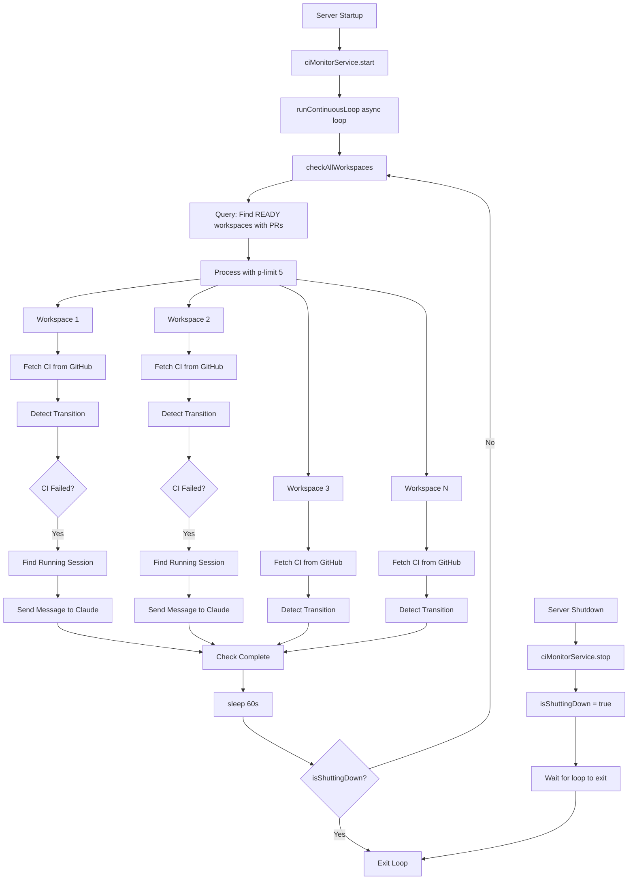
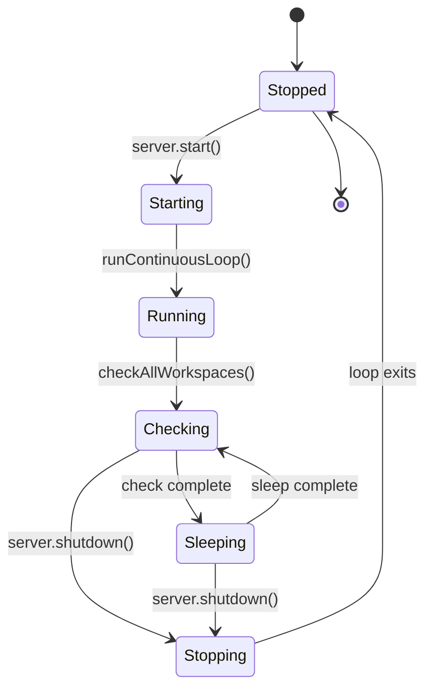
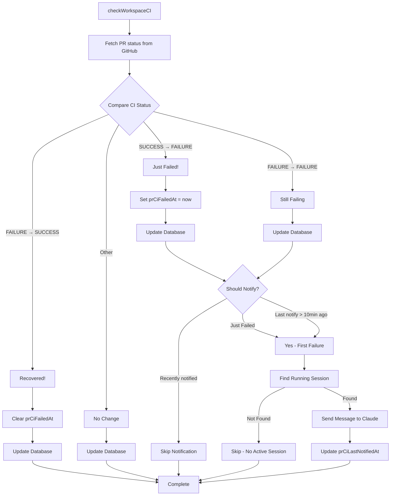
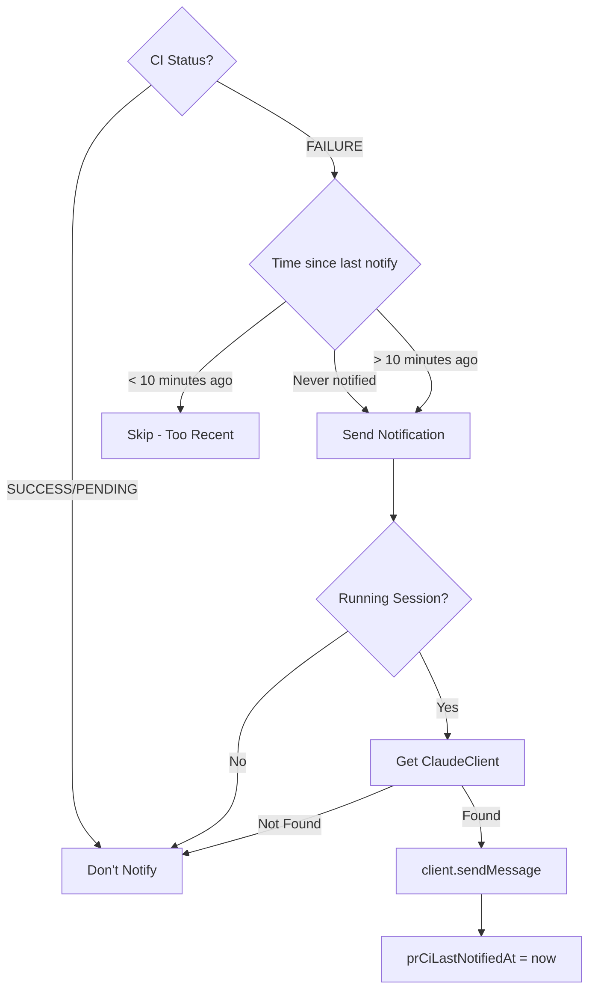
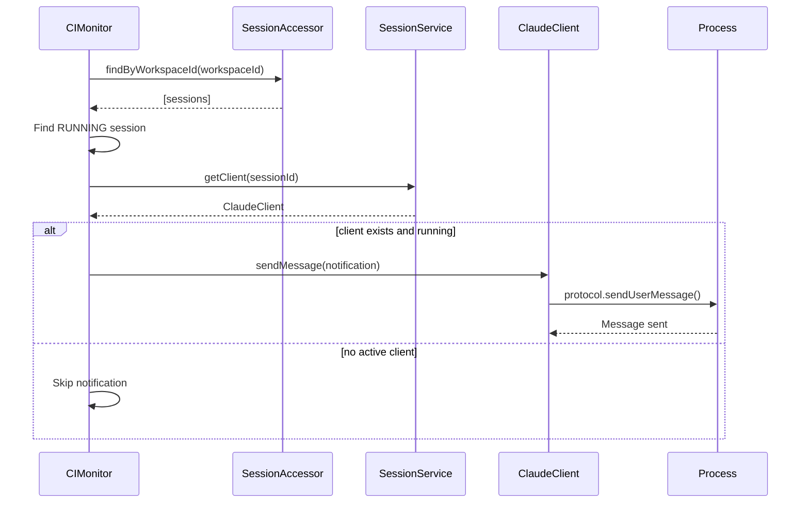
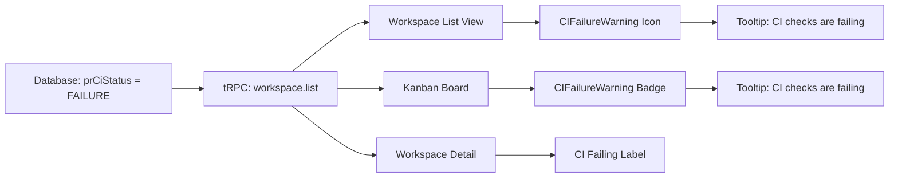

# CI Monitoring System Design

## Overview

The CI Monitoring System is a background service that watches all Pull Requests across workspaces and automatically notifies active Claude sessions when CI checks fail. It implements a **global singleton cron** that monitors all workspaces in a single polling loop.

## Architecture Type: Global Singleton Cron

### Key Design Decision
**We use ONE global cron that checks ALL workspaces**, not one cron per workspace.

**Rationale:**
- More efficient resource usage (single timer, single orchestrator)
- Prevents thundering herd if we had N workspace timers all firing
- Easier to monitor and debug (single service, single log namespace)
- Simpler lifecycle management (start/stop with server)

### Execution Model: Wait-Then-Sleep Pattern

The cron uses an **async loop with wait-then-sleep**, which guarantees no overlapping executions.

```
Timeline:
T=0:00  → Check starts (takes 15s)
T=0:15  → Check completes, sleep for 60s
T=1:15  → Check starts again (takes 12s)
T=1:27  → Check completes, sleep for 60s
T=2:27  → Check starts again
```

**Implementation:**
```javascript
async function runContinuousLoop() {
  while (!isShuttingDown) {
    await checkAllWorkspaces();  // Wait for completion
    await sleep(60000);           // Then sleep
  }
}
```

**Trade-offs:**
- ✅ Guaranteed no overlap - checks never run concurrently
- ✅ No overlap guard needed - architectural guarantee
- ✅ Simpler resource management
- ⚠️ Variable timing - interval measured from completion, not start
- ⚠️ If a check takes 15s, next check starts at T+75s (not T+60s)

**Alternative considered:** `setInterval()` pattern
```javascript
// NOT implemented - shows the alternative
setInterval(() => {
  checkAllWorkspaces();  // Fires every 60s regardless of completion
}, 60000);
```
This provides more predictable timing (always T+0, T+60, T+120) but risks overlapping executions if checks take >60s.

## High-Level Architecture



## Component Breakdown

### 1. CI Monitor Service (Singleton)

**Location:** `src/backend/services/ci-monitor.service.ts`

**Lifecycle:**


**Key Properties:**
- **Single instance:** Created once as `ciMonitorService` singleton
- **Global state:**
  - `monitorLoop`: Promise tracking the continuous loop
  - `isShuttingDown`: Flag to exit loop gracefully
  - `checkLimit`: p-limit(5) concurrency limiter

### 2. Polling Loop Details

```mermaid
sequenceDiagram
    participant Loop as Async Loop
    participant Service as CIMonitorService
    participant DB as Database
    participant Limiter as p-limit(5)
    participant GitHub as GitHub API
    participant Session as ClaudeSession

    Loop->>Service: checkAllWorkspaces()

    alt shutdown flag is true
        Service-->>Loop: Return early
    else normal operation
        Service->>DB: findWithPRsForCIMonitoring()
        DB-->>Service: [ws1, ws2, ..., wsN]

        Service->>Limiter: Process batch with max 5 concurrent

        par Concurrent Check (max 5)
            Limiter->>GitHub: Fetch PR status (ws1)
            GitHub-->>Limiter: prCiStatus: FAILURE
            Limiter->>DB: Update workspace CI status
            Limiter->>Session: Find running session
            Session-->>Limiter: session found
            Limiter->>Session: client.sendMessage(notification)
        and
            Limiter->>GitHub: Fetch PR status (ws2)
            GitHub-->>Limiter: prCiStatus: SUCCESS
            Limiter->>DB: Update workspace CI status
        and
            Limiter->>GitHub: Fetch PR status (ws3-5)
        end

        Service-->>Loop: Check complete
        Loop->>Loop: sleep(60000ms)
    end

    Note over Loop,Service: 60 seconds later...
    Loop->>Service: checkAllWorkspaces() again
```

### 3. Single Workspace Check Flow



## Database Schema

### New Fields on Workspace Model

```sql
-- Tracks when CI first failed (cleared when CI succeeds)
prCiFailedAt: DateTime?

-- Tracks last notification time (prevents spam)
prCiLastNotifiedAt: DateTime?
```

**State Transitions:**

| Previous CI Status | Current CI Status | prCiFailedAt | prCiLastNotifiedAt |
|-------------------|-------------------|--------------|-------------------|
| SUCCESS | FAILURE | Set to now() | (unchanged) |
| FAILURE | FAILURE | (unchanged) | Set to now() if notified |
| FAILURE | SUCCESS | Set to NULL | (unchanged) |
| UNKNOWN | FAILURE | Set to now() | (unchanged) |

## Notification Logic

### Throttling Algorithm



**Notification Cooldown:** 10 minutes (`MIN_NOTIFICATION_INTERVAL_MS`)

**Message Format:**
```markdown
⚠️ **CI Failure Detected**

The CI checks for PR #123 have failed. Please review the failures and fix any issues.

PR: https://github.com/owner/repo/pull/123

You can check the CI status and logs on GitHub to see what failed.
```

## Concurrency Control

### Rate Limiting with p-limit

```javascript
const checkLimit = pLimit(5);  // Max 5 concurrent GitHub API calls

// Process all workspaces with concurrency limit
const results = await Promise.all(
  workspaces.map((workspace) =>
    checkLimit(() => checkWorkspaceCI(workspace))
  )
);
```

**Why 5 concurrent checks?**
- Balances throughput vs GitHub API rate limits
- Prevents overwhelming the system with parallel requests
- Each check involves: GitHub API call + database updates + potential session notification

**Behavior:**
```
Workspace Queue: [w1, w2, w3, w4, w5, w6, w7, w8]
                  |   |   |   |   |
                  ↓   ↓   ↓   ↓   ↓
Active Checks:   [w1  w2  w3  w4  w5]  ← Max 5 running
Waiting:         [w6  w7  w8]           ← Wait for slot

When w1 completes → w6 starts
When w2 completes → w7 starts
When w3 completes → w8 starts
```

## Integration Points

### Server Lifecycle Integration

```javascript
// src/backend/server.ts

// Startup
server.listen(() => {
  schedulerService.start();      // PR status sync (5 min)
  ciMonitorService.start();      // CI monitoring (1 min) ← NEW
  reconciliationService.start(); // Cleanup (5 min)
});

// Shutdown
async function cleanup() {
  await schedulerService.stop();
  await ciMonitorService.stop();      // ← NEW: Wait for in-flight
  await reconciliationService.stop();
}
```

**Graceful Shutdown:**
```mermaid
sequenceDiagram
    participant Server
    participant CIMonitor
    participant Loop
    participant Checks

    Server->>CIMonitor: stop()
    CIMonitor->>CIMonitor: isShuttingDown = true

    alt loop is checking workspaces
        CIMonitor->>Loop: Wait for current check
        Loop->>Checks: Complete in-progress checks
        Checks-->>Loop: All checks done
        Loop-->>CIMonitor: Loop exits (no sleep)
    else loop is sleeping
        Loop->>Loop: Exit sleep early
        Loop-->>CIMonitor: Loop exits immediately
    end

    CIMonitor-->>Server: Stopped cleanly
```

### Session Notification Integration



## Frontend Integration

### UI Warning Indicators



**Component:** `CIFailureWarning`
- Shows AlertTriangle icon when `prCiStatus === 'FAILURE'`
- Tooltip explains issue and suggests checking PR
- Reactive to database changes via tRPC polling (15s)

## Performance Characteristics

### Resource Usage

**Memory:**
- Single service instance
- ~5 concurrent Promise handlers (p-limit)
- Minimal per-workspace state (only in-flight checks)

**Network:**
- GitHub API calls: N workspaces × 1 request per minute
- Rate limited to 5 concurrent requests
- Example: 50 workspaces = 50 API calls spread over ~10 seconds

**Database:**
- Query: 1 × per minute (find workspaces with PRs)
- Updates: N × per minute (workspace CI status)
- Conditional updates: Only when status changes

### Timing Analysis

**Best Case (0 workspaces):**
```
Query DB → 0 results → Complete in ~10ms
```

**Average Case (20 workspaces, 5 failures):**
```
Query DB (50ms)
  ↓
Process 20 workspaces with p-limit(5) (~4 batches)
  ↓
GitHub API: ~200ms per request × 4 batches = ~800ms
  ↓
DB updates: ~20ms per workspace × 20 = ~400ms
  ↓
Session notifications: ~50ms × 5 = ~250ms
  ↓
Total: ~1.5 seconds
```

**Worst Case (100 workspaces, all failing, all have sessions):**
```
Query DB (100ms)
  ↓
Process 100 workspaces (20 batches of 5)
  ↓
GitHub API: ~200ms × 20 batches = ~4 seconds
  ↓
DB updates: ~20ms × 100 = ~2 seconds
  ↓
Session notifications: ~50ms × 100 = ~5 seconds
  ↓
Total: ~11 seconds
```

## Configuration

### Tunable Parameters

```javascript
// Polling interval: How often to check all workspaces
const CI_MONITOR_INTERVAL_MS = 1 * 60 * 1000;  // 1 minute

// Concurrency: Max parallel GitHub API calls
const MAX_CONCURRENT_CHECKS = 5;

// Notification throttle: Min time between notifications per workspace
const MIN_NOTIFICATION_INTERVAL_MS = 10 * 60 * 1000;  // 10 minutes
```

**Tuning Considerations:**

| Parameter | Lower Value | Higher Value |
|-----------|-------------|--------------|
| `CI_MONITOR_INTERVAL_MS` | More responsive, higher load | Less responsive, lower load |
| `MAX_CONCURRENT_CHECKS` | Safer rate limits, slower | Faster checks, risk rate limits |
| `MIN_NOTIFICATION_INTERVAL_MS` | More notifications (spam) | Fewer notifications (might miss issues) |

## Comparison with Alternative Designs

### Alternative 1: Per-Workspace Crons

```javascript
// NOT implemented - shows the alternative
class WorkspaceMonitor {
  private timer: NodeJS.Timeout;

  start() {
    this.timer = setInterval(() => {
      this.checkThisWorkspace();
    }, 60000);
  }
}

// Create one monitor per workspace
workspaces.forEach(ws => {
  monitors.set(ws.id, new WorkspaceMonitor(ws));
});
```

**Why we didn't choose this:**
- ❌ N timers = N * overhead
- ❌ Thundering herd when all fire simultaneously
- ❌ Complex lifecycle (must start/stop on workspace create/delete)
- ❌ Harder to implement global rate limiting

### Alternative 2: Event-Driven (Webhooks)

```javascript
// NOT implemented - shows the alternative
app.post('/webhooks/github/check_suite', (req, res) => {
  const { status, pull_request } = req.body;
  if (status === 'failure') {
    notifyWorkspace(pull_request.number);
  }
});
```

**Why we didn't choose this:**
- ❌ Requires public webhook endpoint (networking complexity)
- ❌ Webhook reliability concerns (retries, deduplication)
- ❌ GitHub webhook setup per repository
- ✅ Would be more real-time (future enhancement)

### Alternative 3: setInterval Pattern

```javascript
// NOT implemented - shows the alternative
start() {
  setInterval(() => {
    checkAllWorkspaces();
  }, 60000);
}
```

**Trade-offs:**
- ✅ Predictable timing (fires at T+0, T+60, T+120...)
- ✅ Standard Node.js pattern
- ❌ Risk of overlapping executions if checks take >60s
- ❌ Requires overlap guard or shutdown flag

**Our choice (wait-then-sleep) is better for:**
- Guaranteed no overlapping executions
- Simpler resource management
- No need for overlap guards

## Monitoring and Observability

### Logging

**Log Namespace:** `ci-monitor`

**Key Events Logged:**

```javascript
// Service lifecycle
logger.info('CI monitor started', { intervalMs: 60000 });
logger.info('CI monitor stopped');

// Check results
logger.info('CI monitor check completed', {
  checked: 50,
  failures: 5,
  notified: 3
});

// Individual workspace events
logger.warn('CI failure detected', {
  workspaceId: 'ws_abc',
  prUrl: 'https://github.com/...',
  prNumber: 123
});

logger.info('Notified active session about CI failure', {
  workspaceId: 'ws_abc',
  sessionId: 'sess_xyz',
  prUrl: 'https://github.com/...',
  prNumber: 123
});
```

### Metrics to Monitor

**Service Health:**
- Check duration (should be < 60s)
- Success rate (GitHub API failures)
- Workspaces checked per minute

**Notification Health:**
- Notifications sent per minute
- Notification delivery rate
- Time from CI failure to notification

**Database Health:**
- Query latency for `findWithPRsForCIMonitoring()`
- Update latency per workspace

## Future Enhancements

### Potential Improvements

1. **Webhook Support**
   - Listen for GitHub check_suite webhooks
   - Instant notifications instead of 1-minute delay
   - Fallback to polling for reliability

2. **Configurable Intervals**
   - Per-project polling intervals
   - Faster checks for high-priority workspaces

3. **Rich Notifications**
   - Include specific failed check names
   - Link to exact log lines
   - Suggest common fixes

4. **Metrics Dashboard**
   - CI failure trends over time
   - MTTR (mean time to resolution)
   - Notification effectiveness

5. **Smart Throttling**
   - Exponential backoff for repeated failures
   - Different cadence for different severity levels

## Summary

The CI Monitoring System uses a **global singleton cron with wait-then-sleep** that:
- ✅ Checks all workspaces in one polling loop (not per-workspace crons)
- ✅ Uses async loop with wait-then-sleep (not setInterval)
- ✅ Guarantees no overlapping executions
- ✅ Processes workspaces concurrently with p-limit(5)
- ✅ Notifies active Claude sessions when CI fails
- ✅ Throttles notifications to prevent spam (10-minute cooldown)
- ✅ Gracefully handles shutdown (exits loop cleanly)

This design balances **simplicity, efficiency, and reliability** while providing timely notifications to help developers fix CI issues quickly. The wait-then-sleep pattern ensures robust resource management by guaranteeing that checks never overlap, eliminating the need for overlap guards.
