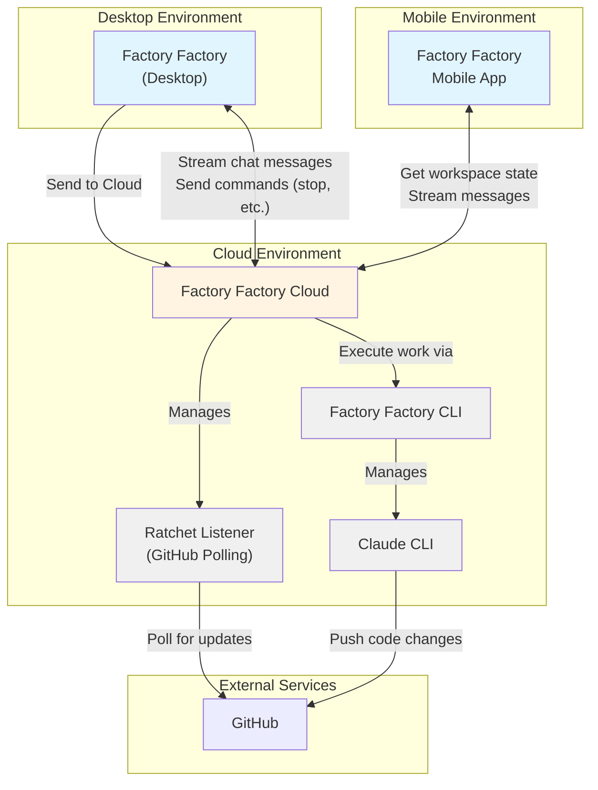

# Factory Factory Cloud Vision
This document lays out my vision for what a "Cloud" version for Factory Factory could look like

## How it behaves
Workspaces default to working on desktop (because engineers like control), but users can click a button to "Send to Cloud". This creates a claude CLI instance in the cloud that executes. The ratchet listener for this workspace is also moved to the cloud. The workspace as seen in the user's UI looks the same as any other workspace, but the work is happening in the cloud. 

## Use cases

### V1: You go out to lunch, but your work keeps happening
The user has 5 workspaces open and they are all busy. It's lunchtime; the user wants to get food and close their laptop, but they want the work to continue. So they send all 5 workspaces to cloud. 

They have lunch and come back, to find all workspaces have open PRs with 5/5 from Greptile. Now all they need to do is test all the changes and push!

### V2: Checking up on work while running errands
The user needs to do a grocery run, but they want to keep their workspace active. They only started this workspace, so it's not ready to go solo yet. The user sends the workspace to cloud, closes their laptop and goes to the grocery store. 

At the grocery store, they go on their FF App (or website?) and check the workspace's status. Looks like the agent has some questions for them. The grocery store has a small seating area, so the user sits down and goes through a few rounds of questions and answers, then reviews their design doc using Markdown Preview mode. The doc and the diagrams look correct; the workspace is ready to go! The user asks the agent to make a PR, then continues with the grocery run. 

The user gets home and puts away their groceries. Now they open up their laptop and check on the workspace. There's a PR open, 5/5 on github, and the implementation matches the design doc. Perfect - all we need to do now is test and merge!

### V3: Talking to their agent while taking a walk
The user does their best work while walking. So they fire up a new workspace on their mobile app and go for a walk. The user has headphones on, and is just talking to the agent. In the workspace, the user starts out by working with the agent to define a design doc. Once the user's satisfied with the voice agent's explanation of the work, they sit down on a park bench and start reviewing the design doc. 

The design doc and diagrams look good! Time to let the agent continue. 

As the user walks home, they suddenly have a question about the work - they realized that there's a new edge case they hadn't thought of! They open up the agent and fire up voice mode, and immediately ask about the edge case. 

After thinking for a moment, the agent says "This edge case is new; nice catch! Would you like me to integrate this into the design document?" The user says yes. 

The agent implements the design according to the original design doc, and then reviews the design. When it reviews, the agent realizes that the design has changed - the new edge case has been added! It updates the design to include the edge case. 

The user gets home. The weather is beautiful, so they are invigorated and ready to go. They open up their laptop and check on the workspace. There's a PR, and greptile gives it 5/5. The design doc clearly includes the new edge case the user thought of, and the implementation matches the design exactly. 

Perfect - now to do some testing!

## Technical Architecture

### Component Descriptions

- **Factory Factory (Desktop)**: The main desktop application. Can send workspaces to cloud and receive streamed chat updates. Sends user commands like "stop" to cloud instances.

- **Factory Factory Cloud**: Cloud service that manages workspace execution. Handles multiple workspaces, streams chat to desktop/mobile clients, and orchestrates Claude CLI execution via Factory Factory CLI.

- **Factory Factory CLI**: Command-line interface used by FF Cloud to execute workspace operations and manage Claude CLI instances.

- **Claude CLI**: The actual Claude agent execution environment, managed by FF CLI, that performs the development work.

- **Ratchet Listener**: GitHub monitoring component that polls for PR updates, CI status, and review comments. Runs in the cloud alongside the workspace.

- **Factory Factory Mobile**: Mobile application that acts as a pure frontend, fetching workspace state and streaming messages through FF Cloud.

- **GitHub**: External service where code changes are pushed and PR status is monitored.