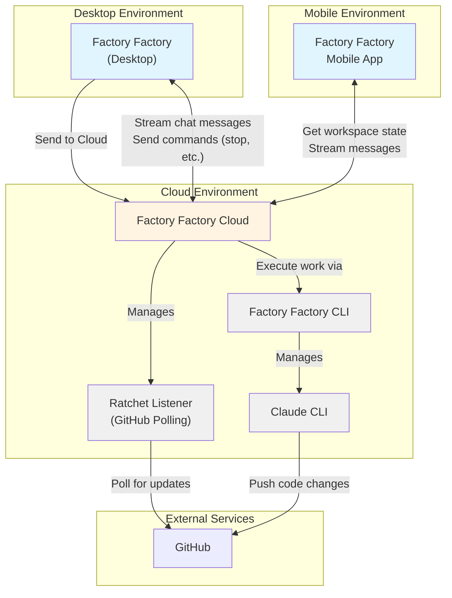

# Factory Factory Cloud Vision
This document lays out my vision for what a "Cloud" version for Factory Factory could look like

## How it behaves
Workspaces default to working on desktop (because engineers like control), but users can click a button to "Send to Cloud". This creates a claude CLI instance in the cloud that executes. The ratchet listener for this workspace is also moved to the cloud. The workspace as seen in the user's UI looks the same as any other workspace, but the work is happening in the cloud. 

## Use cases

### V1: You go out to lunch, but your work keeps happening
The user has 5 workspaces open and they are all busy. It's lunchtime; the user wants to get food and close their laptop, but they want the work to continue. So they send all 5 workspaces to cloud. 

They have lunch and come back, to find all workspaces have open PRs with 5/5 from Greptile. Now all they need to do is test all the changes and push!

### V2: Checking up on work while running errands
The user needs to do a grocery run, but they want to keep their workspace active. They only started this workspace, so it's not ready to go solo yet. The user sends the workspace to cloud, closes their laptop and goes to the grocery store. 

At the grocery store, they go on their FF App (or website?) and check the workspace's status. Looks like the agent has some questions for them. The grocery store has a small seating area, so the user sits down and goes through a few rounds of questions and answers, then reviews their design doc using Markdown Preview mode. The doc and the diagrams look correct; the workspace is ready to go! The user asks the agent to make a PR, then continues with the grocery run. 

The user gets home and puts away their groceries. Now they open up their laptop and check on the workspace. There's a PR open, 5/5 on github, and the implementation matches the design doc. Perfect - all we need to do now is test and merge!

### V3: Talking to their agent while taking a walk
The user does their best work while walking. So they fire up a new workspace on their mobile app and go for a walk. The user has headphones on, and is just talking to the agent. In the workspace, the user starts out by working with the agent to define a design doc. Once the user's satisfied with the voice agent's explanation of the work, they sit down on a park bench and start reviewing the design doc. 

The design doc and diagrams look good! Time to let the agent continue. 

As the user walks home, they suddenly have a question about the work - they realized that there's a new edge case they hadn't thought of! They open up the agent and fire up voice mode, and immediately ask about the edge case. 

After thinking for a moment, the agent says "This edge case is new; nice catch! Would you like me to integrate this into the design document?" The user says yes. 

The agent implements the design according to the original design doc, and then reviews the design. When it reviews, the agent realizes that the design has changed - the new edge case has been added! It updates the design to include the edge case. 

The user gets home. The weather is beautiful, so they are invigorated and ready to go. They open up their laptop and check on the workspace. There's a PR, and greptile gives it 5/5. The design doc clearly includes the new edge case the user thought of, and the implementation matches the design exactly. 

Perfect - now to do some testing!

### V4: The manager's story
Martin manages a team of 5 engineers. He's sipping his coffee, starting his day. Martin likes to start off his day by checking in on what the team is up to. 

Everyone on the team is using FactoryFactory, and the team has a Factory Factory Team subscription, so checking in is very easy: all Martin has to do is login to the cloud site and navigate to the team view.

In the team view, Martin can see a list of team members, along with some stats about the workspaces they have open. 

Martin starts out by checking on Jane. She's new to the team so she may need a little extra support. Martin clicks the card with Jane's details on it, which takes him to a teammate detail view. This shows Martin that Jane's got 4 workspaces open. One of them has her work relating to a pretty difficult task - just then, Martin recalls a subtle edge case that could completely derail the work! He clicks on the workspace, and has his agent check if the work that Jane is doing considers that edge case. After thinking for a bit, his agent confirms that, yes - Jane's work does consider that edge case. Martin is impressed; she was the right hire after all! He sends her a quick message on slack, congratulating her for catching the edge case.

Then he checks Eric's page. Eric has 4 workspaces open. Martin knows what 3 of the workspaces are about - what about the 4th? He checks the workspace - it's a new POC that Eric is thinking about. The branch has many changes, and the documentation is hard to follow. Martin asks the agent to look at the work and make him a document that explains it in simple terms, with diagrams. After thinking about it for a bit, the agent gives him a simple diagram. 

Oh no - this POC is cool, but Martin thinks its not in line with the team's strategy. He wants to make sure, though, so he asks his agent to double check his intuition - for context, he includes a link to the strategy document he wrote the day before. The agent thinks about it, and gives a detailed reply - Eric's POC is not quite in line with the company's strategy. 

Next, Martin checks Boris' work. Oh no! Looks like Boris is working on something that seems to duplicate some of Jane's work. It's a big change though, and the duplication might be a small part of the work, not the whole of it. Martin asks his agent to check what the degree of overlap is. As Martin sips is coffee, the agent tells him that there is some overlap, but it's small, and if Boris were to reduce the scope of his work, the issue would be sorted. Easy enough! Martin sends Boris a slack message about this now.

Martin goes through the rest of his team and catches up on what they are working on. No surprises, but good progress! He stands up and looks outside. Great day for a walk; perhaps he can enjoy the weather while he thinks about how to bring Eric's work in line with the strategy... he sees a few ways to do it, and a walk is the perfect way to digest. 

## Technical Architecture



### Component Descriptions

- **Factory Factory (Desktop)**: The main desktop application. Can send workspaces to cloud and receive streamed chat updates. Sends user commands like "stop" to cloud instances.

- **Factory Factory Cloud**: Cloud service that manages workspace execution. Handles multiple workspaces, streams chat to desktop/mobile clients, and orchestrates Claude CLI execution via Factory Factory CLI.

- **Factory Factory CLI**: Command-line interface used by FF Cloud to execute workspace operations and manage Claude CLI instances.

- **Claude CLI**: The actual Claude agent execution environment, managed by FF CLI, that performs the development work.

- **Ratchet Listener**: GitHub monitoring component that polls for PR updates, CI status, and review comments. Runs in the cloud alongside the workspace.

- **Factory Factory Mobile**: Mobile application that acts as a pure frontend, fetching workspace state and streaming messages through FF Cloud.

- **GitHub**: External service where code changes are pushed and PR status is monitored.

## Factory Factory CLI API

The FF CLI needs to expose these capabilities for FF Cloud to orchestrate cloud workspaces:

### Workspace Lifecycle Management

```bash
# Create a new workspace from a GitHub issue
ff workspace create --issue <issue-url> --workspace-id <id>

# Start an existing workspace (resumes work)
ff workspace start --workspace-id <id>

# Stop a workspace gracefully
ff workspace stop --workspace-id <id>

# Get workspace status and metadata
ff workspace status --workspace-id <id> --json
```

### Chat Interaction

```bash
# Send a message to the workspace's Claude CLI session
ff chat send --workspace-id <id> --message <text>

# Stream chat output from the workspace (blocks until new messages)
ff chat stream --workspace-id <id> --json

# Get chat history
ff chat history --workspace-id <id> --limit <n> --json
```

### Ratchet (Auto-Fix) Management

```bash
# Start ratchet listener for a workspace
ff ratchet start --workspace-id <id> --pr-url <url>

# Stop ratchet listener
ff ratchet stop --workspace-id <id>

# Get ratchet status (is it running? what's the PR state?)
ff ratchet status --workspace-id <id> --json

# Toggle auto-fix on/off for a workspace
ff ratchet toggle --workspace-id <id> --enabled <true|false>
```

### Workspace State & Metadata

```bash
# Export full workspace state (for syncing to cloud DB)
ff workspace export --workspace-id <id> --json

# List all workspaces
ff workspace list --json

# Get workspace file tree and recent changes
ff workspace files --workspace-id <id> --json

# Get git branch and commit info
ff workspace git-status --workspace-id <id> --json
```

### Team & Multi-User Support

```bash
# List workspaces for a specific user/team
ff workspace list --user-id <id> --json

# Get aggregated stats for team view
ff team stats --team-id <id> --json
```

### Session Management

```bash
# Create a new session in a workspace
ff session create --workspace-id <id> --prompt <text>

# Get session status and output
ff session status --session-id <id> --json

# List sessions for a workspace
ff session list --workspace-id <id> --json
```

### Design Considerations

- **JSON Output**: All commands that return data should support `--json` for machine-readable output
- **Streaming**: Chat streaming should output newline-delimited JSON for real-time updates
- **Error Handling**: Exit codes and structured error messages for FF Cloud to handle failures
- **Authentication**: CLI should support API tokens for cloud service authentication
- **Idempotency**: Operations like `workspace create` should be idempotent (rerunning same command is safe)
- **Process Management**: CLI manages long-running Claude CLI processes, keeping them alive and handling crashes

## Chat Streaming Architecture

### How Claude CLI Outputs Messages

Claude CLI is a subprocess managed by Factory Factory. It communicates via events that are captured by FF's `ChatEventForwarderService`:

1. **Claude CLI subprocess** emits events (tool use, thinking, text, completion)
2. **ChatEventForwarderService** listens to these events via `ClaudeClient`
3. For each event:
   - Store the event in `MessageStateService` (for replay on reconnect)
   - Forward to all connected frontends via `ChatConnectionService.forwardToSession()`

The current architecture uses **WebSockets** for real-time bidirectional communication between FF backend and frontend.

### Event Types from Claude CLI

Based on the current implementation, Claude CLI emits these event types:

- **Stream events**: Text chunks, tool use, thinking tokens
- **Status events**: `running: true/false`
- **Interactive requests**: User questions, permission requests
- **Completion events**: Message finished, with final state

### How `ff chat stream` Should Work

For FF Cloud to stream chat to desktop/mobile clients, `ff chat stream` needs to:

#### 1. Output Format: Newline-Delimited JSON (NDJSON)

Each line is a JSON object representing a chat event:

```bash
$ ff chat stream --workspace-id abc123 --json
{"type":"status","running":true,"timestamp":"2026-02-10T10:30:00Z"}
{"type":"message_state_changed","messageId":"msg-1","state":"DISPATCHED"}
{"type":"claude_message","role":"assistant","content":[{"type":"text","text":"Let me check..."}]}
{"type":"claude_message","role":"assistant","content":[{"type":"tool_use","name":"Read","input":{"file_path":"/foo/bar.ts"}}]}
{"type":"user_question","requestId":"req-1","questions":[...]}
{"type":"status","running":false,"timestamp":"2026-02-10T10:31:00Z"}
```

#### 2. Message Types (matches WebSocket protocol)

The CLI should output the same message types that FF's WebSocket currently sends:

| Type | Description | Example |
|------|-------------|---------|
| `status` | Claude running state | `{"type":"status","running":true}` |
| `message_state_changed` | User message state updates | `{"type":"message_state_changed","messageId":"msg-1","state":"ACCEPTED"}` |
| `claude_message` | Claude's streaming response | `{"type":"claude_message","role":"assistant","content":[...]}` |
| `user_question` | AskUserQuestion tool invocation | `{"type":"user_question","requestId":"req-1","questions":[...]}` |
| `permission_request` | Permission dialog | `{"type":"permission_request","requestId":"req-2",...}` |
| `messages_snapshot` | Full state (on connect/reconnect) | `{"type":"messages_snapshot","messages":[...],"sessionStatus":{...}}` |

#### 3. Stream Behavior

```bash
# Blocking: waits for new events and outputs them as they arrive
ff chat stream --workspace-id abc123 --json

# With timeout: exits after 30s of no activity
ff chat stream --workspace-id abc123 --json --timeout 30s

# From a specific point: only new events after timestamp
ff chat stream --workspace-id abc123 --json --since 2026-02-10T10:30:00Z
```

The command should:
- Block and output events in real-time as they occur
- Flush after each event (for immediate streaming)
- Exit cleanly when the workspace stops or the CLI is interrupted (SIGINT/SIGTERM)

#### 4. FF Cloud Integration

FF Cloud would:

1. **Start streaming** when a client connects:
   ```bash
   ff chat stream --workspace-id abc123 --json
   ```

2. **Parse NDJSON output** line by line

3. **Forward to WebSocket/HTTP clients**: Relay each event to connected desktop/mobile clients

4. **Handle reconnection**: When a client reconnects, send `messages_snapshot` first (via `ff chat history`), then resume streaming

### Sending Messages to Claude CLI

For sending user input, FF Cloud uses:

```bash
# Send a text message
ff chat send --workspace-id abc123 --message "Fix the bug in auth.ts"

# Send with attachments (as JSON)
ff chat send --workspace-id abc123 --json '{
  "text": "Review this screenshot",
  "attachments": [{"id":"att-1","name":"bug.png","data":"base64..."}]
}'

# Answer a question
ff chat send --workspace-id abc123 --type question_response --json '{
  "requestId": "req-1",
  "answers": {"question1": "option1"}
}'

# Stop the session
ff chat send --workspace-id abc123 --type stop
```

### State Synchronization

When a client first connects or reconnects:

```bash
# Get full snapshot of current state
ff chat history --workspace-id abc123 --json
```

Returns:
```json
{
  "type": "messages_snapshot",
  "messages": [
    {"id":"msg-1","role":"user","text":"Fix the bug"},
    {"id":"msg-2","role":"assistant","content":[...]}
  ],
  "sessionStatus": {
    "phase": "running",
    "isRunning": true
  },
  "pendingInteractiveRequest": null
}
```

This matches the `messages_snapshot` format that the current WebSocket implementation sends, ensuring consistency between desktop and cloud.