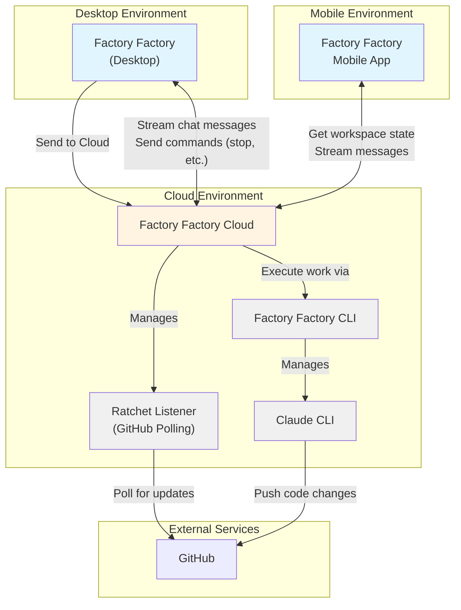

# Factory Factory Cloud Vision
This document lays out my vision for what a "Cloud" version for Factory Factory could look like

## How it behaves
Workspaces default to working on desktop (because engineers like control), but users can click a button to "Send to Cloud". This creates a claude CLI instance in the cloud that executes. The ratchet listener for this workspace is also moved to the cloud. The workspace as seen in the user's UI looks the same as any other workspace, but the work is happening in the cloud. 

## Use cases

### V1: You go out to lunch, but your work keeps happening
The user has 5 workspaces open and they are all busy. It's lunchtime; the user wants to get food and close their laptop, but they want the work to continue. So they send all 5 workspaces to cloud. 

They have lunch and come back, to find all workspaces have open PRs with 5/5 from Greptile. Now all they need to do is test all the changes and push!

### V2: Checking up on work while running errands
The user needs to do a grocery run, but they want to keep their workspace active. They only started this workspace, so it's not ready to go solo yet. The user sends the workspace to cloud, closes their laptop and goes to the grocery store. 

At the grocery store, they go on their FF App (or website?) and check the workspace's status. Looks like the agent has some questions for them. The grocery store has a small seating area, so the user sits down and goes through a few rounds of questions and answers, then reviews their design doc using Markdown Preview mode. The doc and the diagrams look correct; the workspace is ready to go! The user asks the agent to make a PR, then continues with the grocery run. 

The user gets home and puts away their groceries. Now they open up their laptop and check on the workspace. There's a PR open, 5/5 on github, and the implementation matches the design doc. Perfect - all we need to do now is test and merge!

### V3: Talking to their agent while taking a walk
The user does their best work while walking. So they fire up a new workspace on their mobile app and go for a walk. The user has headphones on, and is just talking to the agent. In the workspace, the user starts out by working with the agent to define a design doc. Once the user's satisfied with the voice agent's explanation of the work, they sit down on a park bench and start reviewing the design doc. 

The design doc and diagrams look good! Time to let the agent continue. 

As the user walks home, they suddenly have a question about the work - they realized that there's a new edge case they hadn't thought of! They open up the agent and fire up voice mode, and immediately ask about the edge case. 

After thinking for a moment, the agent says "This edge case is new; nice catch! Would you like me to integrate this into the design document?" The user says yes. 

The agent implements the design according to the original design doc, and then reviews the design. When it reviews, the agent realizes that the design has changed - the new edge case has been added! It updates the design to include the edge case. 

The user gets home. The weather is beautiful, so they are invigorated and ready to go. They open up their laptop and check on the workspace. There's a PR, and greptile gives it 5/5. The design doc clearly includes the new edge case the user thought of, and the implementation matches the design exactly. 

Perfect - now to do some testing!

### V4: The manager's story
Martin manages a team of 5 engineers. He's sipping his coffee, starting his day. Martin likes to start off his day by checking in on what the team is up to. 

Everyone on the team is using FactoryFactory, and the team has a Factory Factory Team subscription, so checking in is very easy: all Martin has to do is login to the cloud site and navigate to the team view.

In the team view, Martin can see a list of team members, along with some stats about the workspaces they have open. 

Martin starts out by checking on Jane. She's new to the team so she may need a little extra support. Martin clicks the card with Jane's details on it, which takes him to a teammate detail view. This shows Martin that Jane's got 4 workspaces open. One of them has her work relating to a pretty difficult task - just then, Martin recalls a subtle edge case that could completely derail the work! He clicks on the workspace, and has his agent check if the work that Jane is doing considers that edge case. After thinking for a bit, his agent confirms that, yes - Jane's work does consider that edge case. Martin is impressed; she was the right hire after all! He sends her a quick message on slack, congratulating her for catching the edge case.

Then he checks Eric's page. Eric has 4 workspaces open. Martin knows what 3 of the workspaces are about - what about the 4th? He checks the workspace - it's a new POC that Eric is thinking about. The branch has many changes, and the documentation is hard to follow. Martin asks the agent to look at the work and make him a document that explains it in simple terms, with diagrams. After thinking about it for a bit, the agent gives him a simple diagram. 

Oh no - this POC is cool, but Martin thinks its not in line with the team's strategy. He wants to make sure, though, so he asks his agent to double check his intuition - for context, he includes a link to the strategy document he wrote the day before. The agent thinks about it, and gives a detailed reply - Eric's POC is not quite in line with the company's strategy. 

Next, Martin checks Boris' work. Oh no! Looks like Boris is working on something that seems to duplicate some of Jane's work. It's a big change though, and the duplication might be a small part of the work, not the whole of it. Martin asks his agent to check what the degree of overlap is. As Martin sips is coffee, the agent tells him that there is some overlap, but it's small, and if Boris were to reduce the scope of his work, the issue would be sorted. Easy enough! Martin sends Boris a slack message about this now.

Martin goes through the rest of his team and catches up on what they are working on. No surprises, but good progress! He stands up and looks outside. Great day for a walk; perhaps he can enjoy the weather while he thinks about how to bring Eric's work in line with the strategy... he sees a few ways to do it, and a walk is the perfect way to digest. 

# Technical Details

## Open questions

### How does Claude CLI work?

**Where are the Claude API docs?**

The Claude CLI doesn't have separate API documentation because it IS a command-line program that wraps the Anthropic Claude API. You can see the available options with `claude --help`. The CLI is installed at `~/.local/bin/claude` and provides various flags for controlling behavior.

**How does it stream text?**

Claude CLI uses a **streaming JSON protocol** for communication:
- Uses `--output-format stream-json` and `--input-format stream-json` flags
- Communicates via stdin/stdout using newline-delimited JSON messages
- Each message is a JSON object with a `type` field (e.g., `assistant`, `user`, `result`, `stream_event`, `system`)
- Factory Factory spawns Claude CLI as a subprocess and uses `ClaudeProtocolIO` to parse the stdout stream

From `src/backend/domains/session/claude/process.ts`:
```typescript
const childProcess = spawn('claude', args, {
  cwd: options.workingDir,
  stdio: ['pipe', 'pipe', 'pipe'],
  // ...
});
const protocol = new ClaudeProtocolIO(childProcess.stdin, childProcess.stdout);
```

**Does the Claude CLI have a server, or do multiple CLIs call a single local server?**

**No local server.** Each `claude` CLI invocation is a **standalone process** that makes direct API calls to the Anthropic Claude API in the cloud. When FF spawns multiple workspaces, each gets its own independent `claude` subprocess.

From the code:
- `ClaudeProcess.spawn()` uses Node's `spawn('claude', args, ...)` to create a new process
- Each process has its own `claudeSessionId` (stored in `~/.claude/projects/<hash>/`)
- Each process maintains its own conversation history in a JSONL file

**Is the CLI backed by the Claude API in the cloud?**

**Yes.** The Claude CLI is a wrapper around the Anthropic Claude API (claude.ai). The "session identity" exists in two places:
1. **Local**: `claudeSessionId` - A hash that identifies the conversation history stored in `~/.claude/projects/<hash>/conversation.jsonl`
2. **Cloud**: The actual Claude conversation state is managed by Anthropic's API. The CLI sends messages to the API and receives streaming responses.

**Why do we have a Claude "server" at all (referring to FF's backend)?**

Factory Factory's backend server (`src/backend/server.ts`) is **not a Claude API server** - it's a coordination layer that:
1. **Manages multiple Claude CLI subprocesses** (one per workspace/session)
2. **Provides a WebSocket API** for the frontend to interact with these processes
3. **Stores workspace metadata** in a SQLite database (Prisma)
4. **Forwards Claude CLI events** to connected frontend clients via WebSocket
5. **Manages the ratchet system** for auto-fixing PRs

The architecture is:
```
Frontend (Browser)
  ↕ WebSocket
FF Backend (Express + tRPC)
  ↕ stdin/stdout (JSON protocol)
Claude CLI subprocess
  ↕ HTTPS (Claude API)
Anthropic Cloud (claude.ai)
```

So FF's backend is a **process manager and message relay**, not a Claude API server.

### The Streaming JSON Protocol Details

The protocol is a **bidirectional NDJSON (Newline-Delimited JSON)** protocol over stdin/stdout:

**Communication Format:**
- Each line is a complete JSON object
- Lines are separated by `\n`
- Messages are validated against Zod schemas for type safety

**Message Flow:**

**SDK → CLI (via stdin):**
```json
{"type":"control_request","request_id":"uuid","request":{"subtype":"initialize","hooks":{...}}}
{"type":"user","message":{"role":"user","content":"Hello"}}
{"type":"control_response","response":{"subtype":"success","request_id":"uuid","response":{...}}}
```

**CLI → SDK (via stdout):**
```json
{"type":"system","subtype":"init","message":"Claude Code CLI initialized"}
{"type":"assistant","message":{"role":"assistant","content":[{"type":"text","text":"Hello!"}]},"session_id":"abc123"}
{"type":"stream_event","event":{"type":"message_start","message":{"id":"msg_1",...}}}
{"type":"stream_event","event":{"type":"content_block_delta","delta":{"type":"text_delta","text":"Let"}}}
{"type":"result","session_id":"abc123","result":"completed"}
{"type":"control_request","request_id":"uuid","request":{"subtype":"bash_tool_use",...}}
```

**Key Message Types:**

1. **`control_request`** (SDK → CLI): Initialize, set model, set permissions, interrupt, rewind files
2. **`control_response`** (SDK → CLI): Response to CLI's control requests (e.g., permission approval)
3. **`user`** (SDK → CLI): User messages with text or images
4. **`assistant`** (CLI → SDK): Claude's complete responses
5. **`stream_event`** (CLI → SDK): Real-time streaming chunks (text deltas, tool use, thinking)
6. **`system`** (CLI → SDK): Status messages (init, status, compact_boundary, hooks)
7. **`result`** (CLI → SDK): Conversation turn completion
8. **`keep_alive`** (CLI → SDK): Heartbeat to keep connection alive
9. **`tool_progress`** (CLI → SDK): Progress updates during tool execution
10. **`tool_use_summary`** (CLI → SDK): Summary after tool completes

**Request/Response Correlation:**
- SDK messages with `request_id` expect responses (tracked in `pendingRequests` Map)
- Responses include the same `request_id` for correlation
- Timeouts (default 60s) prevent hanging on unresponsive CLI

**Backpressure Handling:**
- If stdin buffer fills, protocol waits for `drain` event before continuing
- Prevents memory exhaustion under high message volume

**Error Handling:**
- Invalid JSON → skip line, emit error event
- Schema validation failures → log and skip
- Messages over max length (1MB) → reject to prevent DoS

This protocol design enables **real-time streaming**, **bidirectional communication**, and **type-safe message passing** between Factory Factory and Claude CLI.

### FF CLI vs FF Server API - Which Do We Need?

**Short answer: We need an HTTP/WebSocket API server, not a CLI.**

The "FF CLI" mentioned in the architecture diagrams is misleading. What we actually need is:

**FF Cloud Server** with an HTTP/WebSocket API that:
1. Manages Claude CLI subprocesses (one per workspace)
2. Exposes REST/WebSocket endpoints for desktop/mobile clients
3. Handles authentication and authorization
4. Stores workspace state in a database
5. Manages git operations and sandboxing

**Why not a CLI?**
- **Multi-client access**: Desktop, mobile, and web clients need simultaneous access to the same workspace
- **Centralized state**: Workspace state needs to be in a database, not just CLI output
- **Authentication**: HTTP APIs are easier to secure than CLI commands
- **Streaming**: WebSockets provide better real-time streaming than spawning CLI processes
- **Resource management**: A server can pool resources, handle quotas, and enforce limits better than CLI

**Architecture should be:**
```
Desktop/Mobile Clients
  ↕ WebSocket/HTTP
FF Cloud Server (Node.js + Express)
  ↕ stdin/stdout (NDJSON)
Claude CLI subprocesses
  ↕ HTTPS
Anthropic API
```

The API would look like:
```typescript
// WebSocket for real-time streaming
ws://ff-cloud.com/workspaces/:id/stream

// REST API for workspace management
POST   /workspaces
GET    /workspaces/:id
POST   /workspaces/:id/messages
DELETE /workspaces/:id
GET    /workspaces/:id/files
POST   /workspaces/:id/ratchet/start
```

### Sandboxing: Preventing Users from Breaking Out

**The Challenge:**
Claude CLI can execute arbitrary bash commands via the `Bash` tool. In the cloud, this means users could potentially:
- Access other users' workspaces
- Escape the container/VM
- Exfiltrate secrets
- Mine cryptocurrency
- Attack other services

**Solution: Multi-Layer Sandboxing**

#### 1. Container Isolation (Docker/Firecracker)

Each workspace runs in its own isolated container:

```dockerfile
FROM ubuntu:22.04

# Minimal system with no network access by default
RUN apt-get update && apt-get install -y \
    git nodejs npm python3 \
    && rm -rf /var/lib/apt/lists/*

# Non-root user for running Claude CLI
RUN useradd -m -u 1000 workspace
USER workspace

# Working directory isolated per workspace
WORKDIR /workspace
```

**Container configuration:**
- **No network by default**: `--network none` (only allow specific git/API traffic via proxy)
- **Read-only filesystem**: Only `/workspace` is writable
- **Resource limits**: CPU, memory, disk quotas via cgroups
- **Seccomp profile**: Block dangerous syscalls (e.g., `ptrace`, `reboot`)
- **AppArmor/SELinux**: Restrict file access, capabilities

#### 2. Git Repository Sandboxing

**Isolated git checkouts:**
```bash
# Each workspace gets its own git clone
/cloud-workspaces/
  workspace-abc123/
    repo/          # Git checkout goes here
    .claude/       # Claude CLI session data
```

**Git safety:**
- Clone with `--depth 1` to save space
- Use `git config core.hooksPath /dev/null` to disable hooks
- Restrict to specific branches only
- Use GitHub deploy keys (read-only or write-only)

#### 3. Claude CLI Restrictions

**Permission mode enforcement:**
```bash
claude --permission-mode acceptEdits \
       --disallowed-tools "Bash(rm -rf:*),Bash(sudo:*)" \
       --output-format stream-json
```

**Bash tool filtering:**
- Maintain an allowlist of safe commands (git, npm, python, node, etc.)
- Block dangerous patterns:
  - `rm -rf /`, `dd`, `mkfs`, `:(){ :|:& };:` (fork bomb)
  - `sudo`, `su`, `chroot`
  - Network commands: `curl`, `wget`, `nc` (unless proxied)
  - File access outside `/workspace`

**Implementation in FF Cloud:**
```typescript
// Intercept control_request messages from Claude CLI
if (msg.type === 'control_request' && msg.request.subtype === 'bash_tool_use') {
  const command = msg.request.command;

  if (isDangerousCommand(command)) {
    // Deny and log
    protocol.sendControlResponse(msg.request_id, {
      behavior: 'deny',
      reason: 'Command blocked by security policy'
    });
    return;
  }

  // Allow safe commands
  protocol.sendControlResponse(msg.request_id, {
    behavior: 'allow'
  });
}
```

#### 4. Network Isolation

**Egress proxy for git operations:**
- Only allow HTTPS to github.com (or configured git hosts)
- Block all other external access
- Rate limit API calls
- Log all network activity

```yaml
# Container network config
networks:
  workspace_network:
    driver: bridge
    internal: true  # No external access
  git_proxy_network:
    driver: bridge  # Only connects to git proxy
```

#### 5. Monitoring and Rate Limiting

**Per-workspace limits:**
- **CPU**: 2 cores max
- **Memory**: 4GB max
- **Disk**: 10GB max
- **Process count**: 100 max
- **Network**: 100MB/hour max
- **API calls**: 1000/hour max

**Monitoring:**
- Log all bash commands executed
- Alert on suspicious patterns (port scans, crypto miners)
- Auto-kill workspaces exceeding limits
- Track file modifications outside expected paths

#### 6. Ephemeral Workspaces

**Workspace lifecycle:**
- Workspaces are **temporary** - destroyed after inactivity or completion
- No persistent state except in database and git remote
- Secrets (API keys, tokens) are injected at runtime, never stored in workspace
- Workspace ID is a UUID - no predictable paths

#### 7. User Authentication & Authorization

**Identity management:**
- Each workspace is owned by a specific user
- JWT tokens for API authentication
- Workspace isolation enforced at API level
- Audit log of all workspace actions

**Authorization checks:**
```typescript
// Before any workspace operation
if (workspace.userId !== authenticatedUser.id) {
  throw new ForbiddenError('Access denied');
}
```

### Defense in Depth Summary

| Layer | Protection |
|-------|------------|
| Container | Isolated filesystem, no network, resource limits |
| Git | Sandboxed checkouts, hooks disabled, deploy keys |
| Claude CLI | Command filtering, disallowed tools, permission mode |
| Network | Egress proxy, rate limiting, logging |
| Monitoring | Resource tracking, anomaly detection, auto-kill |
| Lifecycle | Ephemeral, auto-cleanup, no persistent secrets |
| Identity | Authentication, authorization, audit logs |

**Still vulnerable to:**
- Zero-day container escapes (mitigated by using hardened runtimes like Firecracker)
- Resource exhaustion attacks (mitigated by quotas and monitoring)
- Social engineering (out of scope for technical controls)

This approach follows the principle of **defense in depth** - even if one layer fails, others protect the system.

### Firecracker vs Docker: Understanding the Difference

**What is Firecracker?**

Firecracker is a **lightweight virtual machine manager (VMM)** created by AWS, used to run AWS Lambda and Fargate. It provides:

- **True hardware-level isolation** via KVM (Kernel Virtual Machine)
- **Minimal attack surface** - ~50,000 lines of Rust code vs millions in QEMU
- **Fast boot times** - VMs start in <125ms
- **Small memory footprint** - VMs can run with <5MB overhead
- **No Docker daemon** - each microVM is independent

**Docker vs Firecracker:**

| Feature | Docker | Firecracker |
|---------|--------|-------------|
| **Isolation** | Process isolation (namespaces, cgroups) | True VM isolation (hardware virtualization) |
| **Security boundary** | Shared kernel - kernel exploits affect host | Separate kernel per VM - kernel exploits isolated |
| **Startup time** | ~1 second | ~125ms |
| **Memory overhead** | ~10-50MB | ~5MB |
| **Escape risk** | Container escapes possible (CVE history) | VM escapes extremely rare |
| **Use case** | Development, microservices | Security-critical workloads (Lambda, untrusted code) |

**Why Firecracker for FF Cloud?**

Since we're running **untrusted user code** (arbitrary bash commands via Claude CLI), Firecracker provides:

1. **Stronger isolation**: Even if a user exploits a kernel vulnerability, they're isolated to their VM
2. **No shared kernel**: Each workspace has its own kernel, so kernel panics don't affect others
3. **Attack surface reduction**: Minimal VMM code means fewer vulnerabilities
4. **AWS-proven**: Powers millions of Lambda invocations daily

**Architecture with Firecracker:**

```
┌─────────────────────────────────────┐
│         Host OS (Ubuntu)            │
│  ┌──────────────────────────────┐   │
│  │  Firecracker microVM #1      │   │
│  │  ┌────────────────────────┐  │   │
│  │  │  Workspace abc123      │  │   │
│  │  │  - Claude CLI          │  │   │
│  │  │  - Git repo            │  │   │
│  │  │  - /workspace/ (RW)    │  │   │
│  │  └────────────────────────┘  │   │
│  └──────────────────────────────┘   │
│  ┌──────────────────────────────┐   │
│  │  Firecracker microVM #2      │   │
│  │  ┌────────────────────────┐  │   │
│  │  │  Workspace xyz456      │  │   │
│  │  │  - Claude CLI          │  │   │
│  │  │  - Git repo            │  │   │
│  │  │  - /workspace/ (RW)    │  │   │
│  │  └────────────────────────┘  │   │
│  └──────────────────────────────┘   │
└─────────────────────────────────────┘
```

**Practical trade-offs:**

- **Docker**: Easier to use, better tooling, faster development iteration
- **Firecracker**: Better security, but more complex to set up (need KVM, custom orchestration)

**Recommendation**: Start with **Docker** for MVP/development, migrate to **Firecracker** for production when security is critical.

### Read-Only Filesystem: How Can Claude Edit Files?

**The confusion**: When I said "read-only filesystem," I meant the **base system** is read-only, not the entire filesystem.

**Correct filesystem layout:**

```bash
/                    # Read-only (system binaries, libraries)
├── bin/             # Read-only
├── usr/             # Read-only
├── lib/             # Read-only
├── etc/             # Read-only (or mostly read-only with specific writable files)
└── workspace/       # READ-WRITE (writable by workspace user)
    ├── repo/        # Git repository - Claude can edit these files
    │   ├── src/
    │   ├── package.json
    │   └── .git/
    └── .claude/     # Claude CLI session data
        └── projects/
```

**How it works:**

1. **System directories are read-only**: Prevents users from modifying `/bin/bash`, `/etc/passwd`, etc.
2. **Workspace directory is writable**: Claude CLI can freely edit code, create files, commit to git

**Docker implementation:**

```yaml
# docker-compose.yml
services:
  workspace:
    image: factory-factory-workspace:latest
    read_only: true  # Make root filesystem read-only
    volumes:
      # Mount workspace directory as read-write
      - ./workspaces/${WORKSPACE_ID}:/workspace:rw
      # Mount tmp as read-write (needed for some operations)
      - /tmp:rw
      # Mount specific files that need to be writable
      - /run:rw
      - /var/run:rw
    tmpfs:
      # Temporary filesystem for things like lock files
      - /tmp:exec,mode=1777
```

**Firecracker implementation:**

```json
{
  "drives": [
    {
      "drive_id": "rootfs",
      "is_root_device": true,
      "is_read_only": true,
      "path_on_host": "/vm-images/ubuntu-minimal.ext4"
    },
    {
      "drive_id": "workspace",
      "is_root_device": false,
      "is_read_only": false,
      "path_on_host": "/workspaces/abc123/workspace.ext4"
    }
  ]
}
```

**What the agent CAN do:**
- ✅ Edit files in `/workspace/repo/`
- ✅ Create new files in `/workspace/`
- ✅ Run `git add`, `git commit`, `git push`
- ✅ Install npm packages (if using a writable `node_modules` in `/workspace/`)
- ✅ Run tests, build artifacts

**What the agent CANNOT do:**
- ❌ Modify `/bin/bash` or other system binaries
- ❌ Install system packages with `apt-get` (no write access to `/var/lib/apt/`)
- ❌ Modify `/etc/passwd` or add users
- ❌ Write to `/root/` or other system directories
- ❌ Persist malware in the system image (it's read-only)

**Benefits:**
- **Prevents system tampering**: Even if Claude is compromised, it can't modify the OS
- **Clean slate**: Each workspace starts from the same read-only base image
- **Faster startup**: No need to copy the entire filesystem, just mount read-only
- **Malware containment**: Malware can't persist in system directories

**For packages/dependencies:**

If you need to install packages (npm, pip, etc.), you have options:

1. **Pre-install in base image**: Include common packages in the read-only image
2. **Install to workspace**: `npm install --prefix /workspace/repo`
3. **Use volumes**: Mount a shared package cache (read-only) with specific package versions
4. **Layer approach**: Start with read-only base, add a writable overlay for `/usr/local/` or `/opt/`

**Example with overlay filesystem:**

```bash
# Create writable overlay for /usr/local/ (for pip packages, etc.)
docker run \
  --read-only \
  -v /workspace:/workspace:rw \
  --tmpfs /tmp:exec \
  --tmpfs /usr/local:exec  # Writable layer for installed packages
  factory-factory-workspace
```

This way, packages can be installed at runtime but don't persist across workspaces (ephemeral isolation).

## Cloud Architecture: Two Approaches

### Approach #1: Decoupled FF Cloud + Full FF-per-VM

**Architecture:**
```
┌─────────────────────────────────────────────────────────────┐
│                    FF Cloud Server                          │
│  - User management & authentication                         │
│  - Billing & quotas                                         │
│  - VM orchestration (create/destroy VMs)                    │
│  - User → VM mapping (PostgreSQL)                           │
│  - WebSocket relay (forwards to user's VM)                  │
└─────────────────────────────────────────────────────────────┘
                              ↓
        ┌─────────────────────┼─────────────────────┐
        ↓                     ↓                     ↓
┌──────────────────┐  ┌──────────────────┐  ┌──────────────────┐
│  VM (User A)     │  │  VM (User B)     │  │  VM (User C)     │
│  ┌────────────┐  │  │  ┌────────────┐  │  │  ┌────────────┐  │
│  │ FF Server  │  │  │  │ FF Server  │  │  │  │ FF Server  │  │
│  │ (full)     │  │  │  │ (full)     │  │  │  │ (full)     │  │
│  ├────────────┤  │  │  ├────────────┤  │  │  ├────────────┤  │
│  │ SQLite DB  │  │  │  │ SQLite DB  │  │  │  │ SQLite DB  │  │
│  ├────────────┤  │  │  ├────────────┤  │  │  ├────────────┤  │
│  │ Workspace1 │  │  │  │ Workspace1 │  │  │  │ Workspace1 │  │
│  │ Workspace2 │  │  │  │ Workspace2 │  │  │  │ Workspace2 │  │
│  │ Workspace3 │  │  │  │ Workspace3 │  │  │  │ Workspace3 │  │
│  │ ...        │  │  │  │ ...        │  │  │  │ ...        │  │
│  └────────────┘  │  │  └────────────┘  │  │  └────────────┘  │
└──────────────────┘  └──────────────────┘  └──────────────────┘
```

**Key Characteristics:**
- **One VM per user** with **full FF server** inside (Express, SQLite, WebSocket handlers)
- **Multiple workspaces** (5-10) per VM, each with its own Claude CLI subprocess
- **Desktop migration**: Desktop uploads workspace state to cloud, then disconnects (can pull back later)
- **Two codebases**: FF Cloud (orchestration) + FF (workspace execution)

**Pros:**
- ✅ **Strong user isolation**: Each user's VM is completely independent
- ✅ **Reuses existing FF codebase**: VMs run the same FF that works on desktop
- ✅ **Minimal FF modifications**: FF doesn't need to know about multi-tenancy
- ✅ **Independent scaling**: Spin up/down VMs per user
- ✅ **Version flexibility**: Different users can run different FF versions
- ✅ **Desktop parity**: Cloud workspaces behave exactly like desktop workspaces

**Cons:**
- ❌ **Two codebases to maintain**: FF Cloud orchestration layer + FF server
- ❌ **Higher resource cost**: Full FF server (Node.js + SQLite) per user (~200MB per VM)
- ❌ **More complex deployment**: Orchestrate FF Cloud + provision/manage user VMs
- ❌ **Team features harder**: Cross-user data (manager view) requires querying multiple VMs
- ❌ **Duplicate logic**: Workspace management exists in both FF Cloud and FF Server
- ❌ **VM-to-VM overhead**: If users share workspaces, VMs need to communicate

### Approach #2: Monolithic FF Cloud Server

**Architecture:**
```
┌─────────────────────────────────────────────────────────────┐
│         FF Cloud Server (Closed Source)                     │
│  - User management & authentication                         │
│  - Billing & quotas                                         │
│  - VM orchestration (per workspace)                         │
│  - Multi-tenant PostgreSQL database                         │
│  - WebSocket relay & session management                     │
│  - Uses FF as library (open source)                         │
└─────────────────────────────────────────────────────────────┘
          ↓            ↓            ↓            ↓
    ┌─────────┐  ┌─────────┐  ┌─────────┐  ┌─────────┐
    │ VM (WS1)│  │ VM (WS2)│  │ VM (WS3)│  │ VM (WS4)│
    │ FF Core │  │ FF Core │  │ FF Core │  │ FF Core │
    │ (open)  │  │ (open)  │  │ (open)  │  │ (open)  │
    │ Claude  │  │ Claude  │  │ Claude  │  │ Claude  │
    │ CLI     │  │ CLI     │  │ CLI     │  │ CLI     │
    │ Git repo│  │ Git repo│  │ Git repo│  │ Git repo│
    └─────────┘  └─────────┘  └─────────┘  └─────────┘
   User A's WS   User A's WS   User B's WS   User C's WS
```

**Key Characteristics:**
- **FF Cloud server** (closed source) handles multi-tenancy, orchestration, billing
- **FF core** (open source) runs in VMs, provides workspace execution primitives
- **Clean separation**: Open source workspace logic, closed source cloud infrastructure
- **Desktop migration**: Same as approach #1 (upload state, disconnect)
- **Two codebases**: FF Cloud (closed) + FF core (open), but FF core is reusable library

**Pros:**
- ✅ **FF stays open source**: Core workspace logic remains in open source FF library
- ✅ **Faster MVP**: Reuse FF core as library, build cloud wrapper around it
- ✅ **Lower resource cost**: Shared orchestration layer, lightweight VMs run FF core
- ✅ **Team features easier**: All data in shared PostgreSQL, simple queries for manager view
- ✅ **Better observability**: One place for logs, metrics, debugging
- ✅ **Simpler deployment**: One cloud service + VM orchestration
- ✅ **Desktop parity**: VMs run same FF core that desktop uses

**Cons:**
- ❌ **Two codebases**: FF Cloud (closed) + FF core (open), but FF core is reusable
- ❌ **FF core API design**: Need to expose clean library API for FF Cloud to use
- ❌ **Single point of failure**: FF Cloud server crash affects all users (mitigated by horizontal scaling)
- ❌ **Multi-tenancy in cloud layer**: Need userId checks, careful isolation in FF Cloud
- ❌ **Harder to scale**: Need horizontal scaling (multiple FF Cloud instances + load balancer)

## Keeping FF Open Source (Approach #2 Architecture)

**Constraint: FF itself must remain open source. FF Cloud must be closed source.**

### Solution: FF as a Library

**Refactor FF into two layers:**

```
┌──────────────────────────────────────────────────────────┐
│           FF Cloud (Closed Source)                       │
│  - Multi-tenant user management                          │
│  - Billing, quotas, subscriptions                        │
│  - VM orchestration and lifecycle                        │
│  - Team features (manager view, sharing)                 │
│  - Cloud-specific WebSocket relay                        │
│  - PostgreSQL for multi-tenant data                      │
└──────────────────────────────────────────────────────────┘
                        ↓ uses
┌──────────────────────────────────────────────────────────┐
│           FF Core Library (Open Source)                  │
│  - Workspace execution primitives                        │
│  - Claude CLI process management                         │
│  - Session management                                    │
│  - Message state and history                             │
│  - File operations and git integration                   │
│  - Ratchet (auto-fix) logic                              │
│  - SQLite for single-user workspace state                │
└──────────────────────────────────────────────────────────┘
```

### FF Core Library API

**FF Core exposes a clean TypeScript API that both desktop and cloud use:**

```typescript
// FF Core library (@factory-factory/core)
import { WorkspaceManager, Session, ClaudeClient } from '@factory-factory/core';

// Example: FF Cloud uses FF Core to manage workspaces in VMs
class CloudWorkspaceService {
  async createWorkspace(userId: string, issueUrl: string): Promise<Workspace> {
    // Multi-tenant logic (closed source)
    const vm = await this.vmOrchestrator.provisionVM(userId);

    // FF Core library (open source)
    const workspaceManager = new WorkspaceManager({
      dataDir: `/vm/${vm.id}/workspace`,
      githubToken: await this.getGitHubToken(userId),
    });

    const workspace = await workspaceManager.createFromIssue(issueUrl);

    // Store in multi-tenant DB (closed source)
    await this.db.workspace.create({
      userId,
      workspaceId: workspace.id,
      vmId: vm.id,
      // ...
    });

    return workspace;
  }
}
```

### What's Open Source (FF Core)

**Desktop FF and FF Core in VMs both use this:**

```typescript
// @factory-factory/core (open source)

export class WorkspaceManager {
  createFromIssue(issueUrl: string): Promise<Workspace>
  list(): Promise<Workspace[]>
  get(id: string): Promise<Workspace>
  delete(id: string): Promise<void>
}

export class Session {
  start(workspaceId: string, prompt?: string): Promise<void>
  sendMessage(content: string): Promise<void>
  stop(): Promise<void>
  getMessages(): Promise<Message[]>
  on(event: 'message', handler: (msg: Message) => void): void
}

export class ClaudeClient {
  spawn(options: ClaudeProcessOptions): Promise<ClaudeProcess>
  sendUserMessage(content: string): Promise<void>
  interrupt(): Promise<void>
  // ... protocol management
}

export class RatchetService {
  start(workspaceId: string, prUrl: string): Promise<void>
  stop(workspaceId: string): Promise<void>
  getStatus(workspaceId: string): Promise<RatchetStatus>
}
```

### What's Closed Source (FF Cloud)

**Cloud-specific orchestration and business logic:**

```typescript
// @factory-factory/cloud (closed source)

export class UserService {
  authenticate(token: string): Promise<User>
  getQuota(userId: string): Promise<Quota>
  checkBilling(userId: string): Promise<BillingStatus>
}

export class VMOrchestrator {
  provisionVM(userId: string): Promise<VM>
  terminateVM(vmId: string): Promise<void>
  getVMPool(): Promise<VM[]>  // Warm pool management
}

export class TeamService {
  getTeamWorkspaces(teamId: string): Promise<Workspace[]>
  getTeamStats(teamId: string): Promise<TeamStats>
  shareWorkspace(workspaceId: string, teamId: string): Promise<void>
}

export class CloudWebSocketRelay {
  // Relay messages between desktop/mobile clients and VMs
  relayToClient(userId: string, msg: Message): void
  relayToVM(workspaceId: string, msg: Message): void
}
```

### Refactoring FF Desktop for Library Extraction

**Current FF Desktop architecture:**
```
src/
  backend/
    domains/
      session/          ← Core session logic (open source)
        claude/         ← Claude CLI management (open source)
      workspace/        ← Workspace management (open source)
      ratchet/          ← Auto-fix logic (open source)
    server.ts           ← Desktop server (open source)
  client/               ← Desktop UI (open source)
  electron/             ← Electron wrapper (open source)
```

**Refactored for library extraction:**
```
packages/
  core/                          ← @factory-factory/core (open source)
    src/
      workspace/                 ← Workspace primitives
      session/                   ← Session management
      claude/                    ← Claude CLI protocol
      ratchet/                   ← Auto-fix logic
      storage/
        sqlite-adapter.ts        ← SQLite storage (desktop, VM)
    package.json                 ← Published to npm

  desktop/                       ← @factory-factory/desktop (open source)
    src/
      backend/
        server.ts                ← Desktop server (uses @factory-factory/core)
      client/                    ← Desktop UI
      electron/                  ← Electron wrapper
    package.json

  cloud/                         ← @factory-factory/cloud (closed source, private repo)
    src/
      services/
        user.service.ts          ← Multi-tenant user management
        vm.service.ts            ← VM orchestration
        team.service.ts          ← Team features
        billing.service.ts       ← Billing & quotas
      storage/
        postgres-adapter.ts      ← PostgreSQL storage (multi-tenant)
      server.ts                  ← Cloud server (uses @factory-factory/core)
    package.json
```

### Desktop vs Cloud: Same Core, Different Wrappers

| Component | Desktop (Open) | Cloud (Closed) |
|-----------|----------------|----------------|
| **Workspace logic** | `@factory-factory/core` | `@factory-factory/core` (in VM) |
| **Session management** | `@factory-factory/core` | `@factory-factory/core` (in VM) |
| **Claude CLI** | `@factory-factory/core` | `@factory-factory/core` (in VM) |
| **Storage** | SQLite (local) | SQLite (per-VM) + PostgreSQL (multi-tenant) |
| **UI** | Electron React app | Web app + Mobile app |
| **Server** | Express (single-user) | Express (multi-tenant orchestration) |
| **User management** | N/A (single user) | FF Cloud (closed source) |
| **Billing** | N/A | FF Cloud (closed source) |
| **Team features** | N/A | FF Cloud (closed source) |
| **VM orchestration** | N/A | FF Cloud (closed source) |

### Benefits of This Approach

✅ **FF Core stays 100% open source**: All workspace execution logic is open
✅ **Desktop stays open source**: Uses FF Core, no cloud-specific code
✅ **Cloud-specific features are closed**: User management, billing, teams, VM orchestration
✅ **Code reuse**: Desktop and Cloud VMs run identical FF Core
✅ **Community contributions**: Open source contributors can improve FF Core, benefiting both desktop and cloud
✅ **Testing**: FF Core can be tested independently, works on desktop and in VMs
✅ **Clear boundary**: Open source = execution primitives, Closed source = multi-tenant infrastructure

### How FF Cloud Consumes FF Core (Practical Details)

**FF Core is published to public npm (open source):**

```bash
# packages/core/package.json
{
  "name": "@factory-factory/core",
  "version": "1.0.0",
  "main": "./dist/index.js",
  "types": "./dist/index.d.ts",
  "license": "MIT",
  "repository": {
    "type": "git",
    "url": "https://github.com/purplefish-ai/factory-factory"
  }
}
```

**FF Cloud (closed source, private repo) installs it like any npm package:**

```bash
# In factory-factory-cloud repo
npm install @factory-factory/core

# or
pnpm add @factory-factory/core
```

**FF Cloud's package.json:**

```json
{
  "name": "@factory-factory/cloud",
  "version": "1.0.0",
  "private": true,
  "dependencies": {
    "@factory-factory/core": "^1.0.0",
    "express": "^4.18.0",
    "@prisma/client": "^5.0.0",
    "ws": "^8.0.0"
    // ... other cloud-specific deps
  }
}
```

**FF Cloud imports and uses FF Core:**

```typescript
// src/services/workspace.service.ts (FF Cloud - closed source)
import { WorkspaceManager, Session, ClaudeClient } from '@factory-factory/core';
import type { Workspace, ClaudeProcessOptions } from '@factory-factory/core';

export class CloudWorkspaceService {
  async createWorkspace(userId: string, issueUrl: string): Promise<Workspace> {
    // Multi-tenant logic (closed source)
    const vm = await this.vmOrchestrator.provisionVM(userId);

    // FF Core usage (open source library)
    const workspaceManager = new WorkspaceManager({
      dataDir: `/mnt/vm/${vm.id}/workspace`,
      githubToken: await this.getGitHubToken(userId),
    });

    const workspace = await workspaceManager.createFromIssue(issueUrl);

    // Store in cloud DB (closed source)
    await this.db.workspace.create({ userId, workspaceId: workspace.id, vmId: vm.id });

    return workspace;
  }
}
```

**Repository structure:**

```
┌─────────────────────────────────────────────────────┐
│  github.com/purplefish-ai/factory-factory           │
│  (PUBLIC REPO - Open Source)                        │
│                                                     │
│  packages/                                          │
│    core/          ← Published to npm as @factory-factory/core
│    desktop/       ← Uses @factory-factory/core     │
│                                                     │
│  Published to: npmjs.com/package/@factory-factory/core
└─────────────────────────────────────────────────────┘

┌─────────────────────────────────────────────────────┐
│  github.com/purplefish-ai/factory-factory-cloud     │
│  (PRIVATE REPO - Closed Source)                     │
│                                                     │
│  src/                                               │
│    services/                                        │
│      user.service.ts                                │
│      vm.service.ts                                  │
│      workspace.service.ts  ← Uses @factory-factory/core from npm
│    server.ts                                        │
│                                                     │
│  package.json:                                      │
│    dependencies:                                    │
│      "@factory-factory/core": "^1.0.0"              │
└─────────────────────────────────────────────────────┘
```

**Version management:**

- **FF Core** uses semantic versioning (1.0.0, 1.1.0, 2.0.0)
- **FF Desktop** specifies version range: `"@factory-factory/core": "^1.0.0"`
- **FF Cloud** can pin to specific version: `"@factory-factory/core": "1.2.3"` (more control)
- Breaking changes in FF Core → major version bump (1.x → 2.0.0)
- FF Cloud updates at its own pace, tests thoroughly before upgrading

**Development workflow:**

```bash
# Working on FF Core (open source repo)
cd packages/core
pnpm build
pnpm publish  # Publishes to npm

# FF Cloud picks up the update
cd ../factory-factory-cloud
pnpm update @factory-factory/core  # Gets latest 1.x version
pnpm test  # Verify compatibility
git commit -m "Update to @factory-factory/core@1.2.0"
```

**Type safety across repos:**

Since both are TypeScript, FF Cloud gets full type checking:

```typescript
// FF Cloud code (closed source)
import { WorkspaceManager } from '@factory-factory/core';

const manager = new WorkspaceManager({
  dataDir: '/workspace',
  githubToken: 'ghp_xxx',
  invalidOption: true  // ❌ TypeScript error! Not in WorkspaceManagerOptions
});

// Type inference works
const workspace = await manager.createFromIssue(issueUrl);
workspace.id  // ✅ TypeScript knows this is a string
```

**Benefits of this approach:**

✅ **FF Core is truly open source**: Anyone can install `@factory-factory/core` from npm
✅ **FF Cloud is closed source**: Private repo, not published to npm
✅ **Clean dependency**: FF Cloud depends on FF Core via npm, just like any other library
✅ **Version control**: FF Cloud can pin to specific FF Core versions for stability
✅ **Type safety**: TypeScript types are preserved across package boundary
✅ **Independent releases**: FF Core can be updated without touching FF Cloud
✅ **Community contributions**: Open source contributors improve FF Core, FF Cloud benefits automatically

**Alternative: Monorepo with selective publishing**

If you want both in one repo but keep cloud closed:

```
factory-factory/  (public repo)
  packages/
    core/         ← Published to npm (open source)
    desktop/      ← Published to npm (open source)
    cloud/        ← NOT published, gitignored (closed source, separate private repo)
```

But **separate repos is cleaner** because:
- Clear boundary between open and closed source
- No risk of accidentally committing cloud code to public repo
- Cloud can have its own release cycle
- Easier to manage access (cloud repo requires org membership)

### Migration Path

**Phase 1: Extract FF Core library (2-3 weeks)**
1. Create `packages/core/` with workspace, session, claude, ratchet modules
2. Refactor `packages/desktop/` to use `@factory-factory/core`
3. Publish `@factory-factory/core` to npm (open source, MIT license)
4. Verify desktop still works with library

**Phase 2: Build FF Cloud (3-4 weeks)**
1. Create new private repo: `github.com/purplefish-ai/factory-factory-cloud`
2. Install `@factory-factory/core` from npm: `pnpm add @factory-factory/core`
3. Build cloud server using FF Core library
4. Add multi-tenant features (users, billing, teams, VMs)
5. Deploy cloud infrastructure

**Phase 3: VM integration**
1. Package FF Core into VM image (install from npm in VM)
2. FF Cloud orchestrates VMs, each running FF Core
3. Cloud server acts as relay between clients and VMs

**Phase 4: Continuous iteration**
- Improve FF Core (open source PRs, community contributions)
- Publish new FF Core versions to npm
- FF Cloud updates dependency at its own pace
- Both desktop and cloud benefit from FF Core improvements

This keeps FF's core mission (empowering developers with AI workspaces) open source, while building a sustainable closed-source cloud business on top.

## Detailed Comparison

| Dimension | Approach #1 (Decoupled) | Approach #2 (Library-based) |
|-----------|-------------------------|--------------------------|
| **Codebases** | 2 (FF Cloud + FF Server) | 2 (FF Cloud + FF Core lib) |
| **Open source** | FF Server (full app) | FF Core (library only) |
| **Closed source** | FF Cloud (orchestration) | FF Cloud (orchestration + business logic) |
| **User isolation** | VM boundary (strong) | Application boundary (orchestration) + VM (execution) |
| **Workspace isolation** | Container/process within user VM | VM per workspace (strong) |
| **Resource cost/user** | ~500MB (VM + FF Server + 5 workspaces) | ~300MB (5 workspace VMs with FF Core, shared orchestration) |
| **Desktop parity** | Perfect (same FF Server) | Perfect (same FF Core library) |
| **Time to MVP** | 6-8 weeks | 4-5 weeks (extract library + build cloud) |
| **Team features** | Hard (query multiple VMs) | Easy (shared PostgreSQL) |
| **Scaling strategy** | Vertical (bigger host for VMs) | Horizontal (multiple FF Cloud instances) |
| **Failure blast radius** | Single user | All users (mitigated by horizontal scaling) |
| **Maintenance burden** | Higher (two full applications) | Medium (library + cloud service) |
| **Community value** | High (full FF is open) | Medium (core primitives open, cloud closed) |
| **Migration path** | Can't easily merge later | Can add desktop features to core lib |

## Recommendation: Approach #2 with Library Extraction

**Given the constraint that FF must stay open source:**

Approach #2 is the clear winner, but requires refactoring FF into a library first. This keeps FF's core open while building a closed-source cloud business.

**Phase 0 (Library Extraction): 2-3 weeks**
- Extract FF Core as `@factory-factory/core` (open source npm package)
- Core includes: workspace, session, claude, ratchet primitives
- Refactor FF Desktop to use the library
- Publish to npm, verify desktop works unchanged

**Phase 1 (MVP): FF Cloud with Library: 3-4 weeks**
- Build FF Cloud server (closed source) using `@factory-factory/core`
- Add multi-tenant features: users, billing, teams, VM orchestration
- VMs run FF Core for workspace execution
- Cloud acts as orchestration layer and WebSocket relay
- Lower resource costs: shared orchestration, lightweight VMs

**Phase 2 (Scale): Optimize Resource Usage**
- Move to **1 VM per user** with multiple workspaces inside
- Each workspace is a Claude CLI subprocess within the user's VM
- Reduces cost from 5-10 VMs per user → 1 VM per user
- Still uses monolithic FF Cloud for orchestration

**Phase 3 (Security): Hybrid Isolation**
- **Trusted workspaces**: Stay in shared user VM (cheap)
- **Untrusted workspaces**: Get dedicated VM (secure)
- User can mark workspaces as "sensitive" for extra isolation
- Best of both worlds: cost-effective + secure when needed

**Phase 4 (Enterprise): Full Decoupling**
- Migrate to Approach #1 for large enterprise customers
- Each customer gets their own isolated FF Cloud + VMs
- Standard users stay on monolithic FF Cloud (cheaper)
- Enables white-label deployments, on-premise installs

**Why this path works:**
1. ✅ **FF stays open source**: Core workspace execution logic remains fully open
2. ✅ **Cloud is closed source**: Multi-tenant infrastructure, billing, teams are closed
3. ✅ **Reasonable time to market**: 5-7 weeks total (2-3 for library + 3-4 for cloud)
4. ✅ **Desktop benefits**: Library extraction improves FF Desktop architecture
5. ✅ **Code reuse**: Desktop and cloud VMs use identical FF Core
6. ✅ **Community value**: Open source contributors improve both desktop and cloud
7. ✅ **Learn from users**: Understand usage patterns before over-architecting
8. ✅ **Cost optimization**: Start cheap (shared server), optimize later (VM per user)

**Decision rationale:**

Given the constraint that **FF must stay open source** and **FF Cloud must be closed source**, Approach #2 with library extraction is the only viable path. Approach #1 would require keeping the full FF application open source, which conflicts with building a closed-source cloud business.

The library approach provides the best of both worlds:
- **Open source**: Core execution primitives (workspace, session, claude, ratchet)
- **Closed source**: Cloud infrastructure (multi-tenancy, billing, teams, VM orchestration)
- **Clear boundary**: Execution = open, Infrastructure = closed

## VM Startup Time Considerations

**Question: Won't per-workspace VMs mean that a workspace takes longer to start?**

**Short answer: Yes, but it's manageable with smart strategies (warm pools, fast runtimes, Phase 2 optimization).**

### Startup Time Breakdown

**Docker containers (Phase 1 MVP):**
- Cold start: ~1-2 seconds
- With image already pulled: ~500ms
- Breakdown:
  - Container creation: 200ms
  - Network setup: 100ms
  - Filesystem mount: 100ms
  - Process start (Claude CLI): 100-500ms

**Firecracker microVMs (Phase 2+ production):**
- Cold start: ~125-300ms (AWS Lambda uses this)
- Breakdown:
  - VM boot: 125ms
  - Init process: 50ms
  - Claude CLI start: 50-125ms

**For comparison, Desktop FF startup:**
- First workspace: ~2-3 seconds (spawn Claude CLI, load session)
- Additional workspaces: ~500ms each (reuse existing infrastructure)

### Mitigation Strategies

#### 1. Warm VM Pools (Phase 1)

Pre-provision VMs so they're ready when users need them:

```
┌──────────────────────────────────────┐
│         Warm Pool Manager            │
│  - Maintains 10-50 warm VMs          │
│  - Replenishes pool as VMs are used  │
│  - Pre-loads common images           │
└──────────────────────────────────────┘
         ↓                 ↓
    [Warm VM 1]       [Warm VM 2]  ...  [Warm VM N]
    (ready to go)     (ready to go)

User requests workspace → Grab warm VM from pool → Start Claude CLI (500ms)
```

**Benefits:**
- Workspace startup feels instant (~500ms instead of ~2s)
- Pool size adjusts based on demand (more during peak hours)
- Cost: ~10-20 idle VMs × $0.01/hour = ~$2-4/day

**Trade-off:** Small cost for idle VMs vs better UX

#### 2. Lazy VM Provisioning (Phase 1)

Start the workspace in "initializing" state immediately, provision VM in background:

```typescript
// User clicks "Send to Cloud"
const workspace = await db.workspace.create({
  status: 'INITIALIZING',  // Show spinner in UI
  // ...
});

// Respond immediately to user
res.json({ workspaceId: workspace.id, status: 'INITIALIZING' });

// Provision VM asynchronously
provisionWorkspaceVM(workspace.id).then(() => {
  // Update status, notify frontend via WebSocket
  workspace.status = 'READY';
  notifyClient(workspace.id, { status: 'READY' });
});
```

**User experience:**
- Click "Send to Cloud" → immediate feedback ("Initializing...")
- 1-2 seconds later → status changes to "Ready" (via WebSocket notification)
- User doesn't perceive this as "slow" because they got instant acknowledgment

#### 3. Phase 2: VM-per-User (eliminates per-workspace startup)

In Phase 2, move to **1 VM per user** with **multiple workspaces inside**:

```
┌──────────────────────────────────────┐
│         User's Personal VM           │
│  ┌────────────────────────────────┐  │
│  │ Claude CLI (Workspace 1)       │  │  ← Already running
│  ├────────────────────────────────┤  │
│  │ Claude CLI (Workspace 2)       │  │  ← Already running
│  ├────────────────────────────────┤  │
│  │ Claude CLI (Workspace 3)       │  │  ← Already running
│  └────────────────────────────────┘  │
└──────────────────────────────────────┘
       ↑
   User's VM stays alive while user is active
```

**Startup time:**
- First workspace: ~2s (cold start user VM)
- Subsequent workspaces: ~100ms (just spawn Claude CLI subprocess)
- Same as desktop experience!

**User VM lifecycle:**
- VM starts on first workspace creation
- VM stays alive while user is active (has any running workspaces)
- VM shuts down after 10 minutes of inactivity (no workspaces running)
- Next day: Cold start again (~2s), but user expects this

#### 4. Aggressive Caching (All phases)

Cache everything possible:

- **Docker images**: Pre-pull on hosts, store in registry
- **Git repos**: Shallow clones (`--depth 1`), reuse existing checkouts
- **Dependencies**: Cache `node_modules`, Python virtualenvs in shared volumes
- **Claude sessions**: Resume existing sessions instead of starting fresh

**Example:** User has worked on `repo/feature-auth` before
- New workspace on same repo: Reuse existing git checkout (just `git pull`)
- Saves: 5-10 seconds of `git clone` time
- Claude session resume: Instant (session exists on disk)

#### 5. Smart Pre-warming (Phase 3+)

Predict which workspaces users will start and pre-warm them:

- User opens FF Cloud dashboard → pre-warm user's VM in background
- User views workspace in mobile app → pre-warm that workspace's VM
- User has auto-fix enabled → keep ratchet VM always warm

**ML-based prediction:**
- User usually starts 3 workspaces in the morning → pre-warm at 8:50am
- User works on repo X 80% of the time → keep that repo's VM warm

### Reality Check: Is 1-2s Actually a Problem?

**Desktop FF comparison:**
- User clicks "New workspace from issue" → takes 2-3 seconds (fetch issue, spawn Claude, init)
- **Cloud FF with warm pool:** "Send to cloud" → 500ms
- **Perception:** Cloud might actually feel *faster* than desktop!

**User expectations:**
- For "send to cloud": 1-2s is totally acceptable (user expects some setup)
- For "check workspace on mobile": Instant (workspace already running in cloud)
- For "start new workspace": 2-3s matches desktop, feels normal

**When startup time matters:**
- Rapid iteration: User stops/starts workspace frequently → Phase 2 (VM-per-user) solves this
- Mobile quick checks: Pre-warming ensures VMs are ready when user opens app
- Manager view: Read-only queries don't need VMs, just query database

### Startup Time Comparison Table

| Scenario | Desktop FF | Cloud FF (Phase 1) | Cloud FF (Phase 2) |
|----------|------------|-------------------|-------------------|
| First workspace | 2-3s | 1-2s (warm pool) | 2-3s (cold start user VM) |
| Second workspace | 500ms | 1-2s (new VM) | 100ms (same VM) |
| Third workspace | 500ms | 1-2s (new VM) | 100ms (same VM) |
| Resume existing | Instant | 1-2s (cold VM) | Instant (VM alive) |
| After 10min idle | Instant | 1-2s (cold VM) | 2-3s (VM shutdown) |

**Key insight:** Phase 2 (VM-per-user) provides the best of both worlds:
- First workspace: Comparable to desktop (2-3s)
- Additional workspaces: *Faster* than desktop (100ms vs 500ms)
- Security: Still isolated from other users (separate VMs)

### Recommendation: Don't Over-Optimize Early

**Phase 1 MVP:**
- Use warm VM pools (10-20 VMs)
- Lazy provisioning with immediate feedback
- Acceptable UX: 1-2s startup per workspace
- Focus on getting core features working

**Phase 2 optimization:**
- Migrate to VM-per-user once MVP is validated
- Solves startup time AND reduces cost
- Users with 5 workspaces: 5 VMs → 1 VM

**Phase 3+ if needed:**
- Smart pre-warming based on usage patterns
- Firecracker for even faster cold starts (125ms)
- Only optimize further if users complain about startup time

**Bottom line:** VM startup time is a non-issue with warm pools in Phase 1, and becomes *better than desktop* in Phase 2 with VM-per-user architecture.

## Architecture



### Component Descriptions

- **Factory Factory (Desktop)**: The main desktop application. Can send workspaces to cloud and receive streamed chat updates. Sends user commands like "stop" to cloud instances.

- **Factory Factory Cloud**: Cloud service that manages workspace execution. Handles multiple workspaces, streams chat to desktop/mobile clients, and orchestrates Claude CLI execution via Factory Factory CLI.

- **Factory Factory CLI**: Command-line interface used by FF Cloud to execute workspace operations and manage Claude CLI instances.

- **Claude CLI**: The actual Claude agent execution environment, managed by FF CLI, that performs the development work.

- **Ratchet Listener**: GitHub monitoring component that polls for PR updates, CI status, and review comments. Runs in the cloud alongside the workspace.

- **Factory Factory Mobile**: Mobile application that acts as a pure frontend, fetching workspace state and streaming messages through FF Cloud.

- **GitHub**: External service where code changes are pushed and PR status is monitored.

## Factory Factory CLI API

The FF CLI needs to expose these capabilities for FF Cloud to orchestrate cloud workspaces:

### Workspace Lifecycle Management

```bash
# Create a new workspace from a GitHub issue
ff workspace create --issue <issue-url> --workspace-id <id>

# Start an existing workspace (resumes work)
ff workspace start --workspace-id <id>

# Stop a workspace gracefully
ff workspace stop --workspace-id <id>

# Get workspace status and metadata
ff workspace status --workspace-id <id> --json
```

### Chat Interaction

```bash
# Send a message to the workspace's Claude CLI session
ff chat send --workspace-id <id> --message <text>

# Stream chat output from the workspace (blocks until new messages)
ff chat stream --workspace-id <id> --json

# Get chat history
ff chat history --workspace-id <id> --limit <n> --json
```

### Ratchet (Auto-Fix) Management

```bash
# Start ratchet listener for a workspace
ff ratchet start --workspace-id <id> --pr-url <url>

# Stop ratchet listener
ff ratchet stop --workspace-id <id>

# Get ratchet status (is it running? what's the PR state?)
ff ratchet status --workspace-id <id> --json

# Toggle auto-fix on/off for a workspace
ff ratchet toggle --workspace-id <id> --enabled <true|false>
```

### Workspace State & Metadata

```bash
# Export full workspace state (for syncing to cloud DB)
ff workspace export --workspace-id <id> --json

# List all workspaces
ff workspace list --json

# Get workspace file tree and recent changes
ff workspace files --workspace-id <id> --json

# Get git branch and commit info
ff workspace git-status --workspace-id <id> --json
```

### Team & Multi-User Support

```bash
# List workspaces for a specific user/team
ff workspace list --user-id <id> --json

# Get aggregated stats for team view
ff team stats --team-id <id> --json
```

### Session Management

```bash
# Create a new session in a workspace
ff session create --workspace-id <id> --prompt <text>

# Get session status and output
ff session status --session-id <id> --json

# List sessions for a workspace
ff session list --workspace-id <id> --json
```

### Design Considerations

- **JSON Output**: All commands that return data should support `--json` for machine-readable output
- **Streaming**: Chat streaming should output newline-delimited JSON for real-time updates
- **Error Handling**: Exit codes and structured error messages for FF Cloud to handle failures
- **Authentication**: CLI should support API tokens for cloud service authentication
- **Idempotency**: Operations like `workspace create` should be idempotent (rerunning same command is safe)
- **Process Management**: CLI manages long-running Claude CLI processes, keeping them alive and handling crashes

## Chat Streaming Architecture

### How Claude CLI Outputs Messages

Claude CLI is a subprocess managed by Factory Factory. It communicates via events that are captured by FF's `ChatEventForwarderService`:

1. **Claude CLI subprocess** emits events (tool use, thinking, text, completion)
2. **ChatEventForwarderService** listens to these events via `ClaudeClient`
3. For each event:
   - Store the event in `MessageStateService` (for replay on reconnect)
   - Forward to all connected frontends via `ChatConnectionService.forwardToSession()`

The current architecture uses **WebSockets** for real-time bidirectional communication between FF backend and frontend.

### Event Types from Claude CLI

Based on the current implementation, Claude CLI emits these event types:

- **Stream events**: Text chunks, tool use, thinking tokens
- **Status events**: `running: true/false`
- **Interactive requests**: User questions, permission requests
- **Completion events**: Message finished, with final state

### How `ff chat stream` Should Work

For FF Cloud to stream chat to desktop/mobile clients, `ff chat stream` needs to:

#### 1. Output Format: Newline-Delimited JSON (NDJSON)

Each line is a JSON object representing a chat event:

```bash
$ ff chat stream --workspace-id abc123 --json
{"type":"status","running":true,"timestamp":"2026-02-10T10:30:00Z"}
{"type":"message_state_changed","messageId":"msg-1","state":"DISPATCHED"}
{"type":"claude_message","role":"assistant","content":[{"type":"text","text":"Let me check..."}]}
{"type":"claude_message","role":"assistant","content":[{"type":"tool_use","name":"Read","input":{"file_path":"/foo/bar.ts"}}]}
{"type":"user_question","requestId":"req-1","questions":[...]}
{"type":"status","running":false,"timestamp":"2026-02-10T10:31:00Z"}
```

#### 2. Message Types (matches WebSocket protocol)

The CLI should output the same message types that FF's WebSocket currently sends:

| Type | Description | Example |
|------|-------------|---------|
| `status` | Claude running state | `{"type":"status","running":true}` |
| `message_state_changed` | User message state updates | `{"type":"message_state_changed","messageId":"msg-1","state":"ACCEPTED"}` |
| `claude_message` | Claude's streaming response | `{"type":"claude_message","role":"assistant","content":[...]}` |
| `user_question` | AskUserQuestion tool invocation | `{"type":"user_question","requestId":"req-1","questions":[...]}` |
| `permission_request` | Permission dialog | `{"type":"permission_request","requestId":"req-2",...}` |
| `messages_snapshot` | Full state (on connect/reconnect) | `{"type":"messages_snapshot","messages":[...],"sessionStatus":{...}}` |

#### 3. Stream Behavior

```bash
# Blocking: waits for new events and outputs them as they arrive
ff chat stream --workspace-id abc123 --json

# With timeout: exits after 30s of no activity
ff chat stream --workspace-id abc123 --json --timeout 30s

# From a specific point: only new events after timestamp
ff chat stream --workspace-id abc123 --json --since 2026-02-10T10:30:00Z
```

The command should:
- Block and output events in real-time as they occur
- Flush after each event (for immediate streaming)
- Exit cleanly when the workspace stops or the CLI is interrupted (SIGINT/SIGTERM)

#### 4. FF Cloud Integration

FF Cloud would:

1. **Start streaming** when a client connects:
   ```bash
   ff chat stream --workspace-id abc123 --json
   ```

2. **Parse NDJSON output** line by line

3. **Forward to WebSocket/HTTP clients**: Relay each event to connected desktop/mobile clients

4. **Handle reconnection**: When a client reconnects, send `messages_snapshot` first (via `ff chat history`), then resume streaming

### Sending Messages to Claude CLI

For sending user input, FF Cloud uses:

```bash
# Send a text message
ff chat send --workspace-id abc123 --message "Fix the bug in auth.ts"

# Send with attachments (as JSON)
ff chat send --workspace-id abc123 --json '{
  "text": "Review this screenshot",
  "attachments": [{"id":"att-1","name":"bug.png","data":"base64..."}]
}'

# Answer a question
ff chat send --workspace-id abc123 --type question_response --json '{
  "requestId": "req-1",
  "answers": {"question1": "option1"}
}'

# Stop the session
ff chat send --workspace-id abc123 --type stop
```

### State Synchronization

When a client first connects or reconnects:

```bash
# Get full snapshot of current state
ff chat history --workspace-id abc123 --json
```

Returns:
```json
{
  "type": "messages_snapshot",
  "messages": [
    {"id":"msg-1","role":"user","text":"Fix the bug"},
    {"id":"msg-2","role":"assistant","content":[...]}
  ],
  "sessionStatus": {
    "phase": "running",
    "isRunning": true
  },
  "pendingInteractiveRequest": null
}
```

This matches the `messages_snapshot` format that the current WebSocket implementation sends, ensuring consistency between desktop and cloud.