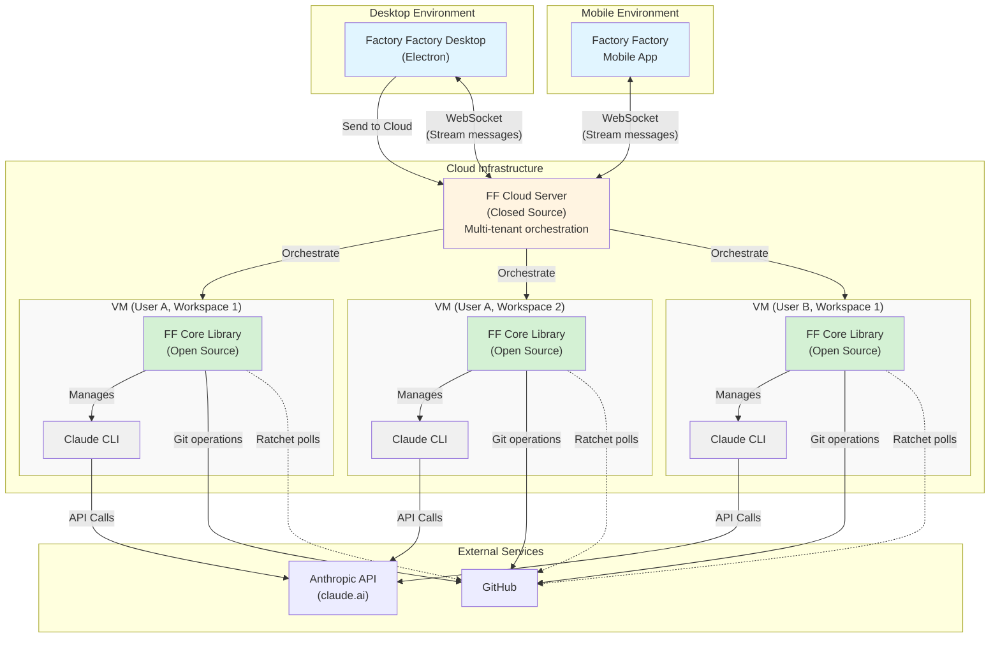

# Factory Factory Cloud Vision
This document lays out my vision for what a "Cloud" version for Factory Factory could look like

## How it behaves
Workspaces default to working on desktop (because engineers like control), but users can click a button to "Send to Cloud". This creates a claude CLI instance in the cloud that executes. The ratchet listener for this workspace is also moved to the cloud. The workspace as seen in the user's UI looks the same as any other workspace, but the work is happening in the cloud. 

## Use cases

### V1: You go out to lunch, but your work keeps happening
The user has 5 workspaces open and they are all busy. It's lunchtime; the user wants to get food and close their laptop, but they want the work to continue. So they send all 5 workspaces to cloud. 

They have lunch and come back, to find all workspaces have open PRs with 5/5 from Greptile. Now all they need to do is test all the changes and push!

### V2: Checking up on work while running errands
The user needs to do a grocery run, but they want to keep their workspace active. They only started this workspace, so it's not ready to go solo yet. The user sends the workspace to cloud, closes their laptop and goes to the grocery store. 

At the grocery store, they go on their FF App (or website?) and check the workspace's status. Looks like the agent has some questions for them. The grocery store has a small seating area, so the user sits down and goes through a few rounds of questions and answers, then reviews their design doc using Markdown Preview mode. The doc and the diagrams look correct; the workspace is ready to go! The user asks the agent to make a PR, then continues with the grocery run. 

The user gets home and puts away their groceries. Now they open up their laptop and check on the workspace. There's a PR open, 5/5 on github, and the implementation matches the design doc. Perfect - all we need to do now is test and merge!

### V3: Talking to their agent while taking a walk
The user does their best work while walking. So they fire up a new workspace on their mobile app and go for a walk. The user has headphones on, and is just talking to the agent. In the workspace, the user starts out by working with the agent to define a design doc. Once the user's satisfied with the voice agent's explanation of the work, they sit down on a park bench and start reviewing the design doc. 

The design doc and diagrams look good! Time to let the agent continue. 

As the user walks home, they suddenly have a question about the work - they realized that there's a new edge case they hadn't thought of! They open up the agent and fire up voice mode, and immediately ask about the edge case. 

After thinking for a moment, the agent says "This edge case is new; nice catch! Would you like me to integrate this into the design document?" The user says yes. 

The agent implements the design according to the original design doc, and then reviews the design. When it reviews, the agent realizes that the design has changed - the new edge case has been added! It updates the design to include the edge case. 

The user gets home. The weather is beautiful, so they are invigorated and ready to go. They open up their laptop and check on the workspace. There's a PR, and greptile gives it 5/5. The design doc clearly includes the new edge case the user thought of, and the implementation matches the design exactly. 

Perfect - now to do some testing!

### V4: The manager's story
Martin manages a team of 5 engineers. He's sipping his coffee, starting his day. Martin likes to start off his day by checking in on what the team is up to. 

Everyone on the team is using FactoryFactory, and the team has a Factory Factory Team subscription, so checking in is very easy: all Martin has to do is login to the cloud site and navigate to the team view.

In the team view, Martin can see a list of team members, along with some stats about the workspaces they have open. 

Martin starts out by checking on Jane. She's new to the team so she may need a little extra support. Martin clicks the card with Jane's details on it, which takes him to a teammate detail view. This shows Martin that Jane's got 4 workspaces open. One of them has her work relating to a pretty difficult task - just then, Martin recalls a subtle edge case that could completely derail the work! He clicks on the workspace, and has his agent check if the work that Jane is doing considers that edge case. After thinking for a bit, his agent confirms that, yes - Jane's work does consider that edge case. Martin is impressed; she was the right hire after all! He sends her a quick message on slack, congratulating her for catching the edge case.

Then he checks Eric's page. Eric has 4 workspaces open. Martin knows what 3 of the workspaces are about - what about the 4th? He checks the workspace - it's a new POC that Eric is thinking about. The branch has many changes, and the documentation is hard to follow. Martin asks the agent to look at the work and make him a document that explains it in simple terms, with diagrams. After thinking about it for a bit, the agent gives him a simple diagram. 

Oh no - this POC is cool, but Martin thinks its not in line with the team's strategy. He wants to make sure, though, so he asks his agent to double check his intuition - for context, he includes a link to the strategy document he wrote the day before. The agent thinks about it, and gives a detailed reply - Eric's POC is not quite in line with the company's strategy. 

Next, Martin checks Boris' work. Oh no! Looks like Boris is working on something that seems to duplicate some of Jane's work. It's a big change though, and the duplication might be a small part of the work, not the whole of it. Martin asks his agent to check what the degree of overlap is. As Martin sips is coffee, the agent tells him that there is some overlap, but it's small, and if Boris were to reduce the scope of his work, the issue would be sorted. Easy enough! Martin sends Boris a slack message about this now.

Martin goes through the rest of his team and catches up on what they are working on. No surprises, but good progress! He stands up and looks outside. Great day for a walk; perhaps he can enjoy the weather while he thinks about how to bring Eric's work in line with the strategy... he sees a few ways to do it, and a walk is the perfect way to digest. 

# Technical Details

## Open questions

See [Appendix: Open Questions](./appendix-open-questions.md) for detailed Q&A on Claude CLI internals, streaming protocol, sandboxing, Firecracker vs Docker, and filesystem layout.

## Cloud Architecture

**Constraint: FF itself must remain open source. FF Cloud must be closed source.**

See [Appendix: Alternative Approaches](./appendix-alternatives.md) for other approaches we considered and why we chose this one.

### FF as a Library

**Refactor FF into two layers:**

```
┌──────────────────────────────────────────────────────────┐
│           FF Cloud (Closed Source)                       │
│  - Multi-tenant user management                          │
│  - Billing, quotas, subscriptions                        │
│  - VM orchestration and lifecycle                        │
│  - Team features (manager view, sharing)                 │
│  - Cloud-specific WebSocket relay                        │
│  - PostgreSQL for multi-tenant data                      │
└──────────────────────────────────────────────────────────┘
                        ↓ uses
┌──────────────────────────────────────────────────────────┐
│           FF Core Library (Open Source)                  │
│  - Workspace execution primitives                        │
│  - Claude CLI process management                         │
│  - Session management                                    │
│  - Message state and history                             │
│  - File operations and git integration                   │
│  - Ratchet (auto-fix) logic                              │
│  - SQLite for single-user workspace state                │
└──────────────────────────────────────────────────────────┘
```

### FF Core Library API

**FF Core exposes a clean TypeScript API that both desktop and cloud use:**

```typescript
// FF Core library (@factory-factory/core)
import { WorkspaceManager, Session, ClaudeClient } from '@factory-factory/core';

// Example: FF Cloud uses FF Core to manage workspaces in VMs
class CloudWorkspaceService {
  async createWorkspace(userId: string, issueUrl: string): Promise<Workspace> {
    // Multi-tenant logic (closed source)
    const vm = await this.vmOrchestrator.provisionVM(userId);

    // FF Core library (open source)
    const workspaceManager = new WorkspaceManager({
      dataDir: `/vm/${vm.id}/workspace`,
      githubToken: await this.getGitHubToken(userId),
    });

    const workspace = await workspaceManager.createFromIssue(issueUrl);

    // Store in multi-tenant DB (closed source)
    await this.db.workspace.create({
      userId,
      workspaceId: workspace.id,
      vmId: vm.id,
      // ...
    });

    return workspace;
  }
}
```

### Responsibility Split: Library vs Server

**FF Core Library (Open Source) - Workspace Execution Primitives**

The library handles **single-workspace execution** - everything needed to run one workspace:

| Responsibility | What it does |
|----------------|-------------|
| **Claude CLI Management** | Spawn, communicate with, monitor Claude CLI subprocesses |
| **Workspace Lifecycle** | Create workspace from issue, load state, save state |
| **Session Management** | Start/stop sessions, send messages, handle responses |
| **Message State** | Track message history, handle streaming, store conversation |
| **File Operations** | Read/write files in workspace directory |
| **Git Integration** | Clone repos, commit changes, push to GitHub |
| **Ratchet Logic** | Poll GitHub for CI/review status, trigger fix sessions |
| **Local Storage** | SQLite for workspace metadata, session history |

**What FF Core does NOT do:**
- ❌ Multi-user management (single workspace context)
- ❌ Authentication/authorization
- ❌ Billing or quotas
- ❌ VM orchestration
- ❌ Cross-workspace queries (e.g., "list all workspaces for user X")
- ❌ Team features (manager view, sharing)

**FF Desktop Server (Open Source) - Single-User Desktop App**

Uses FF Core library + adds desktop-specific features:

| Responsibility | What it does |
|----------------|-------------|
| **Local Server** | Express server on localhost (single user) |
| **UI Backend** | tRPC API for Electron frontend |
| **Workspace Management** | List workspaces, switch between them (uses FF Core) |
| **Local Database** | Single SQLite database for all user's workspaces |
| **WebSocket** | Stream Claude messages to frontend (uses FF Core events) |
| **Electron Integration** | Window management, system tray, auto-launch |

**What Desktop does NOT do:**
- ❌ Multi-user support
- ❌ VM orchestration (runs directly on user's machine)
- ❌ Cloud storage (everything local)

**FF Cloud Server (Closed Source) - Multi-Tenant Cloud Orchestration**

Uses FF Core library (in VMs) + adds cloud-specific features:

| Responsibility | What it does |
|----------------|-------------|
| **User Management** | Authentication, authorization, user accounts |
| **Billing** | Subscriptions, quotas, usage tracking, payments |
| **VM Orchestration** | Provision/terminate VMs, warm pools, lifecycle management |
| **Multi-Tenant DB** | PostgreSQL with userId foreign keys everywhere |
| **WebSocket Relay** | Route messages between desktop/mobile clients and VMs |
| **Team Features** | Manager view, workspace sharing, team stats |
| **Workspace Routing** | Map workspace requests to correct VM |
| **API Gateway** | REST/WebSocket endpoints for clients |

**What Cloud does NOT do directly:**
- ❌ Execute workspaces directly (delegates to FF Core in VMs)
- ❌ Manage Claude CLI (FF Core handles this in VMs)
- ❌ Store workspace state (VMs store in SQLite via FF Core)

### API Comparison: Library vs Servers

**FF Core Library (Open Source):**

```typescript
// Single workspace context
const workspace = new WorkspaceManager({ dataDir: '/workspace' });
await workspace.createFromIssue('https://github.com/org/repo/issues/123');

const session = new Session(workspace.id);
await session.start('Fix the bug in auth.ts');
session.on('message', (msg) => console.log(msg));

const ratchet = new RatchetService();
await ratchet.start(workspace.id, 'https://github.com/org/repo/pull/456');
```

**FF Desktop Server (Open Source):**

```typescript
// Multi-workspace, single-user
app.get('/workspaces', async (req, res) => {
  const workspaces = await workspaceService.listAll();  // Uses FF Core
  res.json(workspaces);
});

app.post('/workspaces', async (req, res) => {
  const workspace = await workspaceService.create(req.body.issueUrl);  // Uses FF Core
  res.json(workspace);
});

// WebSocket
wss.on('connection', (ws) => {
  session.on('message', (msg) => ws.send(msg));  // FF Core event → WebSocket
});
```

**FF Cloud Server (Closed Source):**

```typescript
// Multi-workspace, multi-user, VM orchestration
app.post('/workspaces', authenticate, async (req, res) => {
  const userId = req.user.id;

  // Check quota (closed source)
  await billingService.checkQuota(userId);

  // Provision VM (closed source)
  const vm = await vmOrchestrator.provisionVM(userId);

  // Create workspace in VM using FF Core (open source)
  const workspace = await vmService.executeInVM(vm.id, async () => {
    const manager = new WorkspaceManager({ dataDir: '/workspace' });
    return await manager.createFromIssue(req.body.issueUrl);
  });

  // Store in multi-tenant DB (closed source)
  await db.workspace.create({ userId, workspaceId: workspace.id, vmId: vm.id });

  res.json(workspace);
});
```

### What's Open Source (FF Core)

**Desktop FF and FF Core in VMs both use this:**

```typescript
// @factory-factory/core (open source)

export class WorkspaceManager {
  createFromIssue(issueUrl: string): Promise<Workspace>
  list(): Promise<Workspace[]>
  get(id: string): Promise<Workspace>
  delete(id: string): Promise<void>
}

export class Session {
  start(workspaceId: string, prompt?: string): Promise<void>
  sendMessage(content: string): Promise<void>
  stop(): Promise<void>
  getMessages(): Promise<Message[]>
  on(event: 'message', handler: (msg: Message) => void): void
}

export class ClaudeClient {
  spawn(options: ClaudeProcessOptions): Promise<ClaudeProcess>
  sendUserMessage(content: string): Promise<void>
  interrupt(): Promise<void>
  // ... protocol management
}

export class RatchetService {
  start(workspaceId: string, prUrl: string): Promise<void>
  stop(workspaceId: string): Promise<void>
  getStatus(workspaceId: string): Promise<RatchetStatus>
}
```

### What's Closed Source (FF Cloud)

**Cloud-specific orchestration and business logic:**

```typescript
// @factory-factory/cloud (closed source)

export class UserService {
  authenticate(token: string): Promise<User>
  getQuota(userId: string): Promise<Quota>
  checkBilling(userId: string): Promise<BillingStatus>
}

export class VMOrchestrator {
  provisionVM(userId: string): Promise<VM>
  terminateVM(vmId: string): Promise<void>
  getVMPool(): Promise<VM[]>  // Warm pool management
}

export class TeamService {
  getTeamWorkspaces(teamId: string): Promise<Workspace[]>
  getTeamStats(teamId: string): Promise<TeamStats>
  shareWorkspace(workspaceId: string, teamId: string): Promise<void>
}

export class CloudWebSocketRelay {
  // Relay messages between desktop/mobile clients and VMs
  relayToClient(userId: string, msg: Message): void
  relayToVM(workspaceId: string, msg: Message): void
}
```

### What Happens to the Current FF Repo?

**Short answer: This repo stays the same, just gets reorganized into a monorepo with `packages/core` and `packages/desktop`, and publishes FF Core to npm.**

**Current structure (this repo):**
```
factory-factory/  (public repo)
  src/
    backend/
      domains/
        session/          ← Session logic
          claude/         ← Claude CLI management
        workspace/        ← Workspace management
        ratchet/          ← Auto-fix logic
      server.ts           ← Desktop server
    client/               ← Desktop UI
  electron/               ← Electron wrapper
  package.json
```

**After refactoring (same repo, reorganized):**
```
factory-factory/  (public repo - stays public, stays open source)
  packages/
    core/                          ← NEW: @factory-factory/core
      src/
        workspace/                 ← Extracted from src/backend/domains/workspace
        session/                   ← Extracted from src/backend/domains/session
        claude/                    ← Extracted from src/backend/domains/session/claude
        ratchet/                   ← Extracted from src/backend/domains/ratchet
        storage/
          sqlite-adapter.ts        ← SQLite storage interface
      package.json                 ← NEW: Published to npm
      tsconfig.json

    desktop/                       ← RENAMED: Everything from current src/
      src/
        backend/
          server.ts                ← Desktop server (now uses @factory-factory/core)
          domains/
            # Remaining desktop-specific logic
        client/                    ← Desktop UI (unchanged)
      electron/                    ← Electron wrapper (unchanged)
      package.json                 ← Updated to depend on @factory-factory/core
      tsconfig.json

  # Root level (unchanged)
  .github/
  docs/
  prisma/
  README.md
  LICENSE
  package.json                     ← Workspace root (pnpm workspace config)
  pnpm-workspace.yaml              ← NEW: Defines packages/*/
```

**Key changes to this repo:**

1. **Convert to pnpm workspace** (or npm workspaces):
   ```yaml
   # pnpm-workspace.yaml
   packages:
     - 'packages/*'
   ```

2. **Extract `packages/core/`** from existing code:
   - Move `src/backend/domains/session/claude/` → `packages/core/src/claude/`
   - Move `src/backend/domains/session/` → `packages/core/src/session/`
   - Move `src/backend/domains/workspace/` → `packages/core/src/workspace/`
   - Move `src/backend/domains/ratchet/` → `packages/core/src/ratchet/`

3. **Move everything else to `packages/desktop/`**:
   - `src/` → `packages/desktop/src/`
   - `electron/` → `packages/desktop/electron/`
   - Update imports to use `@factory-factory/core`

4. **Publish FF Core to npm**:
   ```bash
   cd packages/core
   pnpm publish  # Publishes to npmjs.com
   ```

5. **Desktop depends on FF Core**:
   ```json
   // packages/desktop/package.json
   {
     "dependencies": {
       "@factory-factory/core": "workspace:*"  // During dev (local)
       // OR
       "@factory-factory/core": "^1.0.0"      // After publishing
     }
   }
   ```

**Does the desktop app still work the same way?**

✅ **Yes, exactly the same from the user's perspective:**
- Same Electron app
- Same UI
- Same features
- Same commands (`pnpm dev`, `pnpm build`, `pnpm dev:electron`)
- Same release process

**What changes for developers?**

- **Import paths change**: Instead of `import { ClaudeClient } from '@/backend/domains/session/claude'`, now `import { ClaudeClient } from '@factory-factory/core'`
- **Two packages to work on**: `packages/core/` and `packages/desktop/`
- **Build order**: Build core first, then desktop (handled automatically by pnpm workspace)

**Benefits of keeping it in the same repo:**

✅ **Single source of truth**: Core and desktop stay in sync
✅ **Easier development**: Change core and desktop together in one PR
✅ **Shared tooling**: ESLint, Prettier, TypeScript config, CI/CD
✅ **Atomic commits**: Core + desktop changes in one commit
✅ **Monorepo superpowers**: `pnpm --filter` to run commands per package

**Workflow after refactoring:**

```bash
# Work on FF Core
cd packages/core
pnpm build

# Work on FF Desktop (automatically uses local core)
cd packages/desktop
pnpm dev

# Build both
pnpm --filter @factory-factory/core build
pnpm --filter @factory-factory/desktop build

# Or build all from root
pnpm -r build  # -r = recursive (all packages)

# Publish FF Core to npm
cd packages/core
pnpm publish

# Desktop can use published version or local workspace version
```

**FF Cloud repo (separate, closed source):**

```
factory-factory-cloud/  (private repo)
  src/
    services/
      user.service.ts
      vm.service.ts
      workspace.service.ts      ← Uses @factory-factory/core from npm
    server.ts
  package.json
    dependencies:
      "@factory-factory/core": "^1.0.0"  ← Installed from npm
```

### Summary: Same Repo, Just Reorganized

| What | Before | After |
|------|--------|-------|
| **Repo visibility** | Public | Public (same) |
| **License** | Open source | Open source (same) |
| **Structure** | Single package (`src/`) | Monorepo (`packages/core`, `packages/desktop`) |
| **Desktop app** | Works as-is | Works exactly the same (uses core as dependency) |
| **FF Core** | N/A (embedded in desktop) | Published to npm, usable by anyone |
| **Contributors** | Contribute to FF Desktop | Contribute to FF Core and/or FF Desktop |
| **Commands** | `pnpm dev`, `pnpm build` | Same commands work (monorepo handles it) |
| **Cloud repo** | N/A | Separate private repo, installs core from npm |

**No need for users to change anything** - they still install FF Desktop the same way, it just internally uses FF Core as a library now.

### Desktop vs Cloud: Same Core, Different Wrappers

| Component | Desktop (Open) | Cloud (Closed) |
|-----------|----------------|----------------|
| **Workspace logic** | `@factory-factory/core` | `@factory-factory/core` (in VM) |
| **Session management** | `@factory-factory/core` | `@factory-factory/core` (in VM) |
| **Claude CLI** | `@factory-factory/core` | `@factory-factory/core` (in VM) |
| **Storage** | SQLite (local) | SQLite (per-VM) + PostgreSQL (multi-tenant) |
| **UI** | Electron React app | Web app + Mobile app |
| **Server** | Express (single-user) | Express (multi-tenant orchestration) |
| **User management** | N/A (single user) | FF Cloud (closed source) |
| **Billing** | N/A | FF Cloud (closed source) |
| **Team features** | N/A | FF Cloud (closed source) |
| **VM orchestration** | N/A | FF Cloud (closed source) |

### Benefits of This Approach

✅ **FF Core stays 100% open source**: All workspace execution logic is open
✅ **Desktop stays open source**: Uses FF Core, no cloud-specific code
✅ **Cloud-specific features are closed**: User management, billing, teams, VM orchestration
✅ **Code reuse**: Desktop and Cloud VMs run identical FF Core
✅ **Community contributions**: Open source contributors can improve FF Core, benefiting both desktop and cloud
✅ **Testing**: FF Core can be tested independently, works on desktop and in VMs
✅ **Clear boundary**: Open source = execution primitives, Closed source = multi-tenant infrastructure

### How FF Cloud Consumes FF Core (Practical Details)

**FF Core is published to public npm (open source):**

```bash
# packages/core/package.json
{
  "name": "@factory-factory/core",
  "version": "1.0.0",
  "main": "./dist/index.js",
  "types": "./dist/index.d.ts",
  "license": "MIT",
  "repository": {
    "type": "git",
    "url": "https://github.com/purplefish-ai/factory-factory"
  }
}
```

**FF Cloud (closed source, private repo) installs it like any npm package:**

```bash
# In factory-factory-cloud repo
npm install @factory-factory/core

# or
pnpm add @factory-factory/core
```

**FF Cloud's package.json:**

```json
{
  "name": "@factory-factory/cloud",
  "version": "1.0.0",
  "private": true,
  "dependencies": {
    "@factory-factory/core": "^1.0.0",
    "express": "^4.18.0",
    "@prisma/client": "^5.0.0",
    "ws": "^8.0.0"
    // ... other cloud-specific deps
  }
}
```

**FF Cloud imports and uses FF Core:**

```typescript
// src/services/workspace.service.ts (FF Cloud - closed source)
import { WorkspaceManager, Session, ClaudeClient } from '@factory-factory/core';
import type { Workspace, ClaudeProcessOptions } from '@factory-factory/core';

export class CloudWorkspaceService {
  async createWorkspace(userId: string, issueUrl: string): Promise<Workspace> {
    // Multi-tenant logic (closed source)
    const vm = await this.vmOrchestrator.provisionVM(userId);

    // FF Core usage (open source library)
    const workspaceManager = new WorkspaceManager({
      dataDir: `/mnt/vm/${vm.id}/workspace`,
      githubToken: await this.getGitHubToken(userId),
    });

    const workspace = await workspaceManager.createFromIssue(issueUrl);

    // Store in cloud DB (closed source)
    await this.db.workspace.create({ userId, workspaceId: workspace.id, vmId: vm.id });

    return workspace;
  }
}
```

**Repository structure:**

```
┌─────────────────────────────────────────────────────┐
│  github.com/purplefish-ai/factory-factory           │
│  (PUBLIC REPO - Open Source)                        │
│                                                     │
│  packages/                                          │
│    core/          ← Published to npm as @factory-factory/core
│    desktop/       ← Uses @factory-factory/core     │
│                                                     │
│  Published to: npmjs.com/package/@factory-factory/core
└─────────────────────────────────────────────────────┘

┌─────────────────────────────────────────────────────┐
│  github.com/purplefish-ai/factory-factory-cloud     │
│  (PRIVATE REPO - Closed Source)                     │
│                                                     │
│  src/                                               │
│    services/                                        │
│      user.service.ts                                │
│      vm.service.ts                                  │
│      workspace.service.ts  ← Uses @factory-factory/core from npm
│    server.ts                                        │
│                                                     │
│  package.json:                                      │
│    dependencies:                                    │
│      "@factory-factory/core": "^1.0.0"              │
└─────────────────────────────────────────────────────┘
```


### Version Management

- **FF Core** uses semantic versioning (1.0.0, 1.1.0, 2.0.0)
- **FF Desktop** uses workspace reference during dev: `"@factory-factory/core": "workspace:*"`
- **FF Cloud** can pin to specific version: `"@factory-factory/core": "1.2.3"` for stability
- Breaking changes in FF Core trigger a major version bump

## Implementation Phases

**Phase 0: Library Extraction**
- Extract FF Core as `@factory-factory/core` (open source npm package)
- Core includes: workspace, session, claude, ratchet primitives
- Refactor FF Desktop to use the library
- Publish to npm, verify desktop works unchanged

**Phase 1 (MVP): FF Cloud with Docker**
- Build FF Cloud server (closed source) using `@factory-factory/core`
- Add multi-tenant features: users, billing, teams, VM orchestration
- VMs run FF Core for workspace execution (Docker containers, 1 VM per workspace)
- Cloud acts as orchestration layer and WebSocket relay
- Warm VM pools for fast startup (~500ms)

**Phase 2: Optimize Resource Usage**
- Move to **1 VM per user** with multiple workspaces inside
- Each workspace is a Claude CLI subprocess within the user's VM
- Reduces cost from 5-10 VMs per user to 1 VM per user

**Phase 3: Production Security**
- Migrate from Docker to Firecracker microVMs for stronger isolation
- Hybrid isolation: shared user VM for trusted workspaces, dedicated VM for sensitive ones

**Phase 4: Enterprise**
- Per-customer isolated infrastructure for enterprise customers
- White-label deployments, on-premise installs

See [Appendix: Alternative Approaches](./appendix-alternatives.md) for VM startup time analysis and comparison tables.

## Architecture



### Component Descriptions

- **Factory Factory Desktop (Electron)**: Desktop application using FF Core library. Runs workspaces locally or sends them to cloud. Streams real-time updates via WebSocket.

- **FF Cloud Server (Closed Source)**: Multi-tenant orchestration layer. Handles authentication, billing, VM provisioning, and WebSocket relay between clients and VMs. Does NOT execute workspaces directly.

- **VMs (Docker/Firecracker)**: Isolated execution environments, one per workspace (Phase 1) or one per user (Phase 2). Each VM runs FF Core library to manage workspace execution.

- **FF Core Library (Open Source)**: Published to npm as `@factory-factory/core`. Provides workspace execution primitives: Claude CLI management, session management, git operations, ratchet logic. Used by both desktop and cloud VMs.

- **Claude CLI**: Subprocess managed by FF Core that wraps the Anthropic Claude API. Handles tool execution, streaming responses, and conversation management.

- **Factory Factory Mobile**: Mobile application (pure frontend) that connects to FF Cloud to view workspaces and interact with running sessions via WebSocket.

- **Ratchet**: Auto-fix system built into FF Core. Polls GitHub for PR status (CI failures, review comments) and automatically spawns fix sessions. Runs inside VMs alongside workspaces.

- **GitHub**: External service for git operations (push, pull) and ratchet polling (PR status, CI checks).

- **Anthropic API**: Cloud service that powers Claude CLI. Each Claude CLI subprocess makes API calls to claude.ai for AI responses.

## How FF Cloud Communicates with VMs

FF Cloud doesn't communicate with VMs via CLI commands. Instead, FF Core library runs **inside each VM** and FF Cloud communicates via:

1. **VM Management API**: Provision/terminate VMs, execute commands in VMs
2. **WebSocket Relay**: Real-time message streaming between clients and VMs
3. **PostgreSQL**: Store workspace metadata, user info, billing

### Architecture: FF Cloud as WebSocket Relay

```
┌──────────────┐                     ┌─────────────────┐                     ┌──────────────┐
│   Desktop    │◄────WebSocket──────►│   FF Cloud      │◄────WebSocket──────►│  VM (User A) │
│   Client     │                     │   Relay Server  │                     │  FF Core     │
└──────────────┘                     │                 │                     │  Claude CLI  │
                                     │  - Routes msgs  │                     └──────────────┘
┌──────────────┐                     │  - Auth/billing │
│   Mobile     │◄────WebSocket──────►│  - PostgreSQL   │◄────WebSocket──────►┌──────────────┐
│   Client     │                     │  - VM mgmt      │                     │  VM (User B) │
└──────────────┘                     └─────────────────┘                     │  FF Core     │
                                                                              │  Claude CLI  │
                                                                              └──────────────┘
```

### VM Communication via FF Core Library

**FF Cloud executes code in VMs using FF Core:**

```typescript
// FF Cloud (closed source) - orchestration layer
class VMService {
  async createWorkspace(userId: string, issueUrl: string) {
    // 1. Provision VM (closed source)
    const vm = await this.vmOrchestrator.provisionVM(userId);

    // 2. Execute FF Core code inside VM via SSH/API
    const result = await this.executeInVM(vm.id, async () => {
      // This code runs INSIDE the VM
      const { WorkspaceManager } = await import('@factory-factory/core');

      const manager = new WorkspaceManager({
        dataDir: '/workspace',
        githubToken: process.env.GITHUB_TOKEN,
      });

      return await manager.createFromIssue(issueUrl);
    });

    // 3. Store in cloud DB (closed source)
    await db.workspace.create({
      userId,
      workspaceId: result.id,
      vmId: vm.id,
    });

    return result;
  }
}
```

### WebSocket Message Streaming

**Client → FF Cloud → VM:**

```typescript
// Desktop/Mobile client sends message
websocket.send({
  type: 'user_message',
  workspaceId: 'ws-123',
  content: 'Fix the bug in auth.ts'
});

// FF Cloud routes to correct VM
class CloudWebSocketRelay {
  async handleClientMessage(userId: string, msg: ClientMessage) {
    // Find which VM owns this workspace
    const workspace = await db.workspace.findOne({
      id: msg.workspaceId,
      userId,  // Security: ensure user owns workspace
    });

    // Forward to VM's WebSocket connection
    const vmConnection = this.vmConnections.get(workspace.vmId);
    vmConnection.send({
      type: 'user_message',
      content: msg.content,
    });
  }
}

// VM (FF Core) receives and processes
class VMWebSocketHandler {
  async handleMessage(msg: Message) {
    // FF Core inside VM handles the message
    const session = await Session.get(msg.workspaceId);
    await session.sendMessage(msg.content);

    // FF Core emits events as Claude processes the message
    session.on('message', (claudeMsg) => {
      // Send back to FF Cloud
      this.vmWebSocket.send({
        type: 'claude_message',
        workspaceId: msg.workspaceId,
        message: claudeMsg,
      });
    });
  }
}
```

**VM → FF Cloud → Client:**

```typescript
// FF Core in VM emits Claude response
session.on('message', (msg) => {
  vmWebSocket.send({
    type: 'claude_message',
    workspaceId: 'ws-123',
    message: msg,
  });
});

// FF Cloud relays to all connected clients for this workspace
class CloudWebSocketRelay {
  async handleVMMessage(vmId: string, msg: VMMessage) {
    // Find all clients subscribed to this workspace
    const clients = this.clientsByWorkspace.get(msg.workspaceId) || [];

    // Forward to each client
    for (const client of clients) {
      client.send({
        type: 'claude_message',
        content: msg.message,
      });
    }
  }
}
```

### Message Types (Same as Desktop)

FF Cloud uses the same message types that Desktop FF already uses:

| Type | Direction | Description |
|------|-----------|-------------|
| `user_message` | Client → VM | User sends message to Claude |
| `claude_message` | VM → Client | Claude's response (streaming) |
| `status` | VM → Client | Session status (running/idle) |
| `user_question` | VM → Client | AskUserQuestion tool |
| `permission_request` | VM → Client | Permission prompt |
| `question_response` | Client → VM | Answer to question |
| `permission_response` | Client → VM | Permission approval/denial |
| `messages_snapshot` | VM → Client | Full state on connect |

### Key Differences from Desktop

| Aspect | Desktop FF | FF Cloud |
|--------|-----------|----------|
| **FF Core location** | Runs on user's machine | Runs inside VMs |
| **Communication** | Direct (local WebSocket) | Relayed (client ↔ cloud ↔ VM) |
| **Database** | SQLite (local) | PostgreSQL (multi-tenant) + SQLite (per-VM) |
| **Authentication** | N/A (single user) | JWT tokens, userId checks |
| **VM management** | N/A | Provision, monitor, terminate VMs |
| **Message routing** | Direct | FF Cloud routes by workspaceId → vmId |

### Implementation: VM WebSocket Server

Each VM runs a small WebSocket server that FF Cloud connects to:

```typescript
// Inside VM (using FF Core)
class VMWebSocketServer {
  constructor() {
    this.wss = new WebSocketServer({ port: 8080 });
    this.wss.on('connection', (ws) => {
      // FF Cloud connects here
      ws.on('message', (data) => {
        const msg = JSON.parse(data);
        this.handleCloudMessage(msg);
      });
    });
  }

  async handleCloudMessage(msg: Message) {
    // Use FF Core to handle the message
    switch (msg.type) {
      case 'user_message':
        await this.handleUserMessage(msg);
        break;
      case 'question_response':
        await this.handleQuestionResponse(msg);
        break;
      // ... other message types
    }
  }

  async handleUserMessage(msg: UserMessage) {
    const { Session } = await import('@factory-factory/core');
    const session = await Session.get(msg.workspaceId);

    // Send to Claude CLI (FF Core manages this)
    await session.sendMessage(msg.content);

    // FF Core emits events, we forward to cloud
    session.on('message', (claudeMsg) => {
      this.sendToCloud({
        type: 'claude_message',
        workspaceId: msg.workspaceId,
        message: claudeMsg,
      });
    });
  }

  sendToCloud(msg: any) {
    // Send to FF Cloud via WebSocket
    this.ws.send(JSON.stringify(msg));
  }
}

// Start server when VM boots
const server = new VMWebSocketServer();
```

### Benefits of This Approach

✅ **No CLI overhead**: FF Core is a library, not a CLI subprocess
✅ **Type safety**: TypeScript types across the entire stack
✅ **Real-time streaming**: WebSocket for instant message relay
✅ **Reuses desktop logic**: Same FF Core in desktop and cloud VMs
✅ **Simple routing**: FF Cloud maps workspaceId → vmId → forward message
✅ **Security**: Authentication at cloud layer, FF Core doesn't handle multi-tenancy

## Ratchet Handoff: Desktop → Cloud

**Problem**: When a workspace is sent to cloud, the desktop's ratchet service (which polls GitHub for PR status) needs to stop, and the cloud's ratchet service needs to start. How do we coordinate this handoff?

### Current Ratchet Architecture (Desktop)

**How ratchet works today (desktop FF):**

1. **Ratchet Service** runs in the desktop backend, polls all workspaces with PRs every 1 minute
2. For each workspace with `ratchetEnabled: true`:
   - Fetches PR status from GitHub (CI status, review comments)
   - Compares current state to last known state (stored in `ratchetState`, `ratchetLastCiRunId`, `prReviewLastCheckedAt`)
   - If state changed (CI failed, new review comments), dispatches a "fixer session"
3. **Fixer session**: Spawns a Claude CLI session with a ratchet-specific prompt, attempts to fix the issue
4. **State tracking** (in workspace table):
   - `ratchetEnabled`: User toggle (workspace-level)
   - `ratchetState`: Current PR state (IDLE/CI_RUNNING/CI_FAILED/REVIEW_PENDING/READY/MERGED)
   - `ratchetActiveSessionId`: ID of active fixer session (null if idle)
   - `ratchetLastCiRunId`: Last known CI run ID (prevents duplicate dispatches)
   - `prReviewLastCheckedAt`: Timestamp of last review activity check

**Key insight:** Ratchet is a **stateful polling loop** with state stored in the workspace table.

### Handoff Challenge

When "Send to Cloud" is clicked:

1. Desktop must **stop polling** this workspace (no longer its responsibility)
2. Cloud must **start polling** this workspace (now cloud's responsibility)
3. **State must transfer** seamlessly (no duplicate fixes, no missed events)
4. **In-flight fixer sessions** must complete gracefully (desktop) or transfer (cloud)

### Solution: Location-Aware Ratchet with State Transfer

#### 1. Add `location` Field to Workspace Table

```typescript
// Workspace table (both desktop and cloud DBs)
model Workspace {
  // ... existing fields
  ratchetEnabled: boolean
  ratchetState: RatchetState
  ratchetActiveSessionId: string?
  ratchetLastCiRunId: string?
  prReviewLastCheckedAt: DateTime?

  // NEW: Where is this workspace running?
  location: WorkspaceLocation  // DESKTOP | CLOUD
  cloudVmId: string?           // VM ID if location=CLOUD
}

enum WorkspaceLocation {
  DESKTOP
  CLOUD
}
```

#### 2. Desktop Ratchet Service Filters by Location

**Desktop ratchet loop:**

```typescript
// Desktop: src/backend/services/ratchet.service.ts
class RatchetService {
  private async findWorkspacesWithPRs(): Promise<WorkspaceWithPR[]> {
    // Only poll workspaces that are DESKTOP
    return await workspaceAccessor.findMany({
      where: {
        prUrl: { not: null },
        ratchetEnabled: true,
        location: 'DESKTOP',  // ← NEW: Desktop only polls desktop workspaces
      },
    });
  }
}
```

**Cloud ratchet loop (identical logic, different filter):**

```typescript
// Cloud: FF Cloud backend
class CloudRatchetService {
  private async findWorkspacesWithPRs(): Promise<WorkspaceWithPR[]> {
    // Only poll workspaces that are CLOUD
    return await db.workspace.findMany({
      where: {
        prUrl: { not: null },
        ratchetEnabled: true,
        location: 'CLOUD',  // ← Cloud only polls cloud workspaces
      },
    });
  }
}
```

**Result:** Desktop and cloud ratchet loops automatically filter by location, no coordination needed.

#### 3. Send to Cloud: Update Location + Transfer State

**Desktop "Send to Cloud" flow:**

```typescript
// Desktop: src/backend/trpc/workspace.trpc.ts
async function sendWorkspaceToCloud(workspaceId: string) {
  // 1. Upload workspace state to cloud
  const workspace = await workspaceAccessor.findById(workspaceId);

  const cloudWorkspaceId = await ffCloudAPI.createWorkspace({
    // ... workspace details
    ratchetEnabled: workspace.ratchetEnabled,
    ratchetState: workspace.ratchetState,
    ratchetLastCiRunId: workspace.ratchetLastCiRunId,
    prReviewLastCheckedAt: workspace.prReviewLastCheckedAt,
    // ↑ Transfer ratchet state to cloud DB
  });

  // 2. Update location to CLOUD (stops desktop polling)
  await workspaceAccessor.update(workspaceId, {
    location: 'CLOUD',
    cloudVmId: cloudWorkspaceId,
  });

  // 3. Desktop ratchet service will ignore this workspace on next poll
  // 4. Cloud ratchet service will pick it up on next poll (within 1 minute)
}
```

**Cloud workspace creation:**

```typescript
// Cloud: src/services/workspace.service.ts
async function createWorkspaceFromDesktop(data: DesktopWorkspaceData) {
  // 1. Provision VM
  const vm = await vmOrchestrator.provisionVM(userId);

  // 2. Create workspace in VM using FF Core
  const workspace = await vmService.executeInVM(vm.id, async () => {
    const manager = new WorkspaceManager({ dataDir: '/workspace' });
    return await manager.createFromIssue(data.issueUrl);
  });

  // 3. Store in cloud DB with transferred ratchet state
  await db.workspace.create({
    userId,
    workspaceId: workspace.id,
    vmId: vm.id,
    location: 'CLOUD',  // ← Mark as cloud workspace
    prUrl: data.prUrl,
    ratchetEnabled: data.ratchetEnabled,
    ratchetState: data.ratchetState,           // ← Transferred from desktop
    ratchetLastCiRunId: data.ratchetLastCiRunId,
    prReviewLastCheckedAt: data.prReviewLastCheckedAt,
  });

  // 4. Cloud ratchet service will pick this up on next poll
}
```

#### 4. Handling In-Flight Fixer Sessions

**Scenario:** Desktop ratchet dispatched a fixer session, then user clicks "Send to Cloud" before fixer completes.

**Option A: Let desktop fixer complete (simpler)**

```typescript
async function sendWorkspaceToCloud(workspaceId: string) {
  const workspace = await workspaceAccessor.findById(workspaceId);

  // Check if ratchet fixer is active
  if (workspace.ratchetActiveSessionId) {
    const session = await sessionAccessor.findById(workspace.ratchetActiveSessionId);

    if (session.status === 'ACTIVE' || session.status === 'RUNNING') {
      throw new Error(
        'Cannot send workspace to cloud while ratchet fixer is active. ' +
        'Please wait for fixer to complete or stop the fixer session.'
      );
    }
  }

  // Safe to send to cloud
  await uploadToCloud(workspace);
  await workspaceAccessor.update(workspaceId, { location: 'CLOUD' });
}
```

**User experience:**
- User clicks "Send to Cloud"
- If ratchet fixer is active: Show error message "Fixer is running, please wait..."
- After fixer completes: User can retry "Send to Cloud"

**Option B: Transfer session to cloud (more complex)**

```typescript
async function sendWorkspaceToCloud(workspaceId: string) {
  const workspace = await workspaceAccessor.findById(workspaceId);

  // 1. Upload workspace state + active sessions
  const activeSession = workspace.ratchetActiveSessionId
    ? await sessionAccessor.findById(workspace.ratchetActiveSessionId)
    : null;

  await ffCloudAPI.createWorkspace({
    ...workspace,
    activeSession: activeSession ? {
      sessionId: activeSession.id,
      claudeSessionId: activeSession.claudeSessionId,
      status: activeSession.status,
      messages: await sessionAccessor.getMessages(activeSession.id),
      // ... full session state
    } : null,
  });

  // 2. Stop desktop session (interrupt Claude CLI)
  if (activeSession) {
    await sessionService.interrupt(activeSession.id);
  }

  // 3. Update location
  await workspaceAccessor.update(workspaceId, { location: 'CLOUD' });

  // 4. Cloud VM resumes the session using transferred state
}
```

**Recommendation:** Use **Option A (block send if fixer active)** for MVP:
- Simpler implementation
- Avoids complex session state transfer
- Rare edge case (fixer sessions are short, ~2-5 minutes)
- User can easily wait or stop the fixer

#### 5. Pull from Cloud: Reverse Handoff

When user clicks "Pull from Cloud" (bring workspace back to desktop):

```typescript
async function pullWorkspaceFromCloud(cloudWorkspaceId: string) {
  // 1. Download workspace state from cloud
  const cloudWorkspace = await ffCloudAPI.getWorkspace(cloudWorkspaceId);

  // 2. Stop cloud VM (cloud ratchet will stop polling this workspace)
  await ffCloudAPI.terminateVM(cloudWorkspace.vmId);

  // 3. Create/update local workspace
  await workspaceAccessor.upsert(cloudWorkspace.workspaceId, {
    ...cloudWorkspace,
    location: 'DESKTOP',  // ← Mark as desktop workspace
    cloudVmId: null,
    ratchetState: cloudWorkspace.ratchetState,  // ← Transfer state back
    ratchetLastCiRunId: cloudWorkspace.ratchetLastCiRunId,
    prReviewLastCheckedAt: cloudWorkspace.prReviewLastCheckedAt,
  });

  // 4. Desktop ratchet will pick this up on next poll
}
```

### Handoff Summary

| Step | Desktop Action | Cloud Action | Ratchet Impact |
|------|---------------|--------------|----------------|
| **1. Send to Cloud** | Upload workspace state, set `location='CLOUD'` | Create workspace in VM, store in cloud DB | Desktop stops polling (location filter), cloud starts polling |
| **2. Cloud polling** | N/A (ignores workspace) | Cloud ratchet service polls workspace every 1 minute | Cloud dispatches fixers if PR state changes |
| **3. Pull from Cloud** | Download state, set `location='DESKTOP'`, terminate cloud VM | VM terminates, workspace removed from cloud DB | Cloud stops polling (VM gone), desktop resumes polling |

### State Synchronization Details

**What gets transferred:**

| Field | Desktop → Cloud | Cloud → Desktop | Purpose |
|-------|----------------|-----------------|---------|
| `ratchetEnabled` | ✅ Yes | ✅ Yes | User's toggle preference |
| `ratchetState` | ✅ Yes | ✅ Yes | Current PR state (IDLE/CI_FAILED/etc.) |
| `ratchetLastCiRunId` | ✅ Yes | ✅ Yes | Prevents duplicate fix dispatches |
| `prReviewLastCheckedAt` | ✅ Yes | ✅ Yes | Last review activity timestamp |
| `ratchetActiveSessionId` | ❌ No (block send if active) | ❌ No | Session is environment-specific |

**What doesn't get transferred:**
- Active fixer sessions (must complete before send/pull)
- Session message history (optional: could transfer for continuity)
- Claude CLI process state (each environment spawns fresh)

### Edge Cases

#### Edge Case 1: User sends to cloud, immediately pulls back

**Behavior:**
1. Desktop uploads state, sets `location='CLOUD'`
2. Desktop ratchet stops polling immediately
3. Cloud ratchet picks up workspace within 1 minute
4. User pulls back before cloud ratchet runs first check
5. Desktop ratchet resumes polling, no state lost

**Result:** No duplicate checks, no missed events (at most 1 minute gap)

#### Edge Case 2: Cloud ratchet dispatches fixer, user pulls workspace

**Behavior:**
1. Cloud ratchet dispatches fixer session in VM
2. User clicks "Pull from Cloud"
3. Cloud: Block pull request if fixer active (same as Option A above)
4. User waits for fixer to complete
5. Pull succeeds after fixer finishes

**Alternative:** Transfer fixer session to desktop (Option B), but MVP should just block.

#### Edge Case 3: GitHub rate limit during handoff

**Behavior:**
1. Desktop ratchet hit rate limit, backed off to 5 minute interval
2. User sends workspace to cloud
3. Cloud ratchet starts fresh, no backoff state transfer
4. Cloud may immediately hit rate limit, applies its own backoff

**Solution (Phase 2):** Transfer backoff state in workspace metadata:

```typescript
model Workspace {
  // ... existing fields
  ratchetBackoffMultiplier: number?  // Current backoff multiplier
  ratchetBackoffExpiresAt: DateTime?  // When backoff resets
}
```

For MVP: Accept that cloud might hit rate limit immediately after handoff (rare, self-healing).

### Implementation Checklist

**Phase 1 (MVP):**
- [x] Add `location` and `cloudVmId` fields to workspace schema
- [ ] Update desktop ratchet service to filter by `location='DESKTOP'`
- [ ] Implement cloud ratchet service (identical logic, filter by `location='CLOUD'`)
- [ ] Update "Send to Cloud" to transfer ratchet state
- [ ] Block "Send to Cloud" if ratchet fixer is active
- [ ] Update "Pull from Cloud" to transfer ratchet state back
- [ ] Test: Desktop ratchet stops polling after send
- [ ] Test: Cloud ratchet picks up workspace within 1 minute
- [ ] Test: No duplicate fix dispatches during handoff
- [ ] Test: Pull from cloud resumes desktop ratchet correctly

**Phase 2 (Enhancements):**
- [ ] Transfer active fixer sessions (Option B)
- [ ] Transfer backoff state to prevent immediate rate limits
- [ ] Add UI indicator: "Ratchet active on: Desktop | Cloud"
- [ ] Metrics: Track handoff success rate, state transfer errors
- [ ] Graceful degradation: If cloud ratchet fails, notify user to pull back

### Benefits of This Approach

✅ **No coordination overhead**: Desktop and cloud ratchet loops are independent
✅ **Automatic handoff**: Changing `location` field triggers handoff
✅ **No duplicate fixes**: State transfer prevents re-processing same PR state
✅ **Stateless services**: Ratchet services don't need to communicate, just read DB
✅ **Resilient**: If cloud ratchet fails, user can pull back to desktop
✅ **Same code**: Desktop and cloud use identical FF Core ratchet logic
✅ **Fast handoff**: Cloud picks up within 1 minute (ratchet poll interval)