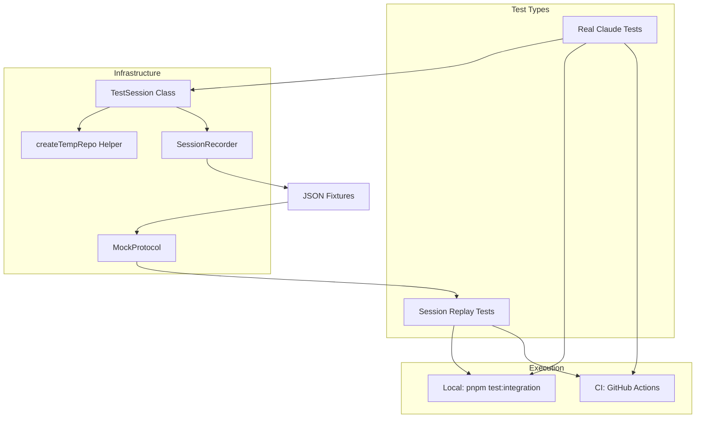
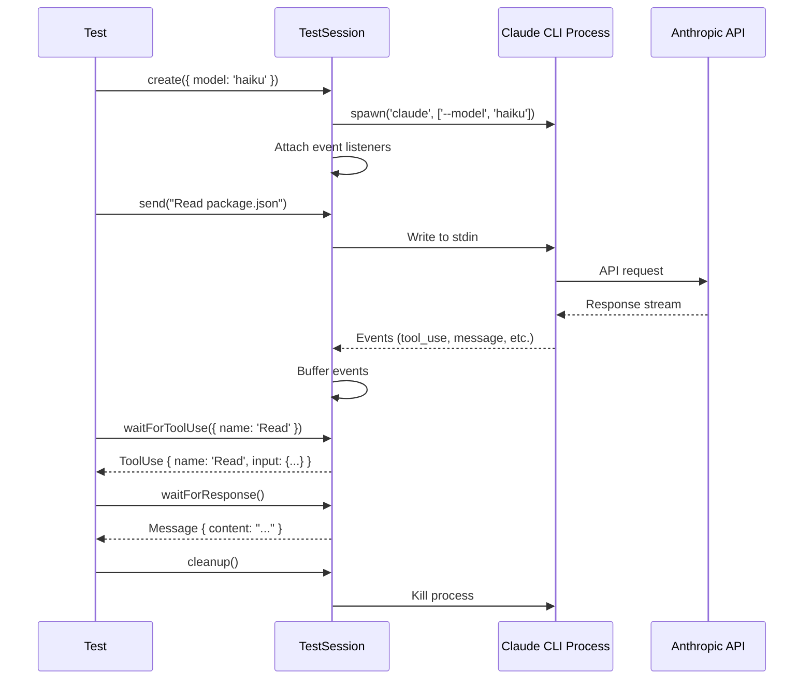

# Integration Testing System Design

## Overview

The Integration Testing System provides smoke tests that verify major functionality hasn't broken. It supports two testing modes:

1. **Real Claude tests** - Run actual Claude CLI sessions with API calls (local + CI)
2. **Session replay tests** - Capture real protocol data and replay without API calls (fast, deterministic)

**Reference:** [GitHub Issue #425](https://github.com/purplefish-ai/factory-factory/issues/425)

## Goals

1. Detect regressions in core Claude session functionality
2. Verify tool use (read/write files) works end-to-end
3. Validate plan mode flow (enter → accept → execute)
4. Ensure session persistence loads correctly
5. Run in CI with reasonable cost (~$0.001 per test using Haiku)

## Architecture Overview



## Technology Stack

### Keep Using (Already Available)

| Tool | Purpose | Status |
|------|---------|--------|
| **Vitest** | Test framework | ✅ Already configured |
| **supertest** | HTTP endpoint testing | ✅ In devDependencies |
| **ws** | WebSocket client | ✅ In dependencies |

### New Components to Build

| Component | Location | Purpose |
|-----------|----------|---------|
| `vitest.integration.config.ts` | Project root | Separate config with longer timeouts |
| `TestSession` | `src/backend/testing/integration/test-session.ts` | Claude session wrapper |
| `createTempRepo` | `src/backend/testing/integration/helpers.ts` | Temp git repo helper |
| `SessionRecorder` | `src/backend/testing/integration/session-recorder.ts` | Protocol event capture |
| `MockProtocol` | `src/backend/testing/integration/mock-protocol.ts` | Replay recorded sessions |

## Component Design

### 1. Vitest Integration Config

**Location:** `vitest.integration.config.ts`

```typescript
import { defineConfig } from 'vitest/config';
import path from 'node:path';

export default defineConfig({
  test: {
    include: ['src/**/*.integration.test.ts'],
    testTimeout: 120_000,  // 2 minutes - Claude can be slow
    hookTimeout: 60_000,   // 1 minute for setup/teardown
    pool: 'forks',         // Process isolation
    poolOptions: {
      forks: {
        singleFork: true,  // Run sequentially (no parallel Claude sessions)
      },
    },
    setupFiles: ['./src/backend/testing/integration/setup.ts'],
  },
  resolve: {
    alias: {
      '@': path.resolve(__dirname, './src'),
      '@prisma-gen': path.resolve(__dirname, './prisma/generated'),
    },
  },
});
```

**Key Design Decisions:**

| Setting | Value | Rationale |
|---------|-------|-----------|
| `testTimeout` | 120s | Claude responses can take 30-60s |
| `pool: 'forks'` | Process isolation | Each test gets clean state |
| `singleFork: true` | Sequential execution | Avoid concurrent Claude sessions |

### 2. TestSession Class

**Location:** `src/backend/testing/integration/test-session.ts`

```typescript
export interface TestSessionOptions {
  model?: 'haiku' | 'sonnet';
  workspacePath?: string;
  recordSession?: boolean;
}

export interface WaitOptions {
  timeout?: number;
  predicate?: (event: unknown) => boolean;
}

export class TestSession {
  private process: ChildProcess | null = null;
  private events: SessionEvent[] = [];
  private recorder: SessionRecorder | null = null;

  static async create(options?: TestSessionOptions): Promise<TestSession>;

  // Send a message to Claude
  async send(message: string): Promise<void>;

  // Wait for Claude's response
  async waitForResponse(options?: WaitOptions): Promise<Message>;

  // Wait for a specific tool use
  async waitForToolUse(options?: { name?: string } & WaitOptions): Promise<ToolUse>;

  // Wait for any event matching predicate
  async waitForEvent<T>(type: string, options?: WaitOptions): Promise<T>;

  // Get all events received so far
  getEvents(): SessionEvent[];

  // Save recorded session to fixture file
  async saveRecording(name: string): Promise<void>;

  // Cleanup: kill process, remove temp files
  async cleanup(): Promise<void>;
}
```

**Implementation Approach:**



**Event Types Captured:**

```typescript
type SessionEvent =
  | { type: 'message'; data: Message }
  | { type: 'tool_use'; data: ToolUse }
  | { type: 'tool_result'; data: ToolResult }
  | { type: 'thinking'; data: ThinkingBlock }
  | { type: 'error'; data: Error }
  | { type: 'compact_boundary'; data: CompactionEvent };
```

### 3. Temp Repo Helper

**Location:** `src/backend/testing/integration/helpers.ts`

```typescript
export interface TempRepoOptions {
  files?: Record<string, string>;  // path → content
  gitInit?: boolean;               // default: true
}

export async function createTempRepo(options?: TempRepoOptions): Promise<string> {
  const tempDir = await fs.mkdtemp(path.join(os.tmpdir(), 'ff-test-'));

  if (options?.gitInit !== false) {
    await execa('git', ['init'], { cwd: tempDir });
    await execa('git', ['config', 'user.email', 'test@example.com'], { cwd: tempDir });
    await execa('git', ['config', 'user.name', 'Test'], { cwd: tempDir });
  }

  if (options?.files) {
    for (const [filePath, content] of Object.entries(options.files)) {
      const fullPath = path.join(tempDir, filePath);
      await fs.mkdir(path.dirname(fullPath), { recursive: true });
      await fs.writeFile(fullPath, content);
    }

    if (options.gitInit !== false) {
      await execa('git', ['add', '.'], { cwd: tempDir });
      await execa('git', ['commit', '-m', 'Initial commit'], { cwd: tempDir });
    }
  }

  return tempDir;
}

export async function cleanupTempRepo(dir: string): Promise<void> {
  await fs.rm(dir, { recursive: true, force: true });
}
```

### 4. Session Recorder

**Location:** `src/backend/testing/integration/session-recorder.ts`

```typescript
export interface RecordedEvent {
  timestamp: number;
  type: string;
  data: unknown;
}

export interface SessionRecording {
  recordedAt: string;
  model: string;
  events: RecordedEvent[];
}

export class SessionRecorder {
  private events: RecordedEvent[] = [];
  private startTime: number;

  constructor() {
    this.startTime = Date.now();
  }

  record(type: string, data: unknown): void {
    this.events.push({
      timestamp: Date.now() - this.startTime,
      type,
      data,
    });
  }

  async save(name: string): Promise<void> {
    const recording: SessionRecording = {
      recordedAt: new Date().toISOString(),
      model: 'haiku',
      events: this.events,
    };

    const fixturePath = path.join(
      __dirname,
      '../fixtures/sessions',
      `${name}.json`
    );

    await fs.mkdir(path.dirname(fixturePath), { recursive: true });
    await fs.writeFile(fixturePath, JSON.stringify(recording, null, 2));
  }
}
```

### 5. Mock Protocol for Replay

**Location:** `src/backend/testing/integration/mock-protocol.ts`

```typescript
import { EventEmitter } from 'events';

export class MockProtocol extends EventEmitter {
  private recording: SessionRecording;
  private eventIndex = 0;

  static async fromRecording(name: string): Promise<MockProtocol> {
    const fixturePath = path.join(
      __dirname,
      '../fixtures/sessions',
      `${name}.json`
    );
    const recording = JSON.parse(await fs.readFile(fixturePath, 'utf-8'));
    return new MockProtocol(recording);
  }

  constructor(recording: SessionRecording) {
    super();
    this.recording = recording;
  }

  async replay(): Promise<void> {
    for (const event of this.recording.events) {
      // Emit events with original timing (optional: use actual delays)
      this.emit(event.type, event.data);
    }
    this.emit('end');
  }

  // Replay with realistic timing
  async replayWithTiming(): Promise<void> {
    let lastTimestamp = 0;
    for (const event of this.recording.events) {
      const delay = event.timestamp - lastTimestamp;
      if (delay > 0) {
        await new Promise(resolve => setTimeout(resolve, delay));
      }
      this.emit(event.type, event.data);
      lastTimestamp = event.timestamp;
    }
    this.emit('end');
  }
}
```

## Test Scenarios

### Scenario 1: Tool Use - Read File

**File:** `src/backend/testing/integration/tool-use-read.integration.test.ts`

```typescript
import { describe, it, expect, beforeAll, afterAll } from 'vitest';
import { TestSession } from './test-session';
import { createTempRepo, cleanupTempRepo } from './helpers';

describe('Tool Use: Read File', () => {
  let session: TestSession;
  let testDir: string;

  beforeAll(async () => {
    testDir = await createTempRepo({
      files: {
        'package.json': JSON.stringify({ name: 'test-project', version: '1.0.0' }),
      },
    });
    session = await TestSession.create({
      model: 'haiku',
      workspacePath: testDir,
    });
  });

  afterAll(async () => {
    await session?.cleanup();
    await cleanupTempRepo(testDir);
  });

  it('reads a file when asked', async () => {
    // 1. Ask Claude to read the file
    await session.send('Read the package.json file and tell me the name field value only.');

    // 2. Wait for the Read tool to be used
    const toolUse = await session.waitForToolUse({
      name: 'Read',
      timeout: 60_000,
    });
    expect(toolUse.input.file_path).toContain('package.json');

    // 3. Wait for the response with the answer
    const response = await session.waitForResponse({ timeout: 30_000 });
    expect(response.content).toContain('test-project');
  });
});
```

### Scenario 2: Tool Use - Write File

**File:** `src/backend/testing/integration/tool-use-write.integration.test.ts`

```typescript
describe('Tool Use: Write File', () => {
  let session: TestSession;
  let testDir: string;

  beforeAll(async () => {
    testDir = await createTempRepo();
    session = await TestSession.create({
      model: 'haiku',
      workspacePath: testDir,
    });
  });

  afterAll(async () => {
    await session?.cleanup();
    await cleanupTempRepo(testDir);
  });

  it('writes a file when asked', async () => {
    // 1. Ask Claude to create a file
    await session.send('Create a file called hello.txt with the content "Hello World"');

    // 2. Wait for the Write tool to be used
    const toolUse = await session.waitForToolUse({
      name: 'Write',
      timeout: 60_000,
    });
    expect(toolUse.input.file_path).toContain('hello.txt');
    expect(toolUse.input.content).toContain('Hello');

    // 3. Verify file was created on disk
    const content = await fs.readFile(path.join(testDir, 'hello.txt'), 'utf-8');
    expect(content).toContain('Hello');
  });
});
```

### Scenario 3: Plan Mode Flow

**File:** `src/backend/testing/integration/plan-mode.integration.test.ts`

```typescript
describe('Plan Mode Flow', () => {
  let session: TestSession;
  let testDir: string;

  beforeAll(async () => {
    testDir = await createTempRepo({
      files: {
        'README.md': '# Test Project',
      },
    });
    session = await TestSession.create({
      model: 'haiku',
      workspacePath: testDir,
    });
  });

  afterAll(async () => {
    await session?.cleanup();
    await cleanupTempRepo(testDir);
  });

  it('completes full plan mode cycle', async () => {
    // 1. Request a plan
    await session.send(
      'Create a plan to add a file called greeting.txt containing "Hello from Plan Mode"'
    );

    // 2. Wait for plan to be presented
    const planResponse = await session.waitForResponse({ timeout: 60_000 });
    expect(planResponse.content).toMatch(/plan|greeting\.txt/i);

    // 3. Accept the plan
    await session.send('looks good, proceed with the plan');

    // 4. Wait for file write
    await session.waitForToolUse({ name: 'Write', timeout: 60_000 });

    // 5. Verify file was created
    const content = await fs.readFile(
      path.join(testDir, 'greeting.txt'),
      'utf-8'
    );
    expect(content).toContain('Hello');
  });
});
```

### Scenario 4: Session Persistence

**File:** `src/backend/testing/integration/session-persistence.integration.test.ts`

```typescript
describe('Session Persistence', () => {
  let testDir: string;

  beforeAll(async () => {
    testDir = await createTempRepo();
  });

  afterAll(async () => {
    await cleanupTempRepo(testDir);
  });

  it('loads session history correctly', async () => {
    // 1. Create first session and send a message
    const session1 = await TestSession.create({
      model: 'haiku',
      workspacePath: testDir,
    });

    await session1.send('Remember this: The secret code is 42.');
    await session1.waitForResponse({ timeout: 60_000 });
    await session1.cleanup();

    // 2. Create second session (should have history)
    const session2 = await TestSession.create({
      model: 'haiku',
      workspacePath: testDir,
      resumeSession: true,  // Resume previous session
    });

    await session2.send('What was the secret code I mentioned?');
    const response = await session2.waitForResponse({ timeout: 60_000 });

    expect(response.content).toContain('42');
    await session2.cleanup();
  });
});
```

## Session Replay Tests

### Recording Sessions

During integration test runs with `RECORD_FIXTURES=1`:

```typescript
// In TestSession.create()
if (process.env.RECORD_FIXTURES === '1') {
  this.recorder = new SessionRecorder();
  // Attach recorder to capture all events
}

// In TestSession.saveRecording()
async saveRecording(name: string): Promise<void> {
  if (this.recorder) {
    await this.recorder.save(name);
  }
}
```

### Replay Test Example

**File:** `src/backend/testing/replay/session-replay.test.ts`

```typescript
import { describe, it, expect } from 'vitest';
import { MockProtocol } from '../integration/mock-protocol';
import { glob } from 'glob';

describe('Session Replay', () => {
  it.each([
    'tool-use-read',
    'tool-use-write',
    'plan-mode',
  ])('parses %s recording correctly', async (fixtureName) => {
    const mockProtocol = await MockProtocol.fromRecording(fixtureName);

    const events: unknown[] = [];
    mockProtocol.on('message', (msg) => events.push({ type: 'message', data: msg }));
    mockProtocol.on('tool_use', (evt) => events.push({ type: 'tool_use', data: evt }));
    mockProtocol.on('tool_result', (evt) => events.push({ type: 'tool_result', data: evt }));

    await mockProtocol.replay();

    // Verify we got expected event types
    expect(events.length).toBeGreaterThan(0);
    expect(events).toMatchSnapshot();
  });
});
```

## Fixture Library

Build up over time by running `pnpm test:integration:record`:

| Fixture | Description | Events Captured |
|---------|-------------|-----------------|
| `tool-use-read.json` | Read tool flow | tool_use, tool_result, message |
| `tool-use-write.json` | Write tool flow | tool_use, tool_result, message |
| `plan-mode.json` | Full plan → accept → execute | Multiple messages & tool uses |
| `thinking-blocks.json` | Extended thinking | thinking, message |
| `multi-tool.json` | Multiple tools in sequence | Multiple tool_use events |

**Fixture Storage:** `src/backend/testing/fixtures/sessions/`

## CI Configuration

### GitHub Actions Workflow Update

**File:** `.github/workflows/ci.yml` (add new job)

```yaml
  integration-test:
    name: Integration Tests
    runs-on: ubuntu-latest
    permissions:
      contents: read
    env:
      DATABASE_URL: "file:./test.db"
      ANTHROPIC_API_KEY: ${{ secrets.ANTHROPIC_API_KEY }}
    steps:
      - uses: actions/checkout@v4

      - name: Install pnpm
        uses: pnpm/action-setup@v4

      - name: Setup Node.js
        uses: actions/setup-node@v4
        with:
          node-version: "20"
          cache: "pnpm"

      - name: Install dependencies
        run: pnpm install --frozen-lockfile

      - name: Generate Prisma client
        run: pnpm db:generate

      - name: Run integration tests
        run: pnpm test:integration
        timeout-minutes: 10
```

### Package.json Scripts

```json
{
  "scripts": {
    "test": "vitest run",
    "test:watch": "vitest",
    "test:coverage": "vitest run --coverage",
    "test:integration": "vitest run --config vitest.integration.config.ts",
    "test:integration:record": "RECORD_FIXTURES=1 vitest run --config vitest.integration.config.ts"
  }
}
```

## Cost Analysis

### Per-Test Costs (Haiku Model)

| Test | Estimated Tokens | Cost |
|------|-----------------|------|
| Tool use (read) | ~2,000 | ~$0.0005 |
| Tool use (write) | ~2,500 | ~$0.0006 |
| Plan mode | ~5,000 | ~$0.0012 |
| Session persistence | ~4,000 | ~$0.0010 |
| **Total per run** | ~13,500 | **~$0.003** |

### Monthly CI Cost Estimates

| Scenario | Runs/Day | Monthly Cost |
|----------|----------|--------------|
| PRs only | 10 | ~$1 |
| Every push | 50 | ~$5 |
| Heavy development | 100 | ~$10 |

## Flakiness Handling

### Retry Strategy

```typescript
// In vitest.integration.config.ts
export default defineConfig({
  test: {
    retry: 2,  // Retry failed tests up to 2 times
    // ...
  },
});
```

### Timeout Strategy

| Operation | Timeout | Rationale |
|-----------|---------|-----------|
| Claude response | 60s | API can be slow under load |
| Tool execution | 30s | File operations are fast |
| Test total | 120s | Buffer for multiple interactions |

### Common Flakiness Sources

1. **API latency spikes** → Generous timeouts + retries
2. **Rate limiting** → Sequential test execution (singleFork)
3. **Model non-determinism** → Flexible assertions (regex, contains)

## Implementation Phases

### Phase 1: Infrastructure (Week 1)
- [ ] Create `vitest.integration.config.ts`
- [ ] Create `TestSession` class
- [ ] Create `createTempRepo()` helper
- [ ] Add npm scripts
- [ ] Set up `ANTHROPIC_API_KEY` secret in GitHub

### Phase 2: First Real Tests (Week 1-2)
- [ ] Tool use (read file) test
- [ ] Tool use (write file) test
- [ ] Add to CI workflow

### Phase 3: Additional Scenarios (Week 2)
- [ ] Plan mode flow test
- [ ] Session persistence test

### Phase 4: Recording & Replay (Week 3)
- [ ] Create `SessionRecorder`
- [ ] Create `MockProtocol.fromRecording()`
- [ ] Record initial fixtures
- [ ] Create replay tests (run in regular `pnpm test`)

## Directory Structure

```
src/backend/testing/
├── setup.ts                     # Existing unit test setup
├── integration/
│   ├── setup.ts                 # Integration test setup
│   ├── test-session.ts          # TestSession class
│   ├── helpers.ts               # createTempRepo, etc.
│   ├── session-recorder.ts      # Recording infrastructure
│   ├── mock-protocol.ts         # Replay infrastructure
│   ├── tool-use-read.integration.test.ts
│   ├── tool-use-write.integration.test.ts
│   ├── plan-mode.integration.test.ts
│   └── session-persistence.integration.test.ts
├── replay/
│   └── session-replay.test.ts   # Replay-based tests
└── fixtures/
    └── sessions/
        ├── tool-use-read.json
        ├── tool-use-write.json
        └── plan-mode.json
```

## Open Questions

| Question | Options | Recommendation |
|----------|---------|----------------|
| Test repo approach | Temp directory vs fixture repo | **Temp directory** - simpler, isolated |
| Retry count | 1, 2, or 3 | **2 retries** - balance reliability vs speed |
| Run on every commit? | Always vs PR-only | **PR + main only** - cost control |
| Record fixtures automatically? | Manual vs CI job | **Manual** - control over fixture quality |

## Summary

The Integration Testing System provides:

- ✅ **Real Claude tests** that verify core functionality end-to-end
- ✅ **Session replay tests** for fast, deterministic CI
- ✅ **TestSession abstraction** for clean test authoring
- ✅ **Vitest integration** with existing tooling
- ✅ **CI support** with cost control (~$0.003/run with Haiku)
- ✅ **Flakiness mitigation** through retries and generous timeouts

This design balances **test reliability, development velocity, and cost efficiency** while providing confidence that major functionality works correctly.
