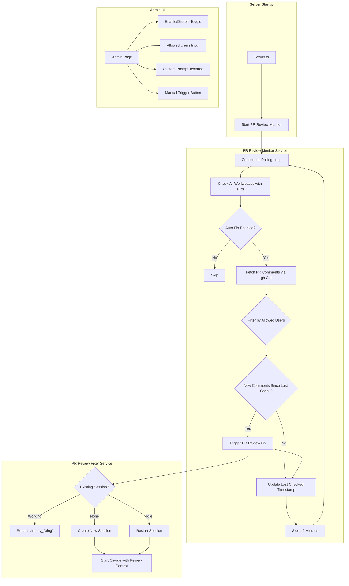
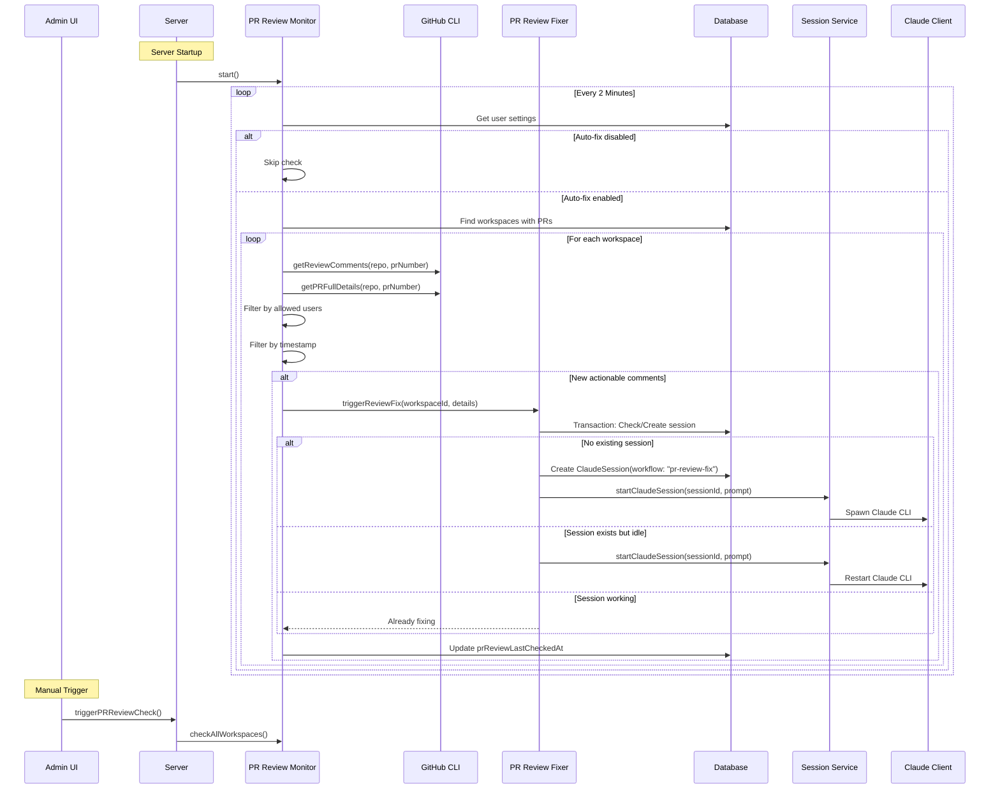
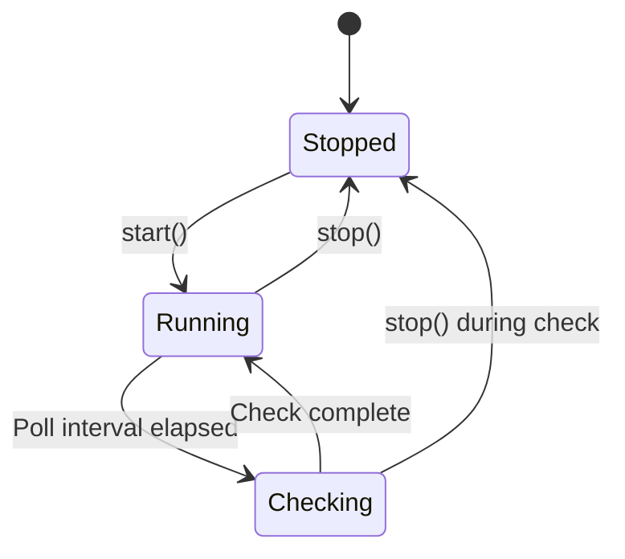
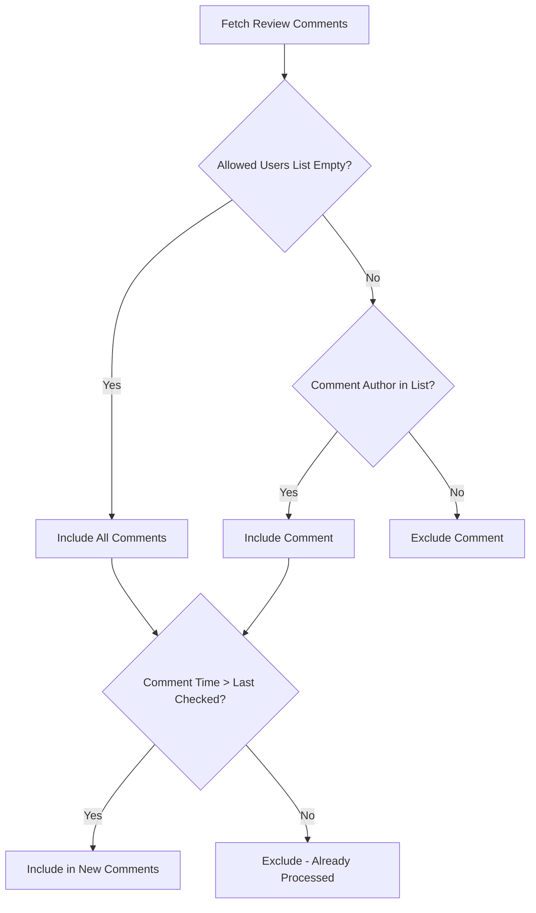
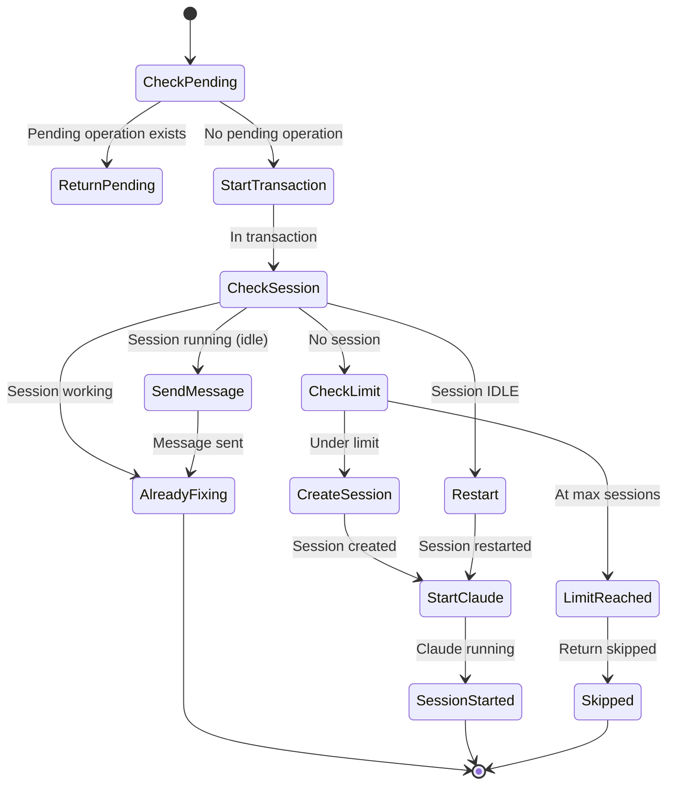
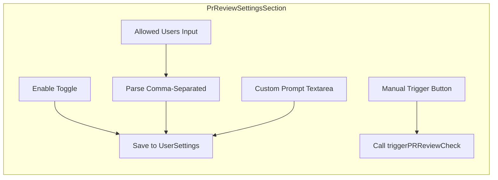
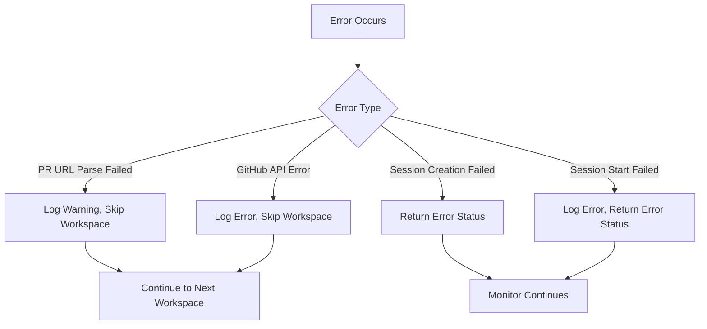

# PR Review Auto-Fix System Design

## Overview

The PR Review Auto-Fix System automatically monitors PRs for new review comments and creates dedicated Claude sessions to address reviewer feedback. When enabled, the system polls for new review comments and spawns specialized "PR Review Fixing" sessions that implement the requested changes.

**Related:**
- [CI Monitoring System Design](./ci-monitoring-system.md) - Similar polling architecture
- [CI Fixing System Design](./ci-fixing-system.md) - Similar session creation pattern

## Requirements (from Issue #383)

1. Automatically fetch PR review comments and address them
2. Create dedicated Claude sessions to fix review feedback (similar to CI auto-fix)
3. Admin panel configuration:
   - Toggle to enable/disable automated PR review fixing
   - Configure which users' comments should trigger auto-fix
   - Custom prompt for additional instructions

## Architecture

### Design Principles

1. **Single PR Review Fixer Per Workspace** - Only one PR Review Fixing session can be active at a time per workspace
2. **Non-Blocking** - The fixing session runs independently; it doesn't block other workspace sessions
3. **Idempotent** - Multiple comment detections should not spawn duplicate sessions
4. **User Filtering** - Only comments from allowed users trigger auto-fix (empty list means all users)
5. **Rich Context** - Pass detailed review/comment information to the fixing session

### High-Level Architecture



### Component Interaction



## Data Model

### Schema Changes

```prisma
model UserSettings {
  // ... existing fields ...

  // PR Review Auto-Fix Settings
  autoFixPrReviewComments   Boolean  @default(false)  // Master toggle
  prReviewFixAllowedUsers   Json?    // Array of GitHub usernames ["user1", "user2"]
  prReviewFixPrompt         String?  // Custom instructions for the session
}

model Workspace {
  // ... existing fields ...

  // PR Review Tracking
  prReviewLastCheckedAt     DateTime?  // When comments were last checked
  prReviewLastCommentId     String?    // ID of last processed comment
}
```

### Session Identification

Uses the existing `workflow` field on `ClaudeSession` with value `"pr-review-fix"`:

```typescript
const PR_REVIEW_FIX_WORKFLOW = 'pr-review-fix';

// Query for existing PR review fixing session
const existingSession = await tx.claudeSession.findFirst({
  where: {
    workspaceId,
    workflow: PR_REVIEW_FIX_WORKFLOW,
    status: { in: [SessionStatus.RUNNING, SessionStatus.IDLE] },
  },
});
```

## Service Details

### PR Review Monitor Service

**File:** `src/backend/services/pr-review-monitor.service.ts`



**Key Configuration:**
- `PR_REVIEW_MONITOR_INTERVAL_MS`: 2 minutes (120,000ms)
- `MAX_CONCURRENT_CHECKS`: 5 concurrent workspace checks

**Lifecycle Methods:**
- `start()` - Begins the continuous polling loop
- `stop()` - Signals shutdown and waits for in-flight checks
- `checkAllWorkspaces()` - Checks all workspaces with PRs (also callable manually)

**Comment Filtering Logic:**



### PR Review Fixer Service

**File:** `src/backend/services/pr-review-fixer.service.ts`



**Race Condition Prevention:**

1. **In-Memory Tracking:** `pendingFixes` Map prevents concurrent triggers for same workspace
2. **Database Transaction:** Atomic check-and-create within transaction
3. **Session Working Check:** Verifies session is actually processing before skipping

**Re-Review Request:**

After the Claude session pushes changes addressing the review comments, it posts a comment on the PR mentioning all reviewers:

```bash
gh pr comment 123 --body "@reviewer1 @reviewer2 I've addressed the review comments. Please re-review when you have a chance."
```

This is achieved by:
1. Extracting unique reviewer usernames from reviews and comments
2. Including the `gh pr comment` command in the session's instructions
3. Claude executes the command after pushing changes

**Initial Prompt Structure:**

```markdown
## PR Review Comments Alert

New review comments have been received on PR #123.

**PR URL:** https://github.com/owner/repo/pull/123

### Reviews Requesting Changes

**reviewer-name** (1/15/2024):
> Please fix the type error on line 42

### Review Comments

**reviewer-name** on `src/file.ts`:45:
> This should use async/await instead of .then()
[View comment](https://github.com/...)

### Additional Instructions

{custom prompt from settings if provided}

### Next Steps

1. Review the comments above carefully
2. Understand what changes the reviewer is requesting
3. Implement the necessary changes to address the feedback
4. Run tests to ensure your changes don't break anything
5. Commit and push your changes
6. After pushing, post a comment on the PR asking for re-review using this command:
   ```bash
   gh pr comment 123 --body "@reviewer1 @reviewer2 I've addressed the review comments. Please re-review when you have a chance."
   ```

Please address these review comments.
```

### GitHub CLI Integration

**File:** `src/backend/services/github-cli.service.ts`

Added method to fetch line-level review comments:

```typescript
async getReviewComments(repo: string, prNumber: number): Promise<Array<{
  id: number;
  author: { login: string };
  body: string;
  path: string;
  line: number | null;
  createdAt: string;
  url: string;
}>>
```

Uses GitHub API: `gh api repos/{owner}/{repo}/pulls/{number}/comments`

Also added method to post comments on PRs:

```typescript
async addPRComment(repo: string, prNumber: number, body: string): Promise<void>
```

Uses: `gh pr comment {prNumber} --repo {repo} --body {body}`

Combined with existing `getPRFullDetails()` for:
- Review states (CHANGES_REQUESTED, APPROVED, etc.)
- General PR comments (not line-specific)

## Admin UI

### Settings Section

**File:** `src/client/routes/admin.tsx`



**UI Components:**
1. **Toggle Switch** - Enable/disable `autoFixPrReviewComments`
2. **Allowed Users Input** - Comma-separated GitHub usernames
3. **Custom Prompt Textarea** - Additional instructions for Claude sessions
4. **Manual Trigger Button** - Force immediate check of all workspaces

## Integration Points

### Server Lifecycle

**File:** `src/backend/server.ts`

```typescript
// Startup
prReviewMonitorService.start();

// Shutdown
await prReviewMonitorService.stop();
```

### tRPC Endpoints

**User Settings Router** (`src/backend/trpc/user-settings.trpc.ts`):
- `update` mutation accepts new fields

**Admin Router** (`src/backend/trpc/admin.trpc.ts`):
- `triggerPRReviewCheck` mutation for manual trigger

### Service Exports

**File:** `src/backend/services/index.ts`

```typescript
export { prReviewFixerService, type PRReviewFixResult, type ReviewCommentDetails } from './pr-review-fixer.service';
export { prReviewMonitorService } from './pr-review-monitor.service';
```

## Configuration Parameters

| Parameter | Default | Description |
|-----------|---------|-------------|
| `autoFixPrReviewComments` | `false` | Master toggle for the feature |
| `prReviewFixAllowedUsers` | `null` (all users) | Array of GitHub usernames whose comments trigger auto-fix |
| `prReviewFixPrompt` | `null` | Custom instructions appended to session prompt |
| `PR_REVIEW_MONITOR_INTERVAL_MS` | 120000 (2 min) | Polling interval |
| `MAX_CONCURRENT_CHECKS` | 5 | Max concurrent workspace checks |

## Error Handling



**Key Error Scenarios:**
1. **Invalid PR URL** - Logged as warning, workspace skipped
2. **GitHub API failure** - Logged as error, workspace skipped
3. **Session limit reached** - Returns `skipped` status with reason
4. **Claude session start failure** - Returns `error` status with message

## Comparison with CI Auto-Fix

| Aspect | CI Auto-Fix | PR Review Auto-Fix |
|--------|------------|-------------------|
| Trigger | CI status change to FAILURE | New review comments |
| Polling Interval | 1 minute | 2 minutes |
| Workflow ID | `ci-fix` | `pr-review-fix` |
| Session Name | "CI Fixing" | "PR Review Fixing" |
| User Filtering | N/A | Configurable allowed users |
| Custom Prompt | N/A | Configurable |
| Tracking Fields | `prCiFailedAt`, `prCiLastNotifiedAt` | `prReviewLastCheckedAt`, `prReviewLastCommentId` |

## Future Enhancements

1. **Selective Comment Types** - Filter by comment type (review vs. general)
2. **Comment Threading** - Track and respond to threaded conversations
3. **Resolution Detection** - Detect when comments are marked as resolved
4. **Notification Integration** - Notify users when comments are addressed
5. **Per-Workspace Settings** - Override global settings per workspace
