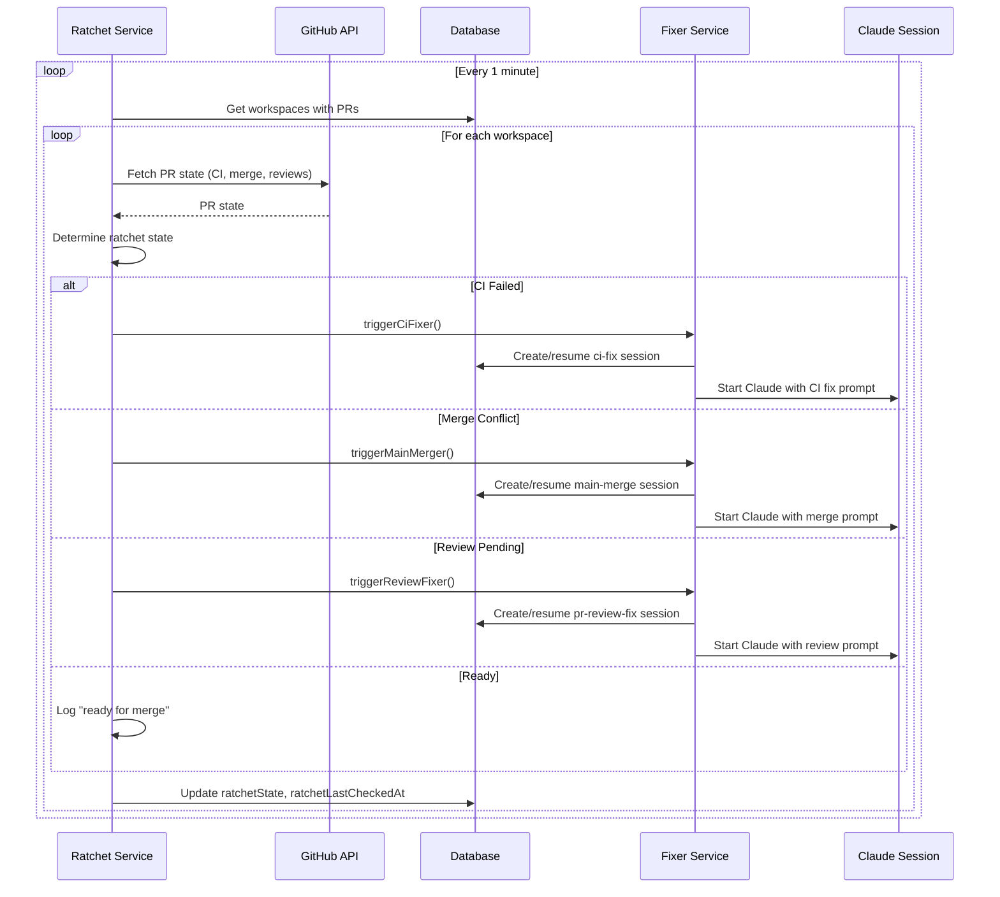
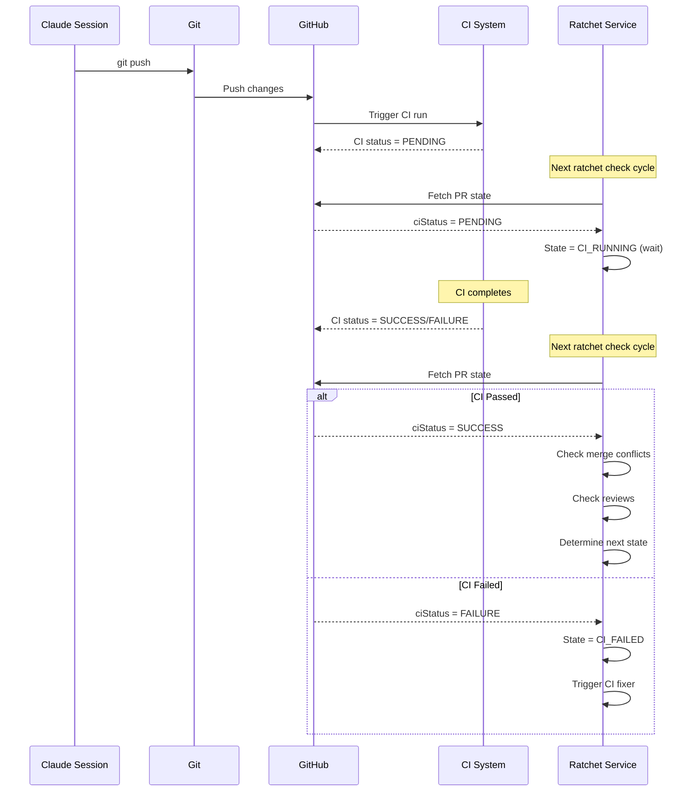
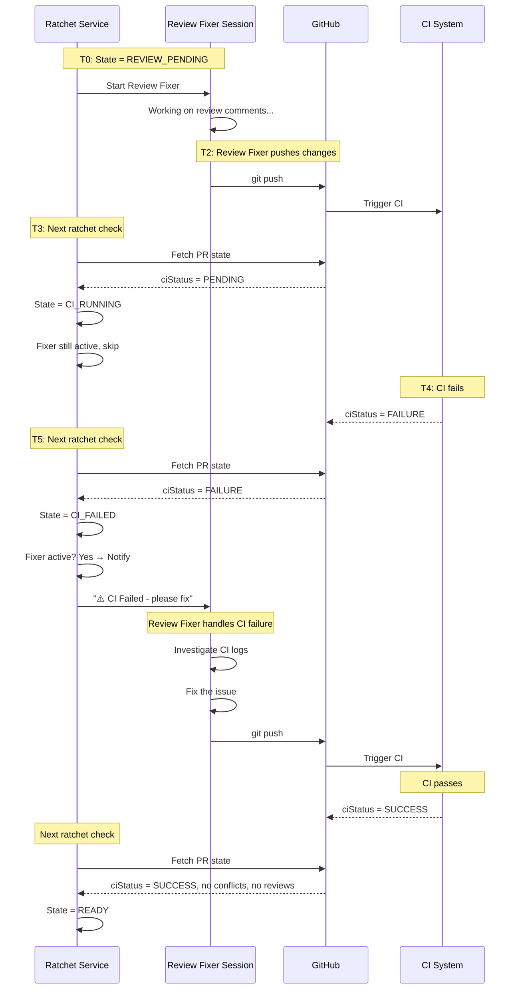

# Ratchet System Design Document

## Overview

The "Ratchet" is a centralized PR progression system that replaces the current separate CI monitor and PR review monitor services. It continuously advances each PR toward merge by detecting the current state and triggering the appropriate action.

## Current Architecture (Problems)

Today we have two independent polling services:

```
┌─────────────────────┐     ┌──────────────────────────┐
│  CI Monitor Service │     │ PR Review Monitor Service │
│  (polls every 1min) │     │    (polls every 2min)     │
└─────────┬───────────┘     └────────────┬─────────────┘
          │                              │
          ▼                              ▼
┌─────────────────────┐     ┌──────────────────────────┐
│  CI Fixer Service   │     │  PR Review Fixer Service │
└─────────────────────┘     └──────────────────────────┘
```

**Problems:**
1. **Duplicated logic**: Both services query workspaces, fetch PR data, manage sessions
2. **No coordination**: CI fixer doesn't know about review comments; review fixer doesn't know about CI status
3. **Missing states**: Merge conflicts aren't handled; successful PRs just sit there
4. **Inefficient polling**: Two services hitting GitHub API separately
5. **Complex configuration**: Separate toggles for CI fix and PR review fix

## Proposed Architecture

### The Ratchet State Machine

```
                    ┌─────────────────┐
                    │   CI RUNNING    │◄────────────────┐
                    │    (PENDING)    │                 │
                    └────────┬────────┘                 │
                             │                          │
              CI completes   │                          │ Push triggers
                             ▼                          │ new CI run
                    ┌─────────────────┐                 │
         ┌─────────►│   CI FAILED     │─────────────────┤
         │          │                 │  CI Fixer       │
         │          └────────┬────────┘  fixes & pushes │
         │                   │                          │
         │    CI passes      │                          │
         │                   ▼                          │
         │          ┌─────────────────┐                 │
         │          │ MERGE CONFLICT  │─────────────────┤
         │          │                 │  Main Merger    │
         │          └────────┬────────┘  resolves &     │
         │                   │           pushes         │
         │    No conflict    │                          │
         │                   ▼                          │
         │          ┌─────────────────┐                 │
         │          │ REVIEW PENDING  │─────────────────┘
         │          │                 │  Review Fixer
         │          └────────┬────────┘  addresses &
         │                   │           pushes
         │    Reviews done   │
         │                   ▼
         │          ┌─────────────────┐
         │          │     READY       │
         │          │   (for merge)   │
         │          └────────┬────────┘
         │                   │
         │    Auto-merge     │ (if enabled)
         │    or manual      │
         │                   ▼
         │          ┌─────────────────┐
         └──────────│     MERGED      │
                    │     (DONE)      │
                    └─────────────────┘
```

### Ratchet Decision Logic

```typescript
function determineRatchetState(pr: PRState): RatchetState {
  // 1. Check if CI is still running
  if (pr.ciStatus === 'PENDING') {
    return 'CI_RUNNING';
  }

  // 2. Check if CI failed
  if (pr.ciStatus === 'FAILURE') {
    return 'CI_FAILED';
  }

  // CI is green from here on...

  // 3. Check for merge conflicts
  if (pr.mergeStateStatus === 'CONFLICTING') {
    return 'MERGE_CONFLICT';
  }

  // 4. Check for unaddressed review comments
  if (hasUnaddressedReviewComments(pr)) {
    return 'REVIEW_PENDING';
  }

  // 5. All clear - ready to merge
  return 'READY';
}
```

### Single Unified Service

```
┌──────────────────────────────────────────────────────────────┐
│                      Ratchet Service                          │
│                    (polls every 1 min)                        │
│                                                               │
│  ┌─────────────────────────────────────────────────────────┐ │
│  │              Ratchet State Machine                       │ │
│  │                                                          │ │
│  │  For each workspace with a PR:                          │ │
│  │    1. Fetch PR state (CI, merge status, reviews)        │ │
│  │    2. Determine current ratchet state                   │ │
│  │    3. Trigger appropriate fixer if needed               │ │
│  │    4. Update workspace tracking fields                  │ │
│  └─────────────────────────────────────────────────────────┘ │
│                                                               │
│  ┌────────────┐ ┌────────────┐ ┌────────────┐ ┌────────────┐ │
│  │ CI Fixer   │ │   Main     │ │  Review    │ │   Auto     │ │
│  │  Agent     │ │  Merger    │ │   Fixer    │ │  Merger    │ │
│  │            │ │   Agent    │ │   Agent    │ │  (future)  │ │
│  └────────────┘ └────────────┘ └────────────┘ └────────────┘ │
└──────────────────────────────────────────────────────────────┘
```

## Detailed Design

### 1. RatchetState Enum

```typescript
// New enum to track where a PR is in the ratchet progression
enum RatchetState {
  CI_RUNNING       = 'CI_RUNNING',       // CI checks in progress
  CI_FAILED        = 'CI_FAILED',        // CI checks failed
  MERGE_CONFLICT   = 'MERGE_CONFLICT',   // Has merge conflicts with base
  REVIEW_PENDING   = 'REVIEW_PENDING',   // Has unaddressed review comments
  READY            = 'READY',            // Ready to merge
  MERGED           = 'MERGED',           // PR has been merged
}
```

### 2. Workspace Schema Changes

```prisma
model Workspace {
  // ... existing fields ...

  // Ratchet tracking (replaces separate CI/review tracking)
  ratchetState          RatchetState  @default(CI_RUNNING)
  ratchetLastCheckedAt  DateTime?
  ratchetActiveFixerId  String?       // ID of active fixer session (if any)

  // Keep for detailed tracking
  lastCiRunId           String?       // Track which CI run we processed
  lastReviewCommentId   String?       // Track which comment we processed
}
```

### 3. UserSettings Changes

```prisma
model UserSettings {
  // ... existing fields ...

  // Replace separate toggles with unified ratchet config
  ratchetEnabled           Boolean  @default(false)   // Master toggle
  ratchetAutoFixCi         Boolean  @default(true)    // Fix CI failures
  ratchetAutoFixReviews    Boolean  @default(true)    // Address review comments
  ratchetAutoMerge         Boolean  @default(false)   // Auto-merge when ready
  ratchetAllowedReviewers  Json?                      // Whose reviews to auto-fix

  // Deprecate (but keep for migration)
  autoFixCiIssues             Boolean  @default(false)
  autoFixPrReviewComments     Boolean  @default(false)
  prReviewFixAllowedUsers     Json?
  prReviewFixPrompt           String?
}
```

### 4. Ratchet Service

```typescript
// src/backend/services/ratchet.service.ts

const RATCHET_POLL_INTERVAL_MS = 60_000; // 1 minute
const MAX_CONCURRENT_CHECKS = 5;

class RatchetService {
  private isShuttingDown = false;
  private monitorLoop: Promise<void> | null = null;
  private readonly checkLimit = pLimit(MAX_CONCURRENT_CHECKS);

  start(): void { /* ... */ }
  async stop(): Promise<void> { /* ... */ }

  async checkAllWorkspaces(): Promise<RatchetCheckResult> {
    const workspaces = await workspaceAccessor.findWithPRsForRatchet();
    const settings = await userSettingsAccessor.get();

    if (!settings.ratchetEnabled) {
      return { checked: 0, actions: [] };
    }

    const results = await Promise.all(
      workspaces.map(ws => this.checkLimit(() => this.processWorkspace(ws, settings)))
    );

    return this.aggregateResults(results);
  }

  private async processWorkspace(
    workspace: WorkspaceWithPR,
    settings: RatchetSettings
  ): Promise<WorkspaceRatchetResult> {
    // 1. Fetch current PR state from GitHub
    const prState = await this.fetchPRState(workspace);

    // 2. Determine ratchet state
    const newState = this.determineRatchetState(prState);
    const previousState = workspace.ratchetState;

    // 3. Log state transition if changed
    if (newState !== previousState) {
      logger.info('Ratchet state transition', {
        workspaceId: workspace.id,
        from: previousState,
        to: newState,
        prNumber: workspace.prNumber,
      });
    }

    // 4. Take action based on state
    const action = await this.executeRatchetAction(workspace, newState, prState, settings);

    // 5. Update workspace
    await workspaceAccessor.update(workspace.id, {
      ratchetState: newState,
      ratchetLastCheckedAt: new Date(),
    });

    return { workspaceId: workspace.id, state: newState, action };
  }

  private async executeRatchetAction(
    workspace: WorkspaceWithPR,
    state: RatchetState,
    prState: PRState,
    settings: RatchetSettings
  ): Promise<RatchetAction> {
    // Check if a fixer is already active
    if (workspace.ratchetActiveFixerId) {
      const isActive = await this.isFixerActive(workspace.ratchetActiveFixerId);
      if (isActive) {
        return { type: 'FIXER_ACTIVE', sessionId: workspace.ratchetActiveFixerId };
      }
      // Clear stale fixer reference
      await workspaceAccessor.update(workspace.id, { ratchetActiveFixerId: null });
    }

    switch (state) {
      case 'CI_RUNNING':
        // Nothing to do, just wait
        return { type: 'WAITING' };

      case 'CI_FAILED':
        if (!settings.ratchetAutoFixCi) {
          return { type: 'DISABLED', reason: 'CI auto-fix disabled' };
        }
        return await this.triggerCiFixer(workspace, prState);

      case 'REVIEW_PENDING':
        if (!settings.ratchetAutoFixReviews) {
          return { type: 'DISABLED', reason: 'Review auto-fix disabled' };
        }
        return await this.triggerReviewFixer(workspace, prState, settings);

      case 'READY':
        if (settings.ratchetAutoMerge) {
          return await this.triggerAutoMerge(workspace);
        }
        return { type: 'READY_FOR_MERGE' };

      case 'MERGED':
        return { type: 'COMPLETED' };
    }
  }

  private determineRatchetState(pr: PRState): RatchetState {
    if (pr.state === 'MERGED') return 'MERGED';
    if (pr.ciStatus === 'PENDING') return 'CI_RUNNING';
    if (pr.ciStatus === 'FAILURE') return 'CI_FAILED';
    if (pr.mergeStateStatus === 'CONFLICTING') return 'MERGE_CONFLICT';
    if (this.hasUnaddressedReviews(pr)) return 'REVIEW_PENDING';
    return 'READY';
  }

  private hasUnaddressedReviews(pr: PRState): boolean {
    // Check for CHANGES_REQUESTED reviews
    const hasChangesRequested = pr.reviews.some(
      r => r.state === 'CHANGES_REQUESTED'
    );

    // Check for unresolved review threads (future enhancement)
    // const hasUnresolvedThreads = pr.reviewThreads.some(t => !t.isResolved);

    return hasChangesRequested;
  }
}
```

### 5. Main Merger Agent (New)

A new workflow for resolving merge conflicts:

```markdown
# prompts/workflows/main-merge.md

---
name: Main Merge
description: Resolve merge conflicts with the base branch
expectsPR: false
---

# Merge Conflict Resolution

You are resolving merge conflicts between this PR branch and the base branch (usually main).

## Workflow Steps

### 1. Understand the Conflicts
- Run `git fetch origin` to get latest changes
- Run `git merge origin/main` to see conflicts
- Identify conflicting files and understand both sides

### 2. Resolve Conflicts
- For each conflicting file, understand the intent of both changes
- Make merge decisions that preserve both features when possible
- If unsure, prefer the main branch changes and note for human review

### 3. Verify Resolution
- Run tests: `pnpm test`
- Run type checking: `pnpm typecheck`
- Run linting: `pnpm check:fix`

### 4. Commit and Push
- Commit the merge resolution: `git commit -m "Merge main into feature branch"`
- Push to the branch: `git push`

## Guidelines
- Preserve functionality from both sides when possible
- Test thoroughly after resolving conflicts
- If conflicts are too complex, leave a comment explaining the situation
```

### 6. Review Fixer Enhancements

The review fixer should post a comment and resolve review threads after addressing comments:

```typescript
// Enhanced prompt for review fixer
const REVIEW_FIX_INSTRUCTIONS = `
### After Addressing Comments

1. Push your changes: \`git push\`

2. Post a re-review request comment:
   \`\`\`bash
   gh pr comment ${prNumber} --body "${reviewerMentions} I've addressed the review comments. Please re-review when you have a chance."
   \`\`\`

3. Resolve the review threads you addressed (if the GitHub API supports this):
   - This signals to reviewers which comments have been handled
`;
```

### 7. Workflow Files

```
prompts/workflows/
├── ci-fix.md           # Existing - fix CI failures
├── main-merge.md       # New - resolve merge conflicts
├── pr-review-fix.md    # Existing - address review comments
└── feature.md          # Existing - general feature work
```

### 8. Admin UI Changes

Replace the separate CI and PR Review settings sections with a unified Ratchet section:

```tsx
// src/client/routes/admin.tsx

function RatchetSettingsSection() {
  return (
    <Card>
      <CardHeader>
        <CardTitle>Ratchet (PR Auto-Progression)</CardTitle>
        <CardDescription>
          Automatically progress PRs toward merge by fixing CI, resolving conflicts,
          and addressing review comments.
        </CardDescription>
      </CardHeader>
      <CardContent>
        {/* Master toggle */}
        <Toggle label="Enable Ratchet" field="ratchetEnabled" />

        {/* Individual toggles */}
        <Toggle label="Auto-fix CI failures" field="ratchetAutoFixCi" />
        <Toggle label="Auto-address review comments" field="ratchetAutoFixReviews" />
        <Toggle label="Auto-merge when ready" field="ratchetAutoMerge" />

        {/* Reviewer filter */}
        <Input
          label="Only respond to these reviewers (empty = all)"
          field="ratchetAllowedReviewers"
          placeholder="github-username-1, github-username-2"
        />

        {/* Manual trigger */}
        <Button onClick={triggerRatchetCheck}>
          Check All PRs Now
        </Button>
      </CardContent>
    </Card>
  );
}
```

## Migration Plan

### Phase 1: Add Ratchet Service (Parallel)
1. Create `ratchet.service.ts` with the new state machine
2. Add new schema fields with migration
3. Keep existing CI monitor and PR review monitor running
4. Add feature flag to enable ratchet (default off)

### Phase 2: Deprecate Old Services
1. When ratchet is enabled, stop the old services
2. Migrate settings: `autoFixCiIssues` → `ratchetAutoFixCi`, etc.
3. Log warnings when old settings are used

### Phase 3: Remove Old Services
1. Remove `ci-monitor.service.ts` and `pr-review-monitor.service.ts`
2. Remove old settings fields
3. Update all documentation

## Sequence Diagrams

### Ratchet Check Flow



### State Transition on Push



## Handling State Transitions During Active Work

A critical scenario: **What happens if a fixer is working on one issue and the state changes?**

### Example: Review Fixer causes CI failure

```
Timeline:
  T0: CI green, review comments exist → REVIEW_PENDING
  T1: Ratchet triggers Review Fixer session
  T2: Review Fixer pushes changes to address comments
  T3: CI starts running (state → CI_RUNNING)
  T4: CI fails due to the review fix changes (state → CI_FAILED)
  T5: What now?
```

### Design: Single Active Fixer Per Workspace

The key insight is that **only one fixer should be active at a time per workspace**. When the state changes, the Ratchet notifies the active fixer session, which handles the new issue inline.

#### Notify the Active Fixer

The active fixer session receives a message about the new issue and handles it inline:

```typescript
async executeRatchetAction(workspace, state, prState, settings): Promise<RatchetAction> {
  const activeFixer = workspace.ratchetActiveFixerId;

  if (activeFixer && this.isFixerActive(activeFixer)) {
    // A fixer is already working - notify it about the state change
    const client = sessionService.getClient(activeFixer);

    if (state === 'CI_FAILED' && workspace.ratchetState !== 'CI_FAILED') {
      // CI just failed while another fixer was working
      client.sendMessage(`
        ⚠️ **CI Failed**

        The CI checks have failed. This may be due to your recent changes.

        **Failed checks:**
        ${formatFailedChecks(prState.failedChecks)}

        Please investigate and fix the CI failure before continuing with your current task.
        Use \`gh run view <run-id> --log-failed\` to see detailed logs.
      `);

      return { type: 'NOTIFIED_ACTIVE_FIXER', sessionId: activeFixer, issue: 'CI_FAILED' };
    }

    if (state === 'MERGE_CONFLICT') {
      client.sendMessage(`
        ⚠️ **Merge Conflict Detected**

        The branch now has merge conflicts with the base branch.
        Please resolve the conflicts before continuing.

        Run \`git fetch origin && git merge origin/main\` to see the conflicts.
      `);

      return { type: 'NOTIFIED_ACTIVE_FIXER', sessionId: activeFixer, issue: 'MERGE_CONFLICT' };
    }

    // Fixer is still working on its original task
    return { type: 'FIXER_ACTIVE', sessionId: activeFixer };
  }

  // No active fixer - proceed with normal state machine
  // ...
}
```

### Why This Approach

1. **Context preservation**: The active Claude session has full context of what it was doing
2. **Efficiency**: No need to start a new session; the current one can handle the new issue
3. **Natural flow**: A developer would also handle a CI failure inline rather than context-switching
4. **Simplicity**: One session manages the entire fix cycle

### State Priority

When notifying an active fixer, follow this priority (most urgent first):

1. **CI_FAILED** - Always notify immediately; CI must pass before anything else matters
2. **MERGE_CONFLICT** - Notify; conflicts block mergeability
3. **REVIEW_PENDING** - Can wait; only notify if fixer was doing something else

### Fixer Responsibility

Each fixer workflow should include instructions to:

1. **Check CI status after pushing**: Before considering the task complete
2. **Handle interruptions**: If notified of a new issue, address it before continuing
3. **Re-verify at the end**: Run full checks before declaring success

### Updated Workflow Prompts

Add to all fixer workflows:

```markdown
## Handling Interruptions

If you receive a notification about CI failure or merge conflicts while working:

1. **Stop your current work** - Don't push incomplete changes
2. **Address the new issue first** - CI failures and merge conflicts block progress
3. **Then resume your original task** - Once the blocker is resolved

Always run `gh pr checks <pr-number>` before considering your work complete.
```

### Sequence Diagram: CI Fails During Review Fix



## Benefits

1. **Single source of truth**: One service manages all PR progression
2. **Clear state machine**: Easy to understand and debug
3. **Efficient API usage**: Single fetch per workspace covers all states
4. **Coordinated actions**: Fixers know about each other's work
5. **Extensible**: Easy to add new states (e.g., security scan, code coverage)
6. **Unified configuration**: One toggle to rule them all

## Open Questions

1. **Auto-merge safety**: Should auto-merge require approval first? Should it respect branch protection rules?

2. **Conflict resolution strategy**: When resolving conflicts, should we prefer main or the feature branch? Should complex conflicts be flagged for human review?

3. **Review thread resolution**: GitHub's API for resolving review threads is limited. Should we rely on the comment mentioning reviewers, or try to use the API?

4. **Rate limiting**: How do we handle GitHub API rate limits when checking many PRs?

5. **Notification preferences**: Should users be notified when ratchet takes action? Via what channel?

6. **Fixer session lifecycle**: Should fixer sessions be:
   - (A) Terminated when their specific issue is resolved (e.g., CI fixer stops when CI passes)?
   - (B) Kept alive to handle subsequent issues in the same PR?
   - (C) Reused across multiple state transitions until PR is merged?

## Files to Change

| File | Change |
|------|--------|
| `prisma/schema.prisma` | Add RatchetState enum, new fields |
| `src/backend/services/ratchet.service.ts` | NEW - main ratchet service |
| `src/backend/services/main-merger.service.ts` | NEW - merge conflict resolver |
| `src/backend/services/ci-fixer.service.ts` | Minor updates for ratchet integration |
| `src/backend/services/pr-review-fixer.service.ts` | Minor updates for ratchet integration |
| `src/backend/server.ts` | Replace old services with ratchet |
| `src/backend/app-context.ts` | Add ratchetService |
| `src/backend/resource_accessors/workspace.accessor.ts` | Add ratchet query methods |
| `src/backend/resource_accessors/user-settings.accessor.ts` | Add ratchet settings |
| `src/backend/trpc/admin.trpc.ts` | Add ratchet endpoints |
| `src/client/routes/admin.tsx` | Replace settings UI |
| `prompts/workflows/main-merge.md` | NEW - merge conflict workflow |
