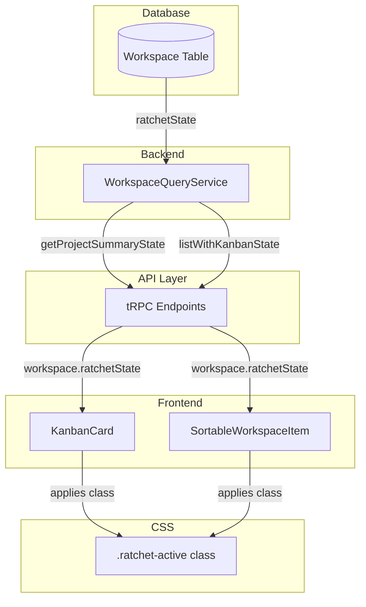
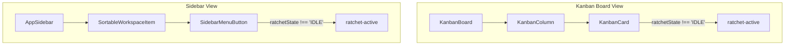
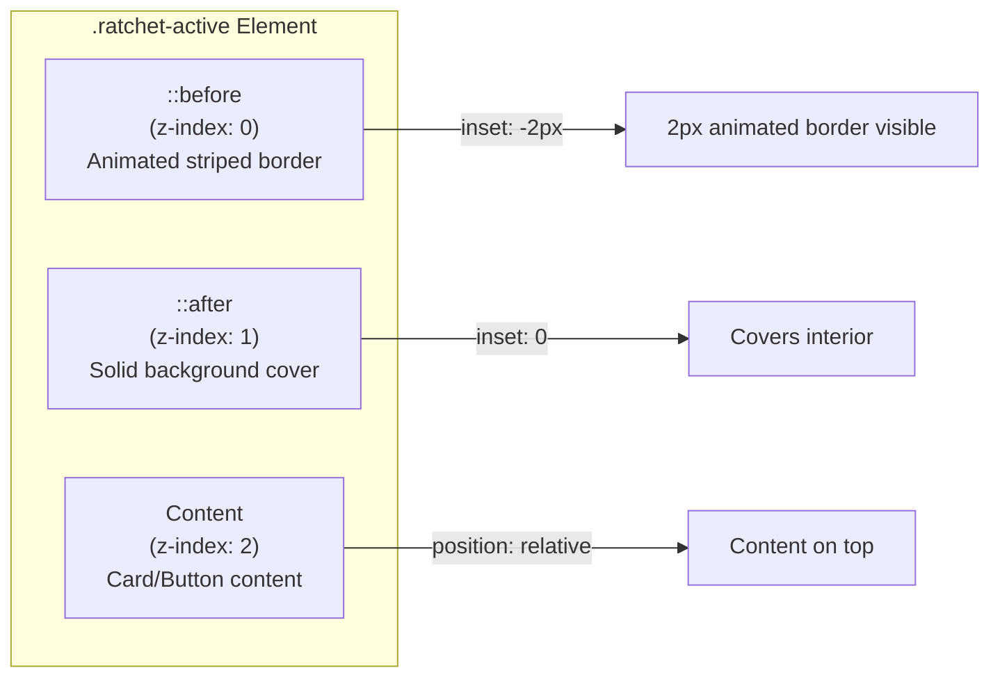
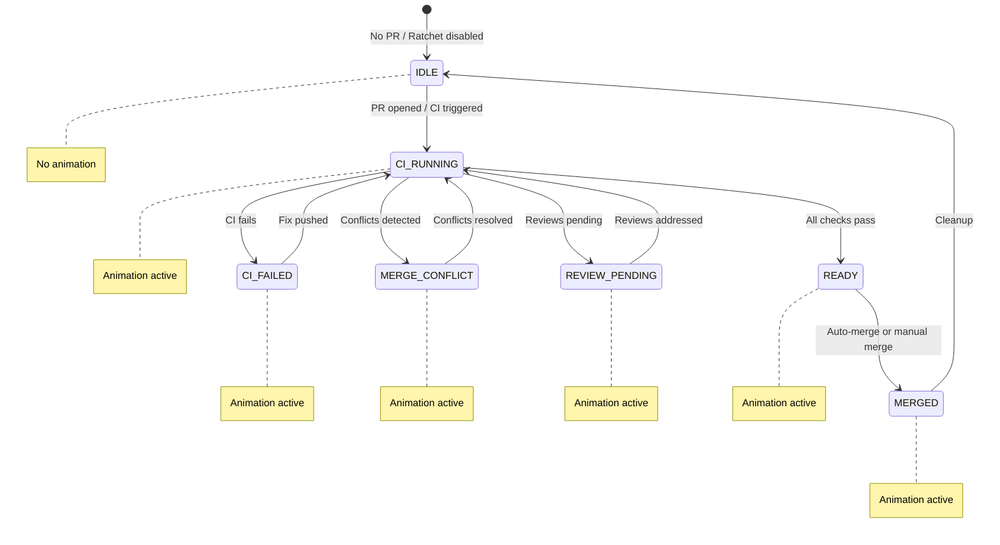

# Ratchet Visual Indicator - Design Document

## Overview

This feature adds a visual indicator to workspace cards and sidebar items when the ratchet system is actively processing a workspace. The indicator is an animated black and yellow "marching ants" border that draws attention to workspaces where automated PR progression is occurring.

## Problem Statement

When the ratchet system is active (fixing CI failures, resolving merge conflicts, addressing review comments, etc.), users have no visual indication that automated work is in progress. This can lead to confusion about the current state of a workspace.

## Solution

Add an animated border effect to workspace UI elements when `ratchetState` is not `IDLE`. The animation uses a black and yellow striped pattern that moves horizontally, evoking a "caution tape" aesthetic that clearly signals automated activity.

## Architecture

### Data Flow



### Component Hierarchy



### CSS Animation Architecture



## Ratchet State Machine

The animation appears for all non-IDLE states:



## Files Changed

| File | Change Type | Description |
|------|-------------|-------------|
| `src/backend/services/workspace-query.service.ts` | Modified | Added `ratchetState` to `getProjectSummaryState` response |
| `src/frontend/components/use-workspace-list-state.ts` | Modified | Added `ratchetState` to `ServerWorkspace` interface |
| `src/frontend/components/kanban/kanban-card.tsx` | Modified | Apply `ratchet-active` class when ratchet is active |
| `src/frontend/components/app-sidebar.tsx` | Modified | Apply `ratchet-active` class to sidebar items |
| `src/client/globals.css` | Modified | Added `.ratchet-active` CSS animation |
| `src/frontend/components/kanban/kanban-card.stories.tsx` | Modified | Added Storybook stories for ratchet states |

## Implementation Details

### Backend Changes

The `getProjectSummaryState` method now includes `ratchetState` in the workspace response:

```typescript
return {
  id: w.id,
  name: w.name,
  // ... other fields
  ratchetState: w.ratchetState,  // NEW
};
```

### Frontend Logic

Both `KanbanCard` and `SortableWorkspaceItem` use the same logic:

```typescript
const isRatchetActive = workspace.ratchetState && workspace.ratchetState !== 'IDLE';
```

### CSS Animation

The animation uses a layered pseudo-element approach:

1. **`::before`** - Creates the animated striped background, positioned 2px outside the element
2. **`::after`** - Covers the interior with the appropriate background color
3. **Direct children** - Elevated to z-index 2 to appear above both pseudo-elements

```css
.ratchet-active::before {
  background: repeating-linear-gradient(
    90deg,
    #000 0px, #000 8px,      /* Black stripe */
    #fbbf24 8px, #fbbf24 16px /* Yellow stripe */
  );
  animation: ratchet-march 0.4s linear infinite;
}
```

The sidebar uses a different background color via CSS specificity:

```css
[data-sidebar] .ratchet-active::after {
  background: var(--sidebar);
}
```

## Visual Appearance

```
┌─────────────────────────────────────┐
│ ████░░░░████░░░░████░░░░████░░░░████│  ← Animated border (moves right)
│ ░                                 ░ │
│ ░   Workspace Name                ░ │
│ ░   feature/branch-name           ░ │
│ ░   #42 PR                        ░ │
│ ░                                 ░ │
│ ████░░░░████░░░░████░░░░████░░░░████│
└─────────────────────────────────────┘
  ████ = Black (#000)
  ░░░░ = Yellow (#fbbf24)
```

## Testing

### Storybook Stories Added

- `RatchetActive` - CI_FAILED state
- `RatchetReviewPending` - REVIEW_PENDING state
- `RatchetReady` - READY state

### Manual Testing

1. Enable ratchet for a workspace with an open PR
2. Trigger a CI failure
3. Verify animation appears in both Kanban and sidebar
4. Verify animation stops when ratchet returns to IDLE

## Future Considerations

- **Different animations per state**: Could use different colors or speeds for different ratchet states (e.g., red for CI_FAILED, orange for REVIEW_PENDING)
- **Reduced motion**: Add `prefers-reduced-motion` media query support for accessibility
- **State-specific tooltips**: Show tooltip explaining what the ratchet is currently doing
