# 🔔 Workspace Agent Completion Notification System - Implementation Proposal

## Executive Summary

**Goal:** Notify user via OS desktop notification when all Claude sessions in a workspace finish working, but only when the app window is not focused or the chat is not visible.

**Key Design Decisions:**
- ✅ OS desktop notification (using existing `notification.service.ts`)
- ✅ Per-workspace scope (all sessions must finish)
- ✅ Suppress when app window is focused OR chat is visible

## Architecture Overview

### Components to Modify/Create

```
Backend:
├── src/backend/services/workspace-activity.service.ts (NEW)
│   └── Tracks running state of all sessions per workspace
├── src/backend/routers/websocket/chat.handler.ts (MODIFY)
│   └── Emit workspace-level events when session state changes
└── src/backend/services/notification.service.ts (MODIFY)
    └── Add workspace completion notification method

Frontend:
├── src/client/hooks/use-window-focus.ts (NEW)
│   └── Track browser/Electron window focus state
└── src/components/workspace/WorkspaceNotificationManager.tsx (NEW)
    └── Listen for workspace events and trigger notifications

Electron:
└── electron/main/index.ts (MODIFY)
    └── Expose window focus state to renderer
```

### Component Interaction Diagram

```mermaid
flowchart TB
    subgraph Workspace["Workspace with Sessions"]
        S1["Session 1<br/>(running)"]
        S2["Session 2<br/>(running)"]
        S3["Session 3<br/>(idle)"]
    end

    subgraph Backend["Backend (Node.js/Express)"]
        ChatHandler["chat.handler.ts<br/>WebSocket Handler"]

        subgraph ActivityService["workspace-activity.service.ts"]
            StateMap["workspaceStates Map<br/>{<br/>  workspaceId: {<br/>    runningSessions: Set<sessionId>,<br/>    lastActivityAt: Date<br/>  }<br/>}"]
            IdleEvent["Event: 'workspace_idle'<br/>(when runningSessions.size === 0)"]
            IdleHandler["workspace_idle handler:<br/>1. Query workspace by ID<br/>2. Emit 'request_notification'"]
        end

        WSSetup["setupWorkspaceNotifications()<br/>Listen to 'request_notification'<br/>Broadcast to WebSocket clients"]
    end

    subgraph Frontend["Frontend (React/Browser)"]
        WSClient["use-chat-websocket.ts<br/>ws.onmessage handler"]
        NotifMgr["WorkspaceNotificationManager.tsx<br/>Suppression Logic:<br/>- isWindowFocused?<br/>- isChatVisible?<br/>- shouldSuppress?"]
        BrowserAPI["Browser Notification API<br/>new Notification()"]
    end

    OS["OS Notification<br/>🔔 Workspace Ready"]

    S1 -->|session_id event| ChatHandler
    S2 -->|result event| ChatHandler
    ChatHandler -->|markSessionRunning()| StateMap
    ChatHandler -->|markSessionIdle()| StateMap
    StateMap --> IdleEvent
    IdleEvent --> IdleHandler
    IdleHandler --> WSSetup
    WSSetup -->|WebSocket Message<br/>workspace_notification_request| WSClient
    WSClient -->|CustomEvent| NotifMgr
    NotifMgr -->|if !shouldSuppress| BrowserAPI
    BrowserAPI --> OS

    style Workspace fill:#e1f5fe
    style Backend fill:#fff3e0
    style Frontend fill:#f3e5f5
    style OS fill:#c8e6c9
```

### Detailed Event Flow

**Scenario: Two sessions in a workspace, both finish sequentially**


**Detailed Timeline:**

| Time | Event | Component | State Change |
|------|-------|-----------|--------------|
| T0 | Session 1 starts processing<br/>emits 'session_id' | ClaudeClient | |
| T1 | chat.handler receives event<br/>calls markSessionRunning() | chat.handler.ts | |
| T2 | Add session1 to runningSet | workspace-activity.service | runningSessions:<br/>Set { session1 } |
| T3 | Session 2 starts processing<br/>emits 'session_id' | ClaudeClient | |
| T4 | chat.handler receives event<br/>calls markSessionRunning() | chat.handler.ts | |
| T5 | Add session2 to runningSet | workspace-activity.service | runningSessions:<br/>Set { s1, s2 } |
| T6 | Session 1 finishes<br/>emits 'result' | ClaudeClient | |
| T7 | chat.handler receives result<br/>calls markSessionIdle() | chat.handler.ts | |
| T8 | Remove session1 from runningSet<br/>Check: size === 0? NO<br/>NO notification triggered | workspace-activity.service | runningSessions:<br/>Set { s2 }<br/>(still running) |
| T9 | Session 2 finishes<br/>emits 'result' | ClaudeClient | |
| T10 | chat.handler receives result<br/>calls markSessionIdle() | chat.handler.ts | |
| T11 | Remove session2 from runningSet<br/>Check: size === 0? YES<br/>✅ Emit 'workspace_idle' | workspace-activity.service | runningSessions:<br/>Set {}<br/>(ALL DONE!) |
| T12 | workspace_idle handler runs<br/>Query workspace from DB<br/>Emit 'request_notification' | workspace-activity.service | |
| T13 | Broadcast to WebSocket clients<br/>type: workspace_notification_request | setupWorkspaceNotifications()<br/>chat.handler.ts | |
| T14 | WebSocket receives message<br/>Dispatch CustomEvent | use-chat-websocket.ts<br/>Frontend | |
| T15 | WorkspaceNotificationManager<br/>receives CustomEvent | WorkspaceNotificationManager.tsx | |
| T16 | Check suppression logic:<br/>- isWindowFocused? NO<br/>- isChatVisible? NO<br/>- shouldSuppress? NO | WorkspaceNotificationManager.tsx | |
| T17 | ✅ Call new Notification()<br/>Display OS notification | Browser Notification API | |
| T18 | 🔔 User sees notification! | Operating System | |

### Sequence Diagrams

#### Flow 1: Session Starts Running (No Notification)


#### Flow 2: Multiple Sessions - First Finishes (No Notification)


#### Flow 3: Last Session Finishes - Notification Triggered (Window Unfocused)

```mermaid
sequenceDiagram
    participant Claude as Claude Client 2
    participant Handler as chat.handler.ts
    participant Activity as workspace-activity.service
    participant WS as WebSocket Clients
    participant NotifMgr as NotificationManager.tsx
    participant OS as OS

    Claude->>Handler: result event
    Handler->>Activity: markSessionIdle()
    Activity->>Activity: Remove session2<br/>Set {}
    Activity->>Activity: Check: size === 0?<br/>YES ✓
    Activity->>Activity: emit('workspace_idle')
    Activity->>Activity: Query workspace from DB<br/>(get name, sessionCount)
    Activity->>Activity: emit('request_notification')
    Activity->>Handler: setupWorkspaceNotifications()<br/>listener receives event
    Handler->>WS: Broadcast to WebSocket clients<br/>{<br/>  type: 'workspace_notification_request',<br/>  workspaceId: 'ws-123',<br/>  workspaceName: 'My Feature',<br/>  sessionCount: 2<br/>}
    WS->>NotifMgr: CustomEvent<br/>('workspace-notification-request')
    NotifMgr->>NotifMgr: Check: isWindowFocused?<br/>NO ✗
    NotifMgr->>NotifMgr: Check: isChatVisible?<br/>NO ✗
    NotifMgr->>NotifMgr: shouldSuppress?<br/>NO ✗
    NotifMgr->>OS: new Notification()
    Note over OS: 🔔 Display
```



#### Flow 4: Last Session Finishes - Notification Suppressed (Window Focused)

```mermaid
sequenceDiagram
    participant Claude as Claude Client 2
    participant Handler as chat.handler.ts
    participant Activity as workspace-activity.service
    participant WS as WebSocket Clients
    participant NotifMgr as NotificationManager.tsx

    Claude->>Handler: result event
    Handler->>Activity: markSessionIdle()
    Activity->>Activity: Remove session2<br/>Set {}
    Activity->>Activity: emit('workspace_idle')
    Activity->>Activity: emit('request_notification')
    Handler->>WS: Broadcast workspace_notification_request
    WS->>NotifMgr: CustomEvent
    NotifMgr->>NotifMgr: Check: isWindowFocused?<br/>YES ✓
    NotifMgr->>NotifMgr: shouldSuppress?<br/>YES ✓
    NotifMgr->>NotifMgr: return;<br/>(suppressed)
    Note over NotifMgr: ℹ️  User is actively looking<br/>at the app - no notification needed
```

#### Flow 5: Window Focus Detection (Electron)


#### Flow 6: Complete End-to-End Flow (Happy Path)

**User Context:** Working on "Feature X" workspace with 2 sessions running, switches to browser to read docs. Both sessions finish while away.


## Detailed Design

[Rest of the design document continues as before with code samples...]

